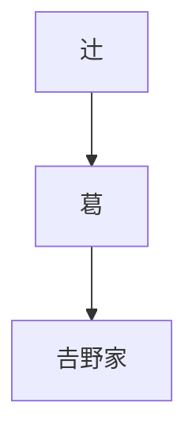

# IPAmj明朝のテスト

これはIPAmj明朝を使用したテストページです。
必要なグリフだけが埋め込まれるため、フォントファイル全体を読み込む必要はありません。

## IVSテスト (異体字セレクタ)

IPAmj明朝はIVSに対応しています。※現在のサブセッター実装でIVSが正しく機能するかは要確認ですが、グリフとしては存在します。

- 辻󠄀 (U+8FBB U+E0100)
- 辻󠄃 (U+8FBB U+E0103)

## PUPテスト (複数フォント・PUP領域)

行政事務標準文字追加明朝によるPUP領域のテストです。

- 􍺒 (G+10DE92)

## Mermaidテスト

