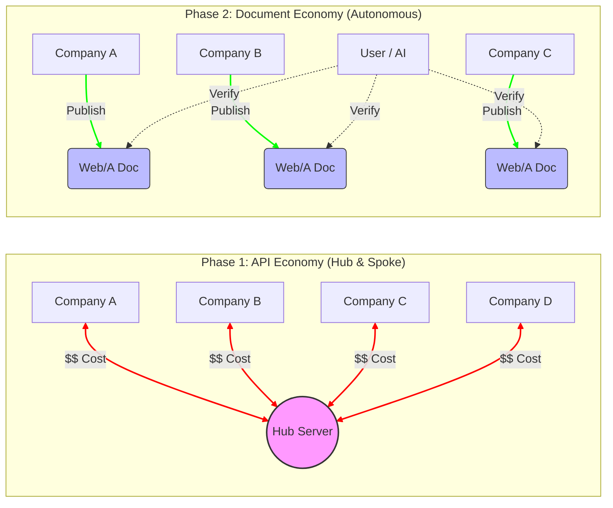

> **演習に関する通知:** 本ドキュメント（試算・比較・分析）は、開発プロジェクトの品質向上を目的としたAIによるロールプレイ（擬似演習）の一環です。実在の機関による公式な統計や経済予測を示すものではありません。

## 1. 概要：データ連携の進化の螺旋

現代のデジタル化において、システム同士を連携させる際の最大の障壁は依然として「接続コスト」です。しかし、我々は歴史を忘れるべきではありません。かつての固定長ファイルやCSVによる過酷な個別調整の時代から、現在の **API Economy** への移行は、情報社会における「偉大なる解放」でした。

本稿では、データ連携の歴史的変遷を振り返りつつ、なぜ今再び、かつて挫折した「ドキュメント（セマンティック）主導の経済」が Web/A という形で再起する必要があるのかを、経済性の観点から試算・分析します。

## 2. 歴史的コンテキスト：三つのフェーズ

### Phase 0：密結合とバッチの時代（固定長 / CSV / EDI）
1970年代から続くこの時代は、システムを繋ぐために数ヶ月の交渉と、バイナリレベルでの個別実装が必要でした。
- **特徴**: 変更が不可能に近い硬直性、高価な専用回線、バッチ処理。
- **コスト**: 天文学的な調整コスト。

### Phase 0.5：表計算ソフトによる「現場の自律」（VisiCalc / 1-2-3 / Excel）
API Economyが普及する前、事務のデジタル化における真の革命は「表計算ソフト」でした。
- **功績**: 専門のエンジニアでなくとも、事務員が自ら集計やビジネスロジック（関数、マクロ）を組み、業務を自動化・高度化できるようになった。これは「計算の民主化」であり、現代の「ノーコード」の原点。
- **課題**: 依然としてデータはローカルに閉じており、「公式な証拠」としての検証可能性や、組織を跨いだリアルタイム連携（信頼の連鎖）が欠けていた。

### Phase 0.8：重厚長大なる理想（SOAP / SOA）
2000年前後、エンタープライズ連携のために XML ベースの SOAP と WSDL による厳格な標準化が試みられました。
- **功績**: 「契約（WSDL）」に基づく堅牢な連携と、WS-Security 等によるセキュリティ標準の確立。Web/A が目指す「検証可能な信頼」の先駆者。
- **敗因**: 複雑怪奇な仕様（XML地獄）と、通信プロトコルへの過度な依存。変更に弱く、開発者の支持を失い、より軽量な REST に主役を奪われた。

### Phase 1：API Economy の勝利（REST / JSON）
2000年代以降、API Economy は「リアルタイムな疎結合」を実現し、DX（Developer Experience）を飛躍的に向上させました。
- **功績**: 接続の標準化、クラウド・マイクロサービスの普及、エコシステムの爆発。
- **現在直面している課題**: 接続相手が増えるたびに $O(N)$ で増大する維持コスト。ハブ（Hub）への過度な依存によるデータ主権の喪失。

### Phase 2：Document Economy への回帰（Web/A）
かつて SGML, XML, Semantic Web が目指し、その複雑さゆえに「死屍累々」となった理想が、現在の**検証可能技術（DID/VC）**と**AI**を武器に再定義されます。
- **必然性**: 相手を信頼するのではなく、ドキュメントに備わった「証拠」を信頼する。接続なしで「検証」だけを行う限界費用ゼロの世界。

## 3. 経済性の比較試算：1,000組織を繋ぐシミュレーション

トポロジの違いが、いかにコスト構造に影響するかを可視化します。APIモデルでは「接続（線）」が増えるのに対し、Documentモデルでは「ノード（点）」が自立します。

1,000のシステムを相互に接続可能にするための「社会全体の総コスト」を試算します。

| 項目 | **Phase 1: API Economy (Hub型)** | **Phase 2: Document Economy (Web/A)** |
| :--- | :--- | :--- |
| **接続の性質** | 「線」の契約（都度認証が必要） | 「点」の自立（検証可能文書が流通） |
| **初期コスト総計** | **約20億円** (2M円 × 1,000) | **約10億円** (10M円 × 1,000実装) |
| **運用の継続費用** | **約4億円/年** (保守・鍵更新等) | **ほぼ 0円** (規格の維持のみ) |
| **AI親和性** | 各APIごとに学習・対応が必要 | **全ドキュメント共通の検証ロジック** |
| **接続の拡張性** | ハブの拡張性に依存 | **宇宙のように無限（ハンドシェイク不要）** |

*※注：API Economy はハブ集約によって Phase 0 より大幅に効率化されたが、ハブの維持費（Rent）と、ハブとの個別統合という「最後の1マイル」のコストが残存している。*

## 4. なぜ「今」、Document Economy なのか？

かつての XML / Semantic Web の試みは、暗号学的な真正性保証（L2暗号化やPQC）が未熟であり、またデータを処理する「賢いエージェント（AI）」が不在でした。Web/A が目指す Phase 2 は、以下の要素により、過去の失敗を乗り越えます。

1.  **ハンドシェイクからの解放**: 相手のAPIサーバーがダウンしていても、手元の文書の真正性は検証可能である。
2.  **スイッチングコストの消滅**: 特定のSaaSやAPIプロバイダーに縛られず、文書という「共通貨幣」を介して自由にシステムを乗り換えられる。
3.  **AIレディ**: 人間がマニュアルを読んでAPIを繋ぐ時代から、AIがWeb/Aを読み、自動でワークフローを構成する時代へ。

## 5. コスト削減以上の価値：「時間」と「裾野」の変革

コスト削減は財務的なメリットに過ぎません。Document Economyへの移行がもたらす本質的な変革は、以下の2点にあります。

### 5.1. リードタイムの劇的な短縮（Time-to-Value）
API連携では、契約書締結から仕様調整、セキュリティレビュー、接続テストを経て本番稼働に至るまで、数週間〜数ヶ月のリードタイムを要します。
- **Web/Aの場合**: ドキュメントを受け取った瞬間（Day 0）から、AIエージェントや検証ツールがその正当性を確認し、業務プロセスを起動できます。「繋ぐ時間」を短縮し、ビジネスチャンスを逃しません。

### 5.2. ロングテールのデジタル化
API化の投資対効果（ROI）が見合わず、紙やPDFのまま放置されていた「小規模な手続き」や「滅多に使わない証明書」が、Web/A によって一気にデジタル化のエコシステムに乗ります。
- これにより、大企業間の基幹取引だけでなく、中小企業や個人事業主、地方自治体の窓口業務までもが、同じ「信頼の基盤」の上でシームレスに繋がるようになります。

## 6. 結言

API Economy は情報の「回線」を整備しました。Document Economy は、その回線の上で、あるいは回線がなくても、信頼を運ぶことができる「貨幣（メディア）」を整備するものです。

APIがもたらした進化を尊重しつつ、その「接続の罠」という限界を、Web/A という検証可能な自律ドキュメントによって突破する。これは、デジタル化の歴史における**「接続から自律へ」**という必然的な回帰なのです。
---
