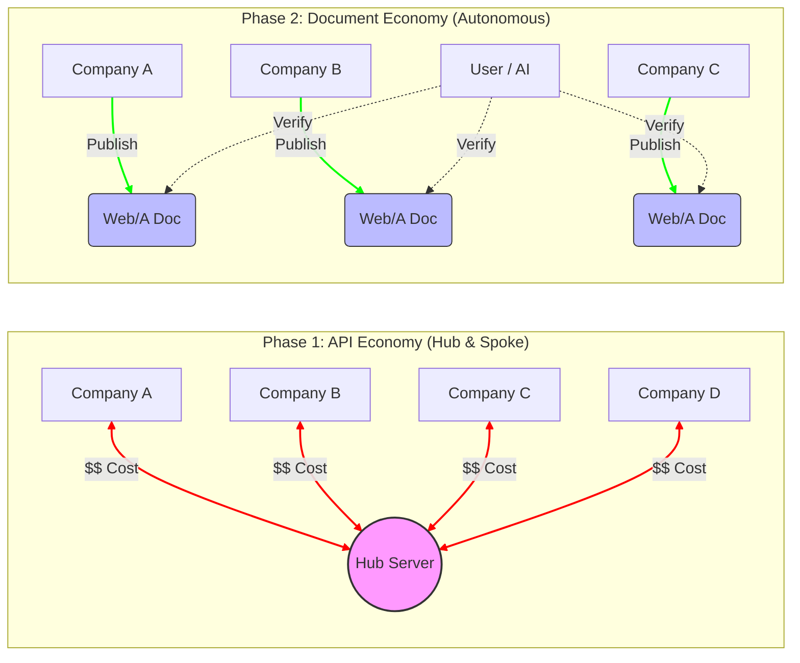

> **SIMULATION NOTICE:** This document (calculation, comparison, analysis) is part of an AI-driven role-playing simulation conducted for project quality and governance testing. It does not constitute a formal legal or economic forecast by any official entity.

## 1. Executive Summary: The Evolutionary Spiral of Data Exchange

In modern digitalization, "connectivity cost" remains the primary bottleneck. However, we must not forget history. The transition from the grueling manual coordination of fixed-length files and CSVs to the current **API Economy** was a "Great Liberation" for the information society.

This paper looks back at the historical evolution of data exchange and analyzes why the "Document/Semantic-driven Economy"—which previously failed to go mainstream—is now poised for a resurgence through Web/A, from an economic standpoint.

## 2. Historical Context: The Three Phases

### Phase 0: Tight Coupling & Batch Processing (Fixed-length / CSV / EDI)
Starting in the 1970s, connecting systems required months of negotiation and individual implementation at the binary/byte level.
- **Characteristics**: Extreme rigidity, expensive leased lines, and batch processing.
- **Cost**: Astronomical coordination overhead.

### Phase 0.5: The Spreadsheet Revolution (VisiCalc / 1-2-3 / Excel)
Before the API Economy took center stage, the true revolution in administrative digitalization was the spreadsheet.
- **Achievements**: For the first time, office workers—not just specialized engineers—could build their own aggregation and business logic (formulas, macros). This was the "Democratization of Computing" and the root of modern "No-Code" culture.
- **Challenges**: Data remained localized and locked in silos. It lacked "Verifiability" as official evidence and couldn't support a cross-organizational "Chain of Trust."

### Phase 0.8: The Heavyweight Vision (SOAP / SOA)
Around 2000, the industry attempted strict standardization for enterprise integration using XML-based SOAP and WSDL.
- **Achievements**: Established robust integration based on "Contracts (WSDL)" and security standards like WS-Security. A spiritual predecessor to the "Verifiable Trust" Web/A aims for.
- **Failures**: Overly complex specifications ("XML Hell") and rigid dependency on transport protocols. It proved brittle to change, lost developer support, and was overtaken by the lightweight REST.

### Phase 1: The Victory of the API Economy (REST / JSON)
Since the 2000s, the API Economy realized "real-time loose coupling" and dramatically improved the Developer Experience (DX).
- **Achievements**: Standardized connectivity, the explosion of Cloud/Microservices, and interconnected ecosystems.
- **Current Challenges**: Maintenance costs grow $O(N)$ with every new partner. Excessive reliance on central Hubs leads to loss of data sovereignty.

### Phase 2: Return to the Document Economy (Web/A)
The ideals that SGML, XML, and the Semantic Web once pursued—leaving a "trail of failed attempts" due to their complexity—are now being redefined with **Verifiable Technologies (DID/VC)** and **AI**.
- **Inevitability**: Instead of trusting a partner's server, we trust the "evidence" embedded within the document. A world of zero marginal cost where you only "verify," not "connect."

## 3. Comparative Simulation: Connecting 1,000 Organizations

Comparing network topologies reveals how costs scale. In the API model, "Connections (Lines)" multiply costs. In the Document model, "Nodes (Points)" remain autonomous.

Total societal cost for enabling data exchange between 1,000 systems.

| Item | **Phase 1: API Economy (Hub Model)** | **Phase 2: Document Economy (Web/A)** |
| :--- | :--- | :--- |
| **Nature of Link** | "Line" contract (Auth needed per link) | "Point" autonomy (Verifiable files) |
| **Total Initial Cost Est.** | **~$20 Million** ($20k × 1,000) | **~$10 Million** ($100k × 1,000) |
| **Annual Maintenance** | **~$4 Million/year** (Key rotation/Auth) | **Near Zero** (Spec maintenance only) |
| **AI Compatibility** | Must learn/adapt to individual APIs | **Universal verification logic** |
| **Scalability** | Limited by Hub capacity | **Infinite (No handshake needed)** |

*Note: While API Economy significantly improved over Phase 0 through Hub aggregation, the "Hub Rent" and the "Last Mile" cost of individual hub integration remain.*

## 4. Why "Now" for the Document Economy?

Previous attempts like XML and the Semantic Web failed because cryptographic authenticity (L2 Encryption/PQC) was immature, and the "Intelligent Agents (AI)" to process the data did not yet exist. Web/A's Phase 2 overcomes these past failures through several factors:

1.  **Freedom from Handshakes**: Even if the issuer's server is down, the document's authenticity can be verified locally.
2.  **Elimination of Switching Costs**: No longer locked into specific SaaS or API providers; systems can be swapped freely as long as they speak the "Common Currency" of Web/A documents.
3.  **AI-Ready**: Moving from an era where humans read manuals to connect APIs, to an era where AI reads Web/A and automatically configures workflows.

## 5. More Than Cost: Time and Inclusion
Cost reduction is merely a financial metric. The true transformation of the Document Economy lies in speed and inclusivity.

### 5.1. Dramatic Reduction in Time-to-Value
API integration typically requires weeks or months of lead time for contract signing, spec coordination, security reviews, and connection testing.
- **Web/A**: From the moment a document is received (Day 0), AI agents and verification tools can confirm its legitimacy and trigger business processes. It eliminates the "Waiting to Connect" period, capturing business opportunities instantly.

### 5.2. Digitalizing the Long Tail
Small-scale procedures and infrequent certificates—often left as paper or PDF because their ROI didn't justify API development—can now join the digital ecosystem effortlessly via Web/A.
- This empowers not just enterprise "backbones" but also SMEs, freelancers, and local government counters to connect seamlessly on the same "Foundation of Trust."

## 6. Conclusion

The API Economy built the "Network Cables" of information. The Document Economy is building the "Currency (Media)" that can carry trust over those cables—or even without them.

While respecting the progress brought by APIs, we must overcome the limits of the "Connectivity Trap" through the verifiable, autonomous documents of Web/A. This is an inevitable return to **"From Connectivity to Autonomy"** in the history of digitalization.
---
