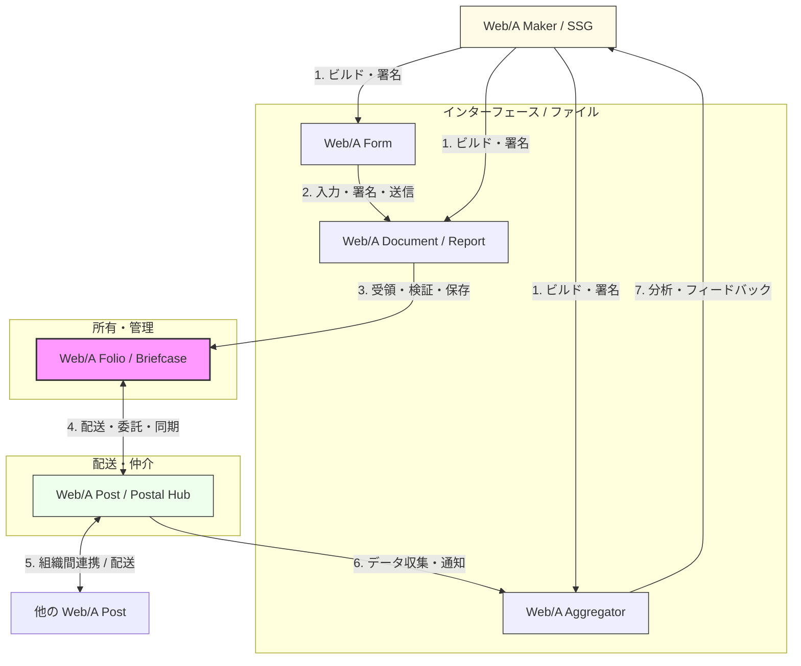

## 1. はじめに：点から線、そして面へ

Web/A プロトコル群は、単なるドキュメント形式の提案ではありません。それは、データの「作成（Foundry）」、「インターフェース（Interface）」、「所有（Ownership）」、そして「配送（Infrastructure）」のすべてを再定義し、プラットフォームに依存しない**「自律的な信頼のネットワーク」**を構築するためのエコシステムです。

本稿では、主要な5つの構成要素がどのように連携し、ユーザーのデータ主権と業務の自動化を両立させるかを概観します。

## 2. エコシステム・マップ（全体像）

Web/A エコシステムにおける情報の流れは、一方的な配信ではなく、発行者、利用者、そして仲介者が織りなす有機的なサイクルです。

## 3. 各コンポーネントの役割

### 3.1. Web/A (Format) ― 信頼の最小単位
すべての基盤となる**「アーカイブ品質」のドキュメント形式**です。
- **特徴**: 単一の HTML ファイルに HTML（視覚）、JSON-LD（構造データ）、フォント、署名を封印。
- **価値**: 50年後もブラウザで「読める」ことと、その瞬間に機械が「検証できる」ことを同時に保証します。

### 3.2. Web/A Maker & Aggregator (Foundry) ― 信頼の鋳造と分析
**Sorane SSG (Static Site Generator)** を核とした、ドキュメントのライフサイクルの始点と終点を担うツール群です。
- **Maker**: テンプレートから、署名済みの Web/A ドキュメントやフォームを生成。
- **Aggregator**: Post を通じて提出された署名済みデータを収集・解析し、ダッシュボードや統計情報を提供。
- **価値**: 開発者が既存のワークフローの中に、自律的な「信頼の生成」と「集計・分析」を容易に組み込めるようにします。

### 3.3. Web/A Form (Interface) ― 対話するドキュメント
Web/A に「入力」と「秘匿性」の機能を加えた、**対話型のドキュメント**です。
- **特徴**: フォーム自体が自律的なプログラムとして動作し、回答者の Passkey 署名や受信者限定の暗号化（L2E）を行います。
- **価値**: サーバー側で入力を待つのではなく、ドキュメント自体が「回答を携えて戻ってくる」モデルを実現します。

### 3.4. Web/A Folio (Ownership) ― デジタル書類鞄
ユーザーの手元（ローカル）で、自らの証拠や履歴を管理する**パーソナル・データコンテナ**です。
- **特徴**: 「ウォレット」が主に ID を扱うのに対し、Folio は大量の「書類（レコード）」を構造的に保持します。
- **価値**: 自分のデータは自分の手元にあるという、真のデータ主権（Self-Sovereignty）の拠り所となります。

### 3.5. Web/A Post (Infrastructure) ― 知的郵便拠点
Folio 間のメッセージ配送と、アイデンティティの仲介を担う**配信インフラ**です。
- **特徴**: マスターデータは保持せず、ルーティング、コンテキスト管理、および「不在時の代理応答」に特化します。
- **価値**: 常時接続を維持しつつ、ユーザーの代わりに「門番」や「受付」として機能するインテリジェントな窓口となります。

## 4. AI エージェントのためのインフラ：Bring Your Own AI Agent (BYOA)

現在の AI エコシステムは、特定のプラットフォーム内部で完結する「分断されたサイロ」になりがちです。あるエージェントは高度な推論ができても、ユーザーのマスターデータ（証拠）にアクセスできず、また別のエージェントはデータを読み取れても、その真正性を検証する術を持ちません。

Web/A エコシステムは、**「Bring Your Own AI Agent (BYOA)」**、すなわちユーザーが自ら選んだ AI エージェントを連れてきて、安全かつ高度な自動化（Automation）を実現するための共通インフラを提供します。

- **エージェントへの「目」と「手」の提供**: 
  Web/A の機械可読性（JSON-LD）と Post の配送機能は、AI エージェントにとっての「共通言語」と「神経系」になります。
- **信頼のチェーン**: 
  エージェントは、受け取ったドキュメントが改ざんされていないか、誰によって署名されたものかを、プラットフォームを介さずに自律的に検証できます。
- **構造化されたコンテキスト**: 
  Folio に蓄積された構造化データは、エージェントがユーザーの状況を正確に把握（RAG 等）し、精度の高い支援を行うための基盤となります。

## 5. 実装と展開：CLI から大規模・広域展開へ

Web/A エコシステムは現在、開発者向けの参照実装として提供されていますが、そのロードマップは公共・民間・個人を横断する大規模な広域展開を見据えています。

- **Folio CLI / MCP (現在)**: 
  AI エージェントや開発者が、コマンドラインや MCP (Model Context Protocol) を通じて直接データを操作・検証できるツール群。
- **大規模・広域展開 (将来)**: 
  Folio は個人や小規模団体が直接管理するだけでなく、国と自治体（G2G）、事業者間（B2B）、あるいは事業者と行政（B2G）を跨ぐ公的な証跡交換の標準インフラとして機能し得ます。
- **サービス基盤への統合**: 
  多数の顧客接点やデータを保持する機関、あるいは複雑な申請・手続の UX を劇的に改善したい事業者が、この参照実装を自社サービスに統合し、ユーザーにセキュアな「書類鞄」としての機能を提供することが期待されます。

## 6. ユースケース・シナリオ：一連の流れ

1.  **発行**: 発行組織（企業、自治体、団体等：**Maker**）が、公式な調査票や手続き用の **Form** を公開する。
2.  **受領**: ユーザーの **AI エージェント**が、Folio に届いた通知を受けて内容を解析し、ユーザーに提案する。
3.  **作成**: AI エージェントが **Folio** 内の既存プロファイルから下書きを作成し、ユーザーが確認・署名を行う。
4.  **提出**: 暗号化されたパッケージが **Post** を通じて、相手先の組織へ最小限の露出で配送される。
5.  **代理応答**: 受信側の **Post** が自動検証を行い、即座に受理証を返信。ユーザーのエージェントがそれを記録する。

## 7. 結論：プラットフォームを超えた自由

Web/A エコシステムが目指すのは、特定の巨大プラットフォームにログインしなければ何もできない世界からの脱却です。

Web/A という「信頼を封じ込めた容器（ドキュメント）」と、それを自律的に扱うツール（Maker / Form）、所有する場所（Folio）、そして届ける経路（Post）。これらが組み合わさることで、ユーザーは自ら選んだ AI と共に、物理的な「書類」が持っていた自由度と、デジタルならではの知的な自動化を享受できるようになります。
