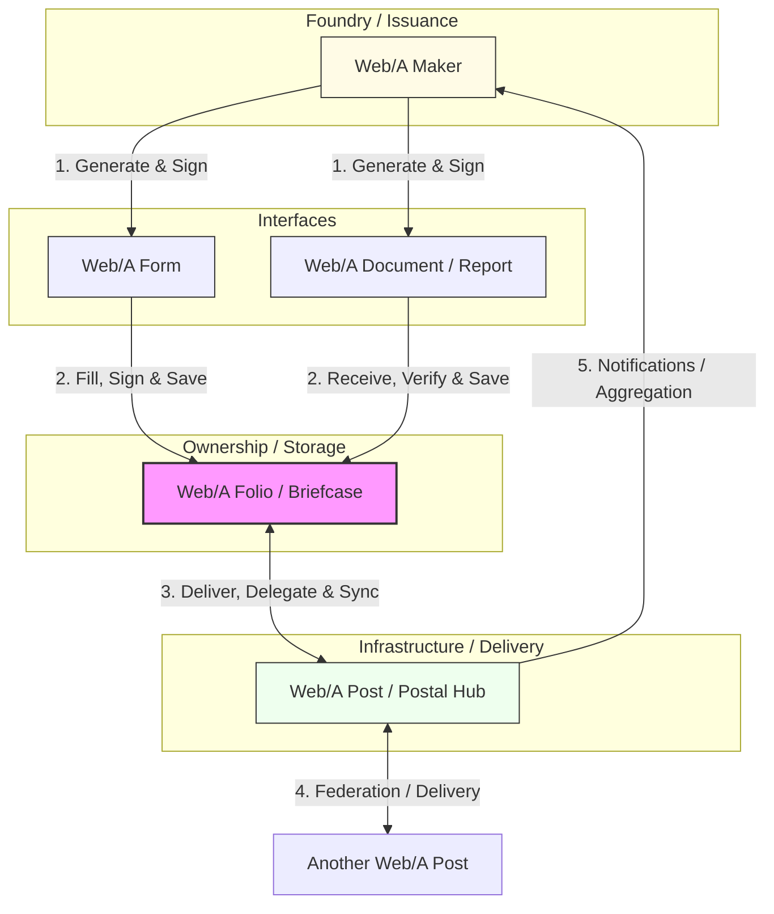

## 1. Introduction: From Points to a Network

The Web/A protocol suite is not merely a proposal for a new document format. It is an ecosystem that redefines the entire lifecycle of data: **Creation (Foundry)**, **Interface**, **Ownership**, and **Infrastructure**. Together, they form an **"Autonomous Network of Trust"** that is independent of any single platform.

This paper provides an overview of how the five key components collaborate to balance user data sovereignty with intelligent automation.

## 2. Ecosystem Map (The Big Picture)

The flow of information in the Web/A ecosystem is not a one-way broadcast, but an organic cycle woven by issuers, users, and mediators.

## 3. Roles of the Components

### 3.1. Web/A (Format) — The Atomic Unit of Trust
The foundation for everything: an **"Archive-Quality" document format**.
- **Features**: A single HTML file that encapsulates HTML (view), JSON-LD (structured data), fonts, and signatures.
- **Value**: Ensures that a document can be "read" by a browser 50 years from now while being simultaneously "verifiable" by a machine.

### 3.2. Web/A Maker (Foundry) — The Mint of Trust
A suite of tools designed to **generate signed Web/A documents** from Markdown and templates.
- **Composition**: CLI tools, libraries, and GUI editors.
- **Value**: Enables developers to easily bake "trust generation" into existing workflows like CI/CD and automated scripts.

### 3.3. Web/A Form (Interface) — The Interactive Document
An **interactive document** that adds "input" and "confidentiality" capabilities to the Web/A format.
- **Features**: The form operates as an autonomous program, handling Passkey signing and recipient-only encryption (L2E).
- **Value**: Shifts from a model where servers wait for input to one where the document itself "returns with the answer."

### 3.4. Web/A Folio (Ownership) — The Digital Briefcase
A **personal data container** residing on the user's local device for managing their own evidence and history.
- **Features**: While "wallets" primarily handle identity, a Folio structure manages a vast volume of "documents (records)."
- **Value**: Serves as the bedrock for true Self-Sovereign data management—your data is in your hands.

### 3.5. Web/A Post (Infrastructure) — The Intelligent Postal Hub
The **delivery infrastructure** responsible for message transport and identity mediation between Folios.
- **Features**: It does not hold master data. Instead, it specializes in routing, context management, and "automated responses in owner absence."
- **Value**: Acts as an intelligent gatekeeper or digital counter, maintaining a 24/7 presence on behalf of the user.

## 4. Infrastructure for AI Agents: Bring Your Own AI Agent (BYOA)

Today's AI ecosystem is often trapped in "fragmented silos" that exist only within specific platforms. One agent might have advanced reasoning but lacks access to the user's master data (evidence), while another might read the data but has no way to verify its authenticity.

The Web/A ecosystem provides a common infrastructure for **"Bring Your Own AI Agent (BYOA)"**—allowing users to bring an AI agent of their choice to achieve safe and sophisticated automation.

- **Eyes and Hands for Agents**:
  Web/A's machine-readability (JSON-LD) and Post's delivery capabilities serve as the "common language" and "nervous system" for AI agents.
- **Chain of Trust**:
  Agents can autonomously verify whether a received document has been tampered with and who signed it, without relying on a central platform.
- **Structured Context**:
  The structured data accumulated in a Folio serves as a foundation for agents to accurately understand the user's situation (e.g., via RAG) and provide high-precision assistance.

## 5. Implementation & Deployment: From CLI to Large-scale Ecosystems

While the Web/A ecosystem is currently provided as a reference implementation for developers, its roadmap envisions large-scale, cross-sector deployment spanning public, private, and personal domains.

- **Folio CLI / MCP (Present)**:
  Tools that allow AI agents and developers to directly manipulate and verify data via the command line or Model Context Protocol (MCP).
- **Large-scale & Cross-sector Deployment (Future)**:
  A Folio is not only for direct management by individuals but can also serve as a standard infrastructure for the exchange of official evidence between government entities (G2G), businesses (B2B), and between enterprises and administrations (B2G/G2B).
- **Integration into Service Platforms**:
  Organizations with extensive customer bases and data—or those seeking to dramatically improve the user experience for complex applications and procedures—can integrate this reference implementation into their own infrastructure to provide secure "Digital Briefcase" functionality to their users.

## 6. Use Case Scenario: The Lifecycle of a Document

1.  **Issuance**: An issuing organization (enterprise, government, or NGO: **Maker**) publishes an official survey or procedural **Form**.
2.  **Reception**: The user's **AI Agent** receives a notification in the Folio, analyzes the content, and presents a draft to the user.
3.  **Completion**: The AI Agent prepares a draft based on existing profiles in the **Folio**, which the user reviews and signs via Passkey.
4.  **Submission**: An encrypted package is delivered via **Post** to the recipient organization with minimal exposure.
5.  **Auto-response**: The recipient's **Post** performs automatic verification and immediately returns a receipt. The user's AI agent records the completion.

## 7. Conclusion: Freedom Beyond Platforms

The goal of the Web/A ecosystem is to move away from a world where one must log into a giant platform to perform even basic digital tasks.

By combining Web/A (the "container for trust"), the tools to handle it (Maker / Form), a place to own it (Folio), and a path to deliver it (Post), users can maintain absolute sovereignty while enjoying the freedom and intelligent automation of an interconnected world, powered by the AI of their choice.
