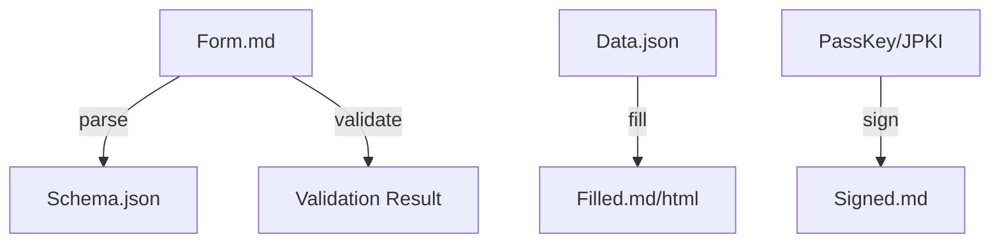

# Folio CLI Design Doc

A reference implementation for Web/A Folio: a headless toolkit that serves as the "hands and feet" for AI agents and automation systems within the Web/A Form ecosystem.

## Overview

- **Name**: `folio`
- **Runtime**: Bun (TypeScript)
- **Distribution**: Single binary (via `bun build --compile`)
- **Philosophy**: "Web/A Engine." Parse, edit, and verify Web/A documents without a browser (text-only operations).

## Architecture

Treat Web/A Form (Markdown) as structured data, allowing conversion and merge with JSON inputs.



## Design Principles: CLI vs MCP

The CLI and MCP surface should be **mirror capabilities**, but not mirror ergonomics. The CLI is the canonical interface for automation and local workflows. MCP is a higher-level bridge for agents and interactive tools.

**Use CLI when:**
- The caller can execute local processes and read files directly.
- Deterministic scripts or CI need stable exit codes.
- Large files or batch operations are involved.

**Use MCP when:**
- The caller is an agent without direct filesystem access.
- The interaction is conversational or incremental.
- You need safer, constrained access (read-only or scoped).

**Principles:**
- **Single Source of Truth**: CLI behavior defines canonical semantics.
- **Safe Abstraction**: MCP should map to CLI primitives without hidden side effects.
- **Explicit Side Effects**: Any write operation should be obvious (CLI flags, MCP tool names).
- **Small Outputs**: MCP returns summaries and paths; large artifacts remain on disk.

## Command Surface

### 1. Form Operations

Most frequently used by AI agents.

- `folio parse <file>`
  - Parse Markdown and output field definitions, types, and constraints as JSON Schema.
  - Agents use the schema to understand required inputs.
  - **Output**: JSON to stdout (`schema.json` compatible).  
  - **Exit**: `0` on success, `1` on parse error.
- `folio fill <file> --data <data.json>`
  - Merge Markdown with input data and output a filled Markdown (or HTML).
  - Validation runs as part of the flow.
  - **Options**: `--out <file>` (default: stdout), `--format md|html`.  
  - **Exit**: `0` on success, `2` on validation failure.
- `folio validate <file>`
  - Validate a filled file against constraints (required fields, types, regex).
  - **Output**: JSON report (`valid`, `errors[]`).  
  - **Exit**: `0` valid, `2` invalid, `1` error.

### 2. Folio Management

Used by users (humans) or setup agents.

- `folio init`
  - Initialize the Folio directory layout (`.index/`, `keys/`, `history/`, etc.).
  - **Options**: `--path <dir>` (default: `.`), `--force`.  
  - **Exit**: `0` on success, `1` on failure.
- `folio index`
  - Scan all Web/A files in the folio and refresh AI indexes (`.index/vectors.db`, etc.).
  - **Options**: `--path <dir>`, `--mode full|incremental`.  
  - **Exit**: `0` on success, `1` on failure.

### 3. Identity & Signing

- `folio sign <file> --key <key_alias>`
  - Sign a document using the specified key (Passkey integration TBD).
  - **Options**: `--out <file>`, `--format html|json`.  
  - **Exit**: `0` on success, `1` on failure.
- `folio verify <file>`
  - Verify signatures on a document.
  - **Output**: JSON report (`valid`, `issuer`, `algorithms`, `warnings[]`).  
  - **Exit**: `0` valid, `3` invalid, `1` error.

### 4. MCP Server (Agent Integration)

Provide native Model Context Protocol (MCP) support so the CLI can act as an MCP server.

- `folio serve`
  - Start MCP server in stdio or SSE mode.
  - **Options**: `--transport stdio|sse`, `--port <n>`.  
  - **Exit**: `0` on clean shutdown.

#### Exposed Resources
- `folio://profile`
  - Expose `profile.html` as text or JSON for agent consumption.
- `folio://history/latest`
  - Provide recent history or form summaries.

#### Exposed Tools
- `weba_parse_form`
  - Wrapper for `folio parse`. Returns structure for a given form.
- `weba_draft_form`
  - Wrapper for `folio fill`. Creates a draft file (no overwrite).
- `weba_search`
  - Semantic search over indexes built by `folio index`.

## Data Model (Draft)

### Folio Layout (Canonical)

```text
MyFolio/
├── .index/            # Derived caches (rebuildable)
│   ├── vectors.db
│   └── manifest.json
├── profile.html       # Human + JSON-LD profile
├── keys/              # Public keys + key metadata
├── history/           # Completed documents and submissions
├── certificates/      # Issued credentials and proofs
├── inbox/             # Incoming forms to be processed
└── logs/              # Audit logs for CLI actions
```

### Folio Metadata (manifest.json)

```json
{
  "version": "0.1",
  "created_at": "2025-12-29T00:00:00Z",
  "owner": {
    "id": "did:web:example.com",
    "display_name": "User Name"
  },
  "paths": {
    "profile": "profile.html",
    "history": "history/",
    "certificates": "certificates/",
    "inbox": "inbox/"
  }
}
```

### Audit Log (logs/folio.log)

Each CLI action appends a JSON line entry.

```json
{
  "ts": "2025-12-29T12:00:00Z",
  "action": "folio.import",
  "target": "inbox/new_application_form.html",
  "status": "ok",
  "meta": {
    "source": "incoming/form.html",
    "hash": "sha256:..."
  }
}
```

### Conventions
- **Immutable Sources**: Inputs remain unchanged; outputs are written to new files.
- **Deterministic Paths**: Paths are predictable and safe for automation.
- **Rebuildable Indexes**: `.index/` can be deleted and regenerated.

## Security & Threat Model (PoC)

This PoC is designed to be **secure enough for local workflows**, while remaining lightweight and auditable.

### Threats Considered
- **Local Compromise**: Malware or a hostile OS can access folio data.
- **Unauthorized Access**: Another local user or process can read files.
- **Tampering**: In-place edits to folio documents or logs.
- **Index Leakage**: Derived caches (`.index/`) can expose metadata.

### Security Goals
- **Integrity**: Detect tampering via Web/A signatures and verification.\n- **Confidentiality**: Keep sensitive payloads in Layer 2 envelopes.\n- **Auditability**: Append-only logs for CLI actions.\n- **Portability**: No vendor lock-in, readable files.

### PoC Controls
- **Read/Write Separation**: Inputs remain immutable; outputs are new files.\n- **Offline Verification**: `folio verify` works without network access.\n- **Minimal Secrets**: Private keys stay in hardware or OS keystore (Passkey/JPKI).\n- **Cache Purge**: `.index/` can be removed without data loss.

### Non-Goals
- Full device hardening or secure enclave management.\n- Strong anonymity against traffic analysis.\n- Multi-tenant server isolation.

## Operational Notes (PoC)

- **Backups**: Keep encrypted backups of `history/` and `certificates/` if the folio is long-lived.\n- **Key Hygiene**: Do not export private keys. Prefer hardware-backed credentials.\n- **Audit Logs**: Treat `logs/` as sensitive; rotate and archive periodically.\n- **Index Safety**: `.index/` is disposable; purge it when sharing a folio snapshot.\n- **Recovery**: A folio should be reconstructible from HTML and signed artifacts alone.

## Implementation Roadmap

### Phase 1: Core Parser (v0.1)
- Markdown AST parsing for Web/A syntax (`[text:...]`)
- `parse` command implementation
- Basic `fill` (no validation)

### Phase 2: Validation & Indexing (v0.2)
- Validation logic
- `folio index` (basic full-text or vector index)

### Phase 3: Identity (v0.3)
- Signing + verification
- JPKI / Passkey prototyping
