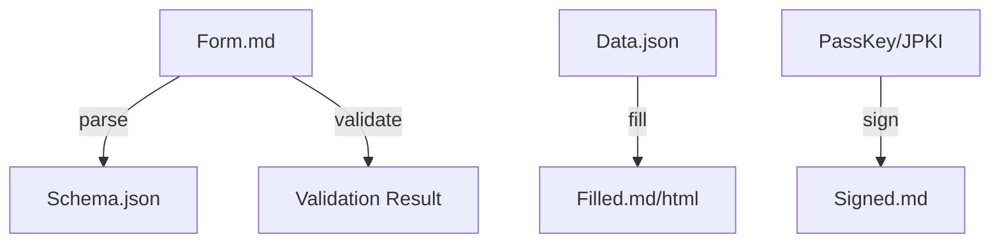

A reference implementation for Web/A Folio: a headless toolkit that serves as the
"hands and feet" for AI agents and automation systems within the Web/A Form
ecosystem.

## Overview

- **Name**: `folio`
- **Runtime**: Bun (TypeScript)
- **Distribution**: Single binary (via `bun build --compile`)
- **Philosophy**: "Web/A Engine." Parse, edit, and verify Web/A documents
  without a browser (text-only operations).

## Architecture

Treat Web/A Form (Markdown) as structured data, allowing conversion and merge
with JSON inputs.



## Design Principles: CLI vs MCP

The CLI and MCP surface should be **mirror capabilities**, but not mirror
ergonomics. The CLI is the canonical interface for automation and local
workflows. MCP is a higher-level bridge for agents and interactive tools.

**Use CLI when:**

- The caller can execute local processes and read files directly.
- Deterministic scripts or CI need stable exit codes.
- Large files or batch operations are involved.

**Use MCP when:**

- The caller is an agent without direct filesystem access.
- The interaction is conversational or incremental.
- You need safer, constrained access (read-only or scoped).

**Principles:**

- **Single Source of Truth**: CLI behavior defines canonical semantics.
- **Safe Abstraction**: MCP should map to CLI primitives without hidden side
  effects.
- **Explicit Side Effects**: Any write operation should be obvious (CLI flags,
  MCP tool names).
- **Small Outputs**: MCP returns summaries and paths; large artifacts remain on
  disk.

## CLI vs MCP Split (Provisional)

This split is a **temporary decision** until walk-through demos validate the
ergonomics.

**CLI should own:**

- **Signing & Verification**: key usage, signing, verification, and key rotation.
- **Persistent Writes**: deterministic file outputs (`fill`, `export`, `index`).
- **Audit & History**: append-only logs and immutable history handling.
- **Import & Normalize**: attachment ingestion and normalization.
- **Conformance**: baseline compatibility tests.

**MCP should own:**

- **Read & Search**: safe browsing, search, and summarization.
- **Draft Suggestions**: prefill proposals and diff previews (no writes).
- **Guidance**: next-step recommendations and safe checks.

**Boundary Rules:**

- MCP is read-only by default.
- Any write must be explicit via CLI flags (e.g., `--write`, `--export`).
- All CLI writes must be logged in `logs/`.

## Reference Implementation & Compatibility

The Folio CLI is both a **demonstration** and a **reference implementation**
for interoperability. Its outputs define the baseline that other Folio
implementations should match when claiming compatibility.

- **Canonical Outputs**: File formats, JSON fields, and signature structures are
  normative for compatibility.
- **Deterministic Behavior**: Given the same inputs, outputs should be
  reproducible (except timestamps and randomized nonces).
- **Test Suite as Baseline**: The CLI test suite is the minimum conformance
  target for derived implementations.

## Conformance & Test Suite

Derived Folio implementations should pass the same conformance checks as the
reference CLI. The baseline test suite should verify:

- **Parsing**: `folio parse` generates stable schemas from forms.
- **Filling**: `folio fill` produces deterministic, valid artifacts.
- **Signing**: `folio sign` outputs verifiable signatures with expected fields.
- **Verification**: `folio verify` validates signatures and reports failures.
- **Indexing**: `folio index` rebuilds derived caches deterministically.
- **Packaging**: `folio export` produces a complete bundle with manifest.

The CLI should also expose a `folio conformance` command to run these checks on
an external implementation's outputs (planned).

### Conformance Checklist (Draft)

The reference suite should include:

- **Manifest validity**: required fields exist, hashes match, and relations are
  resolvable.
- **VP scope**: only designated Level 3 fields appear in VP targets.
- **LoA enforcement**: LoA 2+ items are machine-canonical; manual edits mark
  invalidation.
- **Verification report**: each target has signature/hash checks and issues
  are machine-readable.
- **Determinism**: repeated `folio export` yields identical bundle structure
  (excluding timestamps/nonces).

### Conformance Command (Draft)

The CLI should provide a `folio conformance` command that validates a bundle
against a selected profile.

**Command:**

- `folio conformance --bundle <path>`
- `folio conformance --output <report.json>`
- `folio conformance --profile <profile>` (profile name or DSL file)
- `folio conformance --rules <file>` (explicit DSL ruleset)

**Output (summary):**

```json
{
  "status": "pass",
  "profile": "casual",
  "failed": [],
  "warnings": []
}
```

**Profiles (examples):**

- `casual`: minimal fields only, no strict identity requirements.
- `onboarding`: issuer/subject required, VP required for L3 claims.
- `tax`: issuer/subject required, full verification report required.

### Conformance DSL (Draft)

Instead of hard-coding profiles, define requirements in a small DSL so new
use cases can be added without changing the CLI.

**Goals:**

- Profile rules are data, not code.
- Minimal requirements can be declared explicitly (privacy-first).
- Additional rules can be layered per use case.

**Format:**

- **Primary**: YAML (human-writable)
- **Secondary**: JSON (machine-transport)
- One-to-one mapping between YAML and JSON

**Grammar (Draft):**

- `profile`: string
- `requires`: list of string paths
- `rules`: list of rule objects
  - `id`: string
  - `when`: string expression (optional)
  - `assert`: string expression
  - `level`: `error` | `warn` (optional, default `error`)
  - `message`: string (optional)

**Expressions:**

- Path-like selectors with `.` (e.g., `manifest.issuer.id`)
- Array predicates with `[]` (e.g., `documents[].loa`)
- Simple operators: `==`, `!=`, `in`, `exists`

**Expression examples:**

- `manifest.issuer.id exists`
- `subject.loa in [2,3]`
- `documents[].loa == 1`
- `verifiable_presentations[] exists`
- `vp.targets.level == 3`

**Example DSL (YAML):**

```yaml
profile: casual
requires:
  - manifest.version
  - manifest.bundle_id
  - manifest.created_at
  - verification_report.path
  - verification_report.sha256
rules:
  - id: vp_scope_l3_only
    when: manifest.verifiable_presentations
    assert: vp.targets.level == 3
```

```yaml
profile: onboarding
requires:
  - issuer.id
  - subject.id
  - verification_report.path
  - verification_report.sha256
rules:
  - id: vp_required_for_l3
    when: claims.level == 3
    assert: vp.exists == true
```

## Command Surface

### 1. Form Operations

Most frequently used by AI agents.

- `folio parse <file>`
  - Parse Markdown and output field definitions, types, and constraints as JSON Schema.
  - Agents use the schema to understand required inputs.
  - **Output**: JSON to stdout (`schema.json` compatible).
  - **Exit**: `0` on success, `1` on parse error.
- `folio fill <file> --data <data.json>`
  - Merge Markdown with input data and output a filled Markdown (or HTML).
  - Validation runs as part of the flow.
  - **Options**: `--out <file>` (default: stdout), `--format md|html`.
  - **Exit**: `0` on success, `2` on validation failure.
- `folio validate <file>`
  - Validate a filled file against constraints (required fields, types, regex).
  - **Output**: JSON report (`valid`, `errors[]`).
  - **Exit**: `0` valid, `2` invalid, `1` error.

### 2. Folio Management

Used by users (humans) or setup agents.

- `folio init`
  - Initialize the Folio directory layout (`.index/`, `keys/`, `history/`, etc.).
  - **Options**: `--path <dir>` (default: `.`), `--force`.
  - **Exit**: `0` on success, `1` on failure.
- `folio index`
  - Scan all Web/A files in the folio and refresh AI indexes (`.index/vectors.db`, etc.).
  - **Options**: `--path <dir>`, `--mode full|incremental`.
  - **Exit**: `0` on success, `1` on failure.
- `folio export`
  - Create a submission-ready bundle (documents, attachments, manifest).
  - **Options**: `--path <dir>`, `--out <file>`, `--redact <policy>`.
  - **Exit**: `0` on success, `1` on failure.

### 3. Identity & Signing

- `folio sign <file> --key <key_alias>`
  - Sign a document using the specified key (Passkey integration TBD).
  - **Options**: `--out <file>`, `--format html|json`.
  - **Exit**: `0` on success, `1` on failure.
- `folio verify <file>`
  - Verify signatures on a document.
  - **Output**: JSON report (`valid`, `issuer`, `algorithms`, `warnings[]`).
  - **Exit**: `0` valid, `3` invalid, `1` error.

### 4. MCP Server (Agent Integration)

Provide native Model Context Protocol (MCP) support so the CLI can act as an MCP
server.

- `folio serve`
  - Start MCP server in stdio or SSE mode.
  - **Options**: `--transport stdio|sse`, `--port <n>`.
  - **Exit**: `0` on clean shutdown.

#### Exposed Resources

- `folio://profile`
  - Expose `profile.html` as text or JSON for agent consumption.
- `folio://history/latest`
  - Provide recent history or form summaries.

#### Exposed Tools

- `weba_parse_form`
  - Wrapper for `folio parse`. Returns structure for a given form.
- `weba_draft_form`
  - Wrapper for `folio fill`. Creates a draft file (no overwrite).
- `weba_search`
  - Semantic search over indexes built by `folio index`.

## Data Model (Draft)

### Folio Layout (Canonical)

```text
MyFolio/
├── .index/            # Derived caches (rebuildable)
│   ├── vectors.db
│   └── manifest.json
├── profile.html       # Human + JSON-LD profile
├── keys/              # Public keys + key metadata
├── history/           # Completed documents and submissions
├── certificates/      # Issued credentials and proofs
├── inbox/             # Incoming forms to be processed
└── logs/              # Audit logs for CLI actions
```

### Folio Metadata (manifest.json)

```json
{
  "version": "0.1",
  "created_at": "2025-12-29T00:00:00Z",
  "owner": {
    "id": "did:web:example.com",
    "display_name": "User Name"
  },
  "paths": {
    "profile": "profile.html",
    "history": "history/",
    "certificates": "certificates/",
    "inbox": "inbox/"
  }
}
```

### Audit Log (logs/folio.log)

Each CLI action appends a JSON line entry.

```json
{
  "ts": "2025-12-29T12:00:00Z",
  "action": "folio.import",
  "target": "inbox/new_application_form.html",
  "status": "ok",
  "meta": {
    "source": "incoming/form.html",
    "hash": "sha256:..."
  }
}
```

### Conventions

- **Immutable Sources**: Inputs remain unchanged; outputs are written to new files.
- **Deterministic Paths**: Paths are predictable and safe for automation.
- **Rebuildable Indexes**: `.index/` can be deleted and regenerated.

## Submission Package (Draft)

A submission package is a portable bundle suitable for mission-critical
workflows (e.g., onboarding or tax filing). It contains:

- **Documents**: Filled Web/A files or rendered HTML.
- **Attachments**: Supporting files referenced by the documents.
- **Manifest**: A JSON index of contents, hashes, and relations.
- **Verification Report**: A machine-readable signature check summary.

The package is produced by `folio export` and is the standard handoff unit for
external systems.

### VP Scope (Draft)

The bundle is **VP-first**, but only for data that must not be reused without
explicit consent. In practice:

- **VP targets**: Select Level 3 (high-assurance) fields that require
  non-transferability (e.g., identity assertions, consent-critical claims).
- **Everything else**: Included as documents or attachments referenced by the
  manifest.

This avoids overloading the VP with high-volume content while keeping sensitive
claims verifiable and tightly scoped.

### Manifest (Draft)

The submission bundle includes a `manifest.json` that is the single source of
truth for contents and relations.

```json
{
  "version": "0.1",
  "bundle_id": "folio-bundle-2025-12-29T00:00:00Z",
  "created_at": "2025-12-29T00:00:00Z",
  "issuer": {
    "id": "did:web:example.com",
    "name": "Example Org"
  },
  "subject": {
    "id": "did:key:z...",
    "loa": 2
  },
  "documents": [
    {
      "id": "doc:employment-form",
      "path": "docs/employment.html",
      "sha256": "sha256:...",
      "loa": 1,
      "source": "self"
    }
  ],
  "attachments": [
    {
      "id": "att:family-id-1",
      "path": "attachments/family-id-1.pdf",
      "sha256": "sha256:...",
      "loa": 2,
      "source": "verified"
    }
  ],
  "verifiable_presentations": [
    {
      "id": "vp:consent-claims",
      "path": "vp/consent.json",
      "sha256": "sha256:...",
      "targets": ["field:consent", "field:identity"]
    }
  ],
  "relations": [
    {
      "from": "doc:employment-form",
      "to": "att:family-id-1",
      "type": "requires"
    }
  ],
  "verification_report": {
    "path": "reports/verification.json",
    "sha256": "sha256:..."
  }
}
```

**Field notes:**

- `loa` describes trust level at the item level.
- `source` is `self` or `verified` to align with LoA semantics.
- `targets` scope the VP to specific claims or fields.

**Required fields (minimum, privacy-minimized):**

- `version`
- `bundle_id`
- `created_at`
- `documents[]` (can be empty if bundle is VP-only)
- `verification_report.path`
- `verification_report.sha256`

**Use-case required fields:**

- `issuer.id` (required when an issuer is asserted)
- `subject.id` (required when a subject is asserted)
- `verifiable_presentations[]` (required when VP is present)
- `attachments[]` (required when attachments exist)
- `relations[]` (required when dependencies are expressed)

**Optional fields:**

- `issuer.name`
- `subject.loa`
- Item-level `loa` and `source`
- `targets` for VP scoping

### Verification Report (Draft)

The bundle includes a machine-readable verification report that summarizes
signature checks, integrity, and policy violations.

```json
{
  "version": "0.1",
  "generated_at": "2025-12-29T00:00:00Z",
  "bundle_id": "folio-bundle-2025-12-29T00:00:00Z",
  "checks": [
    {
      "target": "doc:employment-form",
      "type": "document",
      "signature_valid": true,
      "hash_match": true,
      "loa": 1,
      "issues": []
    },
    {
      "target": "vp:consent-claims",
      "type": "vp",
      "signature_valid": true,
      "hash_match": true,
      "loa": 2,
      "issues": []
    }
  ],
  "policy": {
    "loa_mismatch": false,
    "manual_edit_detected": false
  }
}
```

**Report rules:**

- `signature_valid` and `hash_match` are required per target.
- `policy` flags summarize bundle-level constraints.
- Any `issues[]` entry should be actionable and machine-readable.

### Export Output Structure (Draft)

`folio export` should emit a deterministic bundle layout:

```text
bundle/
├── manifest.json
├── docs/
│   └── employment.html
├── attachments/
│   └── family-id-1.pdf
├── vp/
│   └── consent.json
└── reports/
    └── verification.json
```

**Export rules:**

- Paths are stable and referenced from `manifest.json`.
- `docs/` contain rendered Web/A outputs (HTML/MD).
- `attachments/` contain original or redacted files, per policy.
- `vp/` contains scoped VPs only for designated Level 3 targets.
- `reports/` contains verification and policy summaries.

## Attachment Lifecycle (Draft)

Attachments need explicit handling for trust and portability:

1. **Import**: Ingest and hash attachments, record metadata.
2. **Normalize**: Convert to stable formats if needed (e.g., PDF/A).
3. **Bind**: Link attachments to documents via manifest entries.
4. **Redact**: Produce minimal, shareable copies for submission.
5. **Export**: Bundle with documents and verification reports.

## Security & Threat Model (PoC)

This PoC is designed to be **secure enough for local workflows**, while
remaining lightweight and auditable. Production-hardening items are tracked as
a memo/roadmap for later review.

### Threats Considered

- **Local Compromise**: Malware or a hostile OS can access folio data.
- **Unauthorized Access**: Another local user or process can read files.
- **Tampering**: In-place edits to folio documents or logs.
- **Index Leakage**: Derived caches (`.index/`) can expose metadata.

### Security Goals

- **Integrity**: Detect tampering via Web/A signatures and verification.
- **Confidentiality**: Keep sensitive payloads in Layer 2 envelopes.
- **Auditability**: Append-only logs for CLI actions.
- **Portability**: No vendor lock-in, readable files.

### PoC Controls

- **Read/Write Separation**: Inputs remain immutable; outputs are new files.
- **Offline Verification**: `folio verify` works without network access.
- **Bring-Your-Own Agent**: A local agent can automate CLI runs; secrets never leave the device.
- **Minimal Secrets**: Private keys stay in hardware or OS keystore (Passkey/JPKI) when available.
- **Cache Purge**: `.index/` can be removed without data loss.

### Non-Goals

- Full device hardening or secure enclave management.
- Strong anonymity against traffic analysis.
- Multi-tenant server isolation.

## Non-Goals (Product Scope)

The Folio CLI is not intended to:

- Replace full-featured document editors or DMS products.
- Provide real-time collaborative editing.
- Act as a hosted SaaS platform for Folio storage.
- Guarantee legal compliance in every jurisdiction out of the box.

### Key Handling (PoC vs Production)

- **PoC Default**: Flat-file keys may be stored under OS permissions when
  hardware support is unavailable (e.g., early PQC flows).
- **Passkey Priority**: For high-trust actions (submission consent, signing),
  use Passkey/secure hardware when available.
- **Testing Stub**: Flat-file key stubs are allowed for tests and local demos.
- **Production Reminder**: Flat-file storage must be replaced by
  hardware-backed or OS keystore mechanisms before production.
- **Explicit Review**: Document any flat-file usage and mark it for revisiting
  before production hardening.

## Operational Notes (PoC)

- **Backups**: Keep encrypted backups of `history/` and `certificates/` if the
  folio is long-lived.
- **Key Hygiene**: Do not export private keys. Prefer hardware-backed credentials.
- **Audit Logs**: Treat `logs/` as sensitive; rotate and archive periodically.
- **Index Safety**: `.index/` is disposable; purge it when sharing a folio snapshot.
- **Recovery**: A folio should be reconstructible from HTML and signed
  artifacts alone.

## Production Hardening Checklist (Memo)

- **Key Storage Migration**: Replace flat-file keys with hardware-backed or
  OS-keystore keys.
- **Credential Attestation**: Capture attestations for Passkey/JPKI where available.
- **Key Rotation & Revocation**: Define rotation cadence and revocation
  handling.
- **Log Integrity**: Add log signing and tamper-evident storage.
- **Supply Chain**: Pin dependencies and publish reproducible build notes.
- **Backup Strategy**: Encrypted, versioned backups with periodic restore
  drills.
- **Access Controls**: Per-folio access policies for multi-user machines.

## Implementation Roadmap

### Phase 1: Core Parser (v0.1)

- Markdown AST parsing for Web/A syntax (`[text:...]`)
- `parse` command implementation
- Basic `fill` (no validation)

### Phase 2: Validation & Indexing (v0.2)

- Validation logic
- `folio index` (basic full-text or vector index)

### Phase 3: Identity (v0.3)

- Signing + verification
- JPKI / Passkey prototyping
