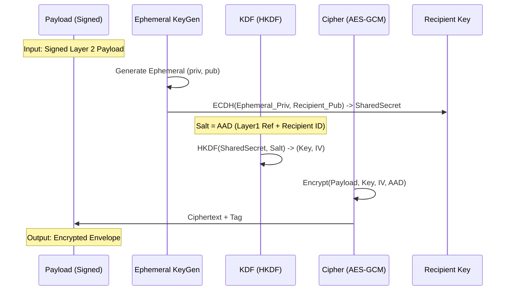
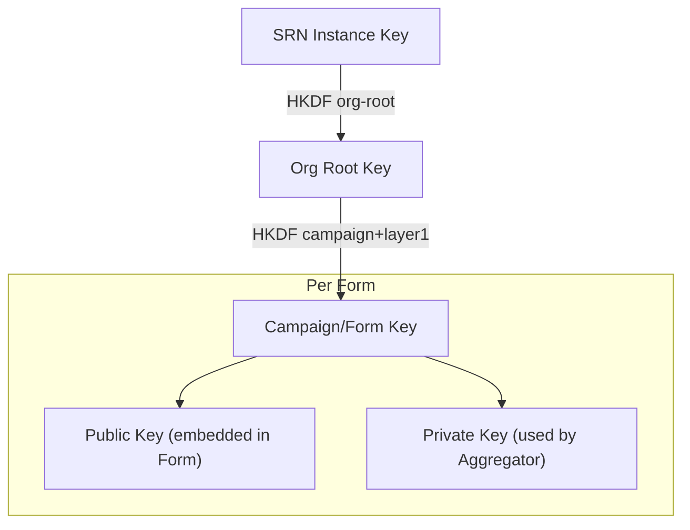
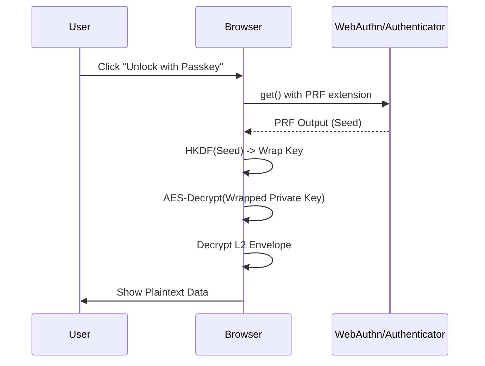

# Technical Report: Web/A Layer 2 Encryption Architecture

**Confidentiality and Privacy for Distributed Form Data**

## 1. Abstract
This report details the architectural design and implementation of **Layer 2
Encryption** for the Web/A protocol. Web/A Layer 2 Encryption provides
end-to-end confidentiality for user responses (Layer 2) in a file-centric,
serverless environment. By utilizing a Hybrid Public Key Encryption (HPKE)-like
construction, it ensures that sensitive data is readable only by the intended
recipient (Issuer/Aggregator), protecting it during transit and storage. The
system supports a hybrid Post-Quantum Cryptography (PQC) mode and integrates
with WebAuthn PRF for browser-native decryption.

## 2. Introduction
In the Web/A model, documents are self-contained artifacts. A "Form" (Layer 1)
is a static file that users fill out to generate an "Answer" (Layer 2). Unlike
traditional web forms that POST data to a specific server, Web/A answers can be
transported via any channel (email, USB, IPFS, etc.).

This decoupled architecture necessitates a robust encryption mechanism that:
1.  **Protects Confidentiality**: Data must remain encrypted at rest and in
    transit.
2.  **Binds to Context**: Answers must be cryptographically bound to the
    specific question (Layer 1) to prevent splicing attacks.
3.  **Enables Offline Operations**: Decryption should be possible in offline
    environments (e.g., local browser, air-gapped aggregators).

## 3. Architecture Overview

Layer 2 Encryption acts as a wrapper around the standard signed Layer 2
payload.

```mermaid
flowchart LR
    User["User Input"] --> Plain["L2 Plaintext"]
    Plain --> Sign["Signer (Ed25519)"]
    Sign --> Signed["L2 Payload (Signed)"]
    Signed --> Encrypt["Encrypter (HPKE X25519)"]
    Encrypt --> Envelope["L2 Encrypted Envelope"]
    
    subgraph browser ["Browser Client"]
        User
        Plain
        Sign
        Signed
        Encrypt
    end
    
    Envelope --> Storage["Storage Transport"]
    Storage --> Decrypt["Decrypter"]
    Decrypt --> Verify["Signature Verifier"]
    Verify --> Data["Validated Data"]

    subgraph aggregator ["Aggregator Issuer"]
        Decrypt
        Verify
        Data
    end
```



### 3.1. Design Principles
*   **Identity Separation**: Signing (Authentication) and Encryption
    (Confidentiality) use different keys. Signing keys are user-controlled
    (ephemeral or persistent), while encryption keys are issuer-controlled.
*   **Hybrid Encryption**: We use a KEM (Key Encapsulation Mechanism) + DEM
    (Data Encapsulation Mechanism) approach, allowing efficient encryption of
    large payloads.
*   **Context Binding**: Using AEAD (Authenticated Encryption with Associated
    Data), we bind the encryption to the Layer 1 hash (`layer1_ref`), ensuring
    that an encrypted answer cannot be validly decrypted in the context of a
    different form.

## 4. Cryptographic Specifications

The protocol uses a suite inspired by **HPKE (RFC 9180)** but optimized for
JSON/JavaScript environments.

| Component | Primitive | Notes |
| :--- | :--- | :--- |
| **Signing** | Ed25519 | For user authentication of the plaintext. |
| **KEM** | X25519 | Classical Diffie-Hellman (Curve25519). |
| **KEM (PQC)** | ML-KEM-768 | Optional hybrid extension. |
| **KDF** | HKDF-SHA256 | Key Derivation Function. |
| **AEAD** | AES-256-GCM | Authenticated Encryption. |

### 4.1. Encryption Process



1.  **Input**: A signed `Layer2Payload` and a target `layer1_ref`.
2.  **AAD Construction**: A canonical JSON string binding the context:
    ```json
    {"layer1_ref": "...", "recipient": "...", "weba_version": "0.1"}
    ```
3.  **KEM**: Generate an ephemeral X25519 key pair. Compute shared secret with Recipient Public Key.
    *   *Hybrid PQC*: If enabled, also generate PQC encapsulation and concatenate shared secrets.
4.  **KDF**: Derive `key` (32 bytes) and `iv` (12 bytes) using HKDF-SHA256.
    The AAD is used as the salt.
5.  **AEAD**: Encrypt the payload using AES-256-GCM with the derived key, IV,
    and AAD. The output is split into `ciphertext` and `auth_tag` fields.

### 4.2. Data Structures

#### Layer 2 Payload (Inner)
The plaintext data, signed by the user.

```typescript
type Layer2Payload = {
  layer2_plain: any; // The form data
  layer2_sig: {
    alg: "Ed25519";
    kid: string;     // e.g., "user#sig-1"
    sig: string;     // base64url encoded signature
    created_at: string;
  };
  _padding?: string; // Hex string to pad the payload to a fixed block size (e.g., 512 bytes)
};
```

#### Layer 2 Encrypted Envelope (Outer)
The final artifact embedded in the HTML or JSON output.

```typescript
type Layer2Encrypted = {
  weba_version: string;
  layer1_ref: string; // Critical: binds to the form template
  layer2: {
    enc: "HPKE-v1";
    suite: {
      kem: "X25519" | "X25519+ML-KEM-768";
      kdf: "HKDF-SHA256";
      aead: "AES-256-GCM";
    };
    recipient: string; // Key ID of the recipient
    encapsulated: {
      classical: string; // base64url(ephemeral_pk)
      pqc?: string;      // base64url(kem_ct) [Optional]
    };
    ciphertext: string; // base64url(aes_ct)
    auth_tag: string;   // base64url(16 bytes)
    aad: string;        // base64url(aad_json)
  };
  meta: {
    id?: string;         // did:content:sha256:<payload_hash>
    thread_id?: string;  // Root message ID of the thread
    in_reply_to?: string;// Parent message ID
    action?: string;     // e.g., 'submit', 'approve', 'reject', 'comment'
    created_at: string;
    nonce: string;
    campaign_id?: string;
  };
};
```

**Compatibility checks**
- `layer2.enc` MUST be `"HPKE-v1"` for newly created envelopes.
- Decryptors MUST reject any other `layer2.enc` value.

### 4.3. Reply Metadata and Routing

To enable responses to Web/A documents, we define a standard for `meta.reply_to` and threading. This covers destination resolution (via DID), encryption, and storage placement.

**Mandatory reply_to fields**
- `reply_to.did`: The DID of the reply recipient (Mandatory).
- `reply_to.endpoint`: The delivery endpoint for the reply (Mandatory).
- `reply_to.broker`: Optional DID of an intermediary broker.

**DID Resolution for Replies**
1. Use `reply_to.endpoint` if provided.
2. If missing, resolve `reply_to.did` and retrieve its DID Document.
3. Search for a service with `type: "weba-reply"` and use its `serviceEndpoint`.
4. For `did:web`, retrieve the document over HTTPS.
5. If multiple entries exist, prioritize the one with the lowest `priority` value.

**Message ID and Threading**
- Each message SHOULD have a **`meta.id`** (Recommended format: `did:content:sha256:<Hash of Layer2Payload>`).
- **`meta.thread_id`**: The ID of the initial message that started the conversation.
- **`meta.in_reply_to`**: The ID of the direct parent message being replied to.
- **`meta.action`**: Defines the intent of the message (e.g., `submit`, `approve`, `reject`, `comment`, `close`, `finalize`).
- Each message SHOULD include the parent message ID (`in_reply_to`) in its **signature scope** (Layer 2 plaintext) to ensure a cryptographic chain of context.

**Reply Endpoint Resolution Priority**
When an agent or client prepares a reply, it MUST resolve the destination endpoint using the following priority:
1.  **Explicit Reply-To**: Use the `meta.reply_to.endpoint` from the most recent received message in the thread.
2.  **Thread Root**: If (1) is missing, use the endpoint from the thread's root message (`thread_id`).
3.  **DID Service**: If still unresolved, resolve the recipient's DID and look for a service with `type: "weba-reply"`.
4.  **Fallback**: Fail the operation if no endpoint is discoverable.
- Reply metadata and thread indices are stored in the Folio `history/` directory.
- A sidecar file `history/<message-id>.meta.json` stores `reply_to`, `thread_id`, `in_reply_to`, and `action`.
- AI Agents use these links to reconstruct the conversation history as logical threads.

**Shared Server Model (vs. SMTP)**

Unlike SMTP, where the recipient MUST operate their own mail server, Web/A Folio supports a **shared server model**:

- **Either party** (sender or recipient) can host the Folio Remote (e.g., Firebase).
- The hosting party's server acts as the **conversation hub**.
- Both parties `sync` messages from this shared location.

**Use Cases:**
1. **Recipient-hosted (SMTP-like)**: Applicant (CLI-only) → Government (Firebase)
2. **Sender-hosted (Novel)**: Individual (CLI-only) ← Corporation (Firebase)
3. **Third-party broker**: Individual A ↔ Broker (Firebase) ↔ Individual B

**Data Model:**
```json
{
  "senderDid": "did:web:sender.example",
  "recipientDid": "did:web:recipient.example",
  "hostDid": "did:web:host.example",
  "envelope": "...",
  "meta": { "id": "...", "thread_id": "..." }
}
```

**Invariant:** `hostDid` MUST equal either `senderDid` OR `recipientDid`.

**GraphQL Extensions:**
```graphql
type Query {
  inbox(did: ID!, ...): [Message!]!    # Messages TO this DID
  outbox(did: ID!, ...): [Message!]!   # Messages FROM this DID (not yet received)
  threads(did: ID!, ...): [Thread!]!   # All threads involving this DID
}
```

This model significantly lowers the barrier to entry, as individuals without server infrastructure can participate by leveraging their counterparty's Folio Remote.

## 5. Key Management & Hierarchy

To manage keys effectively across many campaigns and forms, Web/A employs a
hierarchical key derivation scheme for organizations.

### 5.1. Organization Key Derivation
Instead of managing thousands of random key pairs, an organization maintains a
single **SRN Instance Key**.



*   **SRN Instance Key**: The master secret for the server/node.
*   **Org Root Key**: Derived per organization ID. Allows multi-tenant
    isolation.
*   **Campaign/Form Key**: Derived for a specific campaign or form
    (`layer1_ref`).

This ensures that compromising a key for one form does not compromise past or
future forms.

### 5.2. Aggregator Escrow
In the "Aggregator Escrow" model, the derived private key for a specific form
is temporarily provided to the aggregator tool (browser-based or CLI). This
allows authorized operators to batch-decrypt responses without needing access
to the master root key.

## 6. Browser Integration & WebAuthn PRF

For individual recipients (e.g., a doctor receiving a patient form directly),
we support **Browser-Only Decryption** using WebAuthn PRF (Pseudo-Random
Function).

### 6.1. Key Wrapping Flow
1.  **Setup**: The recipient generates a persistent L2 encryption key pair.
2.  **Wrapping**: The private key is encrypted (wrapped) using a key derived
    from their Passkey (WebAuthn PRF).
3.  **Embedding**: The wrapped key is embedded in the Form HTML or the
    Aggregator HTML.



This enables a "smart document" experience where the file itself verifies the
user's identity via biometric/security key before revealing its contents,
without contacting any central server.

## 7. Security Considerations

### 7.1. Context Binding (Anti-Splicing)
A critical threat is an attacker taking an encrypted answer from Form A (e.g.,
"Sign up for Newsletter") and injecting it into Form B (e.g., "Authorize
Transfer").
*   **Mitigation**: The `layer1_ref` (hash of the Form) is included in the
    **AAD**.
*   **Effect**: If the envelope is moved to a form with a different
    `layer1_ref`, the AEAD decryption will fail (Auth Tag mismatch) because the
    AAD verification fails.

### 7.2. Replay Protection (Nonce Tracking)
Since the Layer 2 protocol is stateless, an attacker could resubmit a valid
encrypted envelope multiple times.
*   **Mitigation**: The `Layer2Encrypted` structure includes a `meta.nonce`
    field.
*   **Requirement**: Aggregators **MUST** implement nonce verification. A
    reference `ReplayGuard` utility is provided in the core library that tracks
    seen nonces.
    *   **Persistent Storage**: To prevent replays across aggregator restarts,
        persistent stores are provided: `JsonFileReplayStore` for CLI (using
        `--replay-store`) and `LocalStorageReplayStore` for browsers
        (zero-touch).
*   **Policy (Secure by Default)**: Replay checks will be required by default
    at the API boundary. Bypassing the check must be an explicit opt-out with a
    "safe mode" warning.

### 7.3. Draft State Handling (Client)
Draft downloads embed a structured draft state inside the HTML so users can
restore work after cache clears or on other devices.
*   **Embedded State**: Includes the form data snapshot and the browser replay
    nonce list used by the local replay guard.
*   **Operational Note**: Treat draft files as sensitive artifacts because they
    may contain plaintext responses and replay metadata.

### 7.4. Traffic Analysis (Padding)
The length of the ciphertext reveals the approximate size of the plaintext,
which might leak information (e.g., "Yes" vs "No" answers).
*   **Mitigation**: The `Layer2Payload` includes a `_padding` field. The
    implementation uses a **bucket-based padding strategy** (e.g., 1KB, 4KB,
    16KB, 64KB, etc.). This ensures that messages are normalized to specific
    size tiers, making it extremely difficult to distinguish between payloads
    of different sizes, even for larger documents.
*   **Roadmap (Decoy Traffic)**: Introduce optional "decoy submissions"
    (constant-rate background traffic or batched delays) for high-sensitivity
    deployments to reduce timing metadata leakage.

### 7.5. Side-Channel Mitigation (Unified Errors)
Detailed error messages in cryptographic operations can act as an oracle for
attackers.
*   **Mitigation**: The `decryptLayer2` function is designed to return a
    generic "Decryption failed" error regardless of the specific failure point
    (AAD mismatch, MAC failure, KEM failure). This prevents attackers from
    distinguishing between different types of invalid messages.

### 7.6. Graduated Forward Secrecy (Adaptive Security)
Web/A implements a **Graduated Forward Secrecy** model to balance the paradoxical requirements of high-grade confidentiality and total offline availability.
*   **Adaptive Tiers**: The client automatically selects the highest available security level based on network conditions:
    1.  **High (Tier 3)**: Fetches a one-time ephemeral pre-key from a dynamic server (e.g., Cloudflare Workers). Provides True PFS.
    2.  **Standard (Tier 2)**: Fetches a daily rotating key from a static CDN registry (Epoch-Based FS). Provides "Practical PFS" with a 24-hour vulnerability window.
    3.  **Basic (Tier 1)**: Falls back to a long-term master key if offline. No PFS.
*   **Transparency**: The UI provides a "Security Signal" indicator to inform the user of the active tier, preventing silent downgrades to insecure modes without notice.

### 7.7. Post-Quantum Readiness & Provider Integrity
*   The hybrid mode (`X25519 + ML-KEM-768`) ensures that data harvested today
    cannot be decrypted by future quantum computers.
*   **Integrity Protection**: To prevent malicious PQC provider injection
    (e.g., via XSS), the application **MUST** use a strict Content Security
    Policy (CSP) and Subresource Integrity (SRI) for all cryptographic modules.
    The project is moving toward a self-contained WebAssembly module to further
    isolate cryptographic logic from the highly dynamic JavaScript environment.

**CSP/SRI Template (Strict Mode Example)**:
```html
<meta http-equiv="Content-Security-Policy"
  content="default-src 'self';
           script-src 'self' 'sha256-__SRI_MKFORM__' 'sha256-__SRI_WASM_GLUE__';
           style-src 'self' 'unsafe-inline';
           img-src 'self' data:;
           connect-src 'self';
           base-uri 'self';
           object-src 'none';
           frame-ancestors 'none';">
```
*   **SRI Values**: Replace `__SRI_MKFORM__` and `__SRI_WASM_GLUE__` with
    build-generated SHA-256 hashes for `mkform.js` and the Wasm loader script.
*   **Delivery**: Prefer HTTP headers for CSP on hosted deployments. For
    offline HTML bundles, use `<meta http-equiv="Content-Security-Policy">`
    and keep inline scripts to a minimum.
*   **Build Guidance**:
    *   Generate SRI with a reproducible build, e.g.
        `openssl dgst -sha256 -binary mkform.js | openssl base64 -A`.
    *   If a page embeds inline runtime (e.g. `weba-structure` JSON), either
        hash that inline block or move it to a separate file and add its SRI.

### 7.8. Supply Chain Security
*   **Vendoring**: Core cryptographic primitives (e.g., `@noble/*`) are
    vendored directly into the source tree (`src/vendor/`) to eliminate
    reliance on public registries and prevent supply chain injection for
    critical security logic.
*   **SBOM/CBOM**: A full Software and Cryptography Bill of Materials
    (`sbom.json`) is maintained to ensure transparency and auditability of the
    cryptographic stack.

### 7.9. Security Disclaimer & Use Case Limitations
**IMPORTANT**: While Web/A provides significantly higher security than standard web forms, it is NOT a replacement for dedicated secure messaging protocols (like Signal) or hardware-isolated environments in all scenarios.

#### Use Case Policy
*   **APPROVED**: General business inquiries, non-critical surveys, internal reporting, and disaster recovery communications where availability is paramount.
*   **NOT RECOMMENDED (High Risk)**: Whistleblowing (where a 24-hour "Window of Vulnerability" could lead to source identification), handling of classified government data, or high-value financial settlements.
*   **LIMITATION**: The "Static-Epoch" PFS model (Tier 2) carries a structural risk where all messages within a single day become vulnerable if the current private key is compromised. Users must evaluate if their threat model permits a 24-hour exposure window.

## 8. Current Implementation Status & Roadmap
*   **Core Logic**: Implemented in TypeScript (`src/core/l2crypto.ts`) using
    vendored primitives.
*   **Replay Protection**: Fully implemented with persistent storage support
    in both CLI and Browser aggregators.
*   **Graduated PFS**: Tier 2 (Epoch) and Tier 1 (Static) implemented. Tier 3 (Dynamic) is in active development.
*   **WASM Implementation**: Core cryptographic primitives (AES-GCM, X25519,
    ML-KEM, ML-DSA) have been migrated to a Rust-compiled WebAssembly module to
    ensure safe memory management and deterministic execution across different
    browser environments.
*   **Client Integrity (Roadmap)**: Publish SRI values and CSP guidance for
    all distributed scripts and Wasm artifacts.
*   **Decoy Traffic (Roadmap)**: Evaluate constant-rate or batch scheduling
    options for high-sensitivity deployments.

## 9. Conclusion
Web/A Layer 2 Encryption provides a robust, flexible, and future-proof
confidentiality layer for serverless forms. By leveraging standard primitives
(HPKE, AES-GCM) and modern browser capabilities (WebAuthn PRF), it enables
secure workflows ranging from personal medical forms to large-scale
organizational surveys without centralized infrastructure dependency.

---

## Reference Links
- [Security Audit Index](./web-a-l2-security-audit-index.html)
- [Market Comparison](./web-a-l2-market-comparison.html)