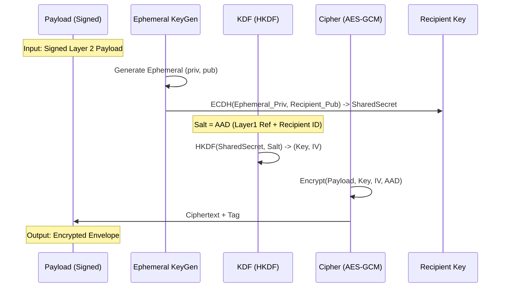
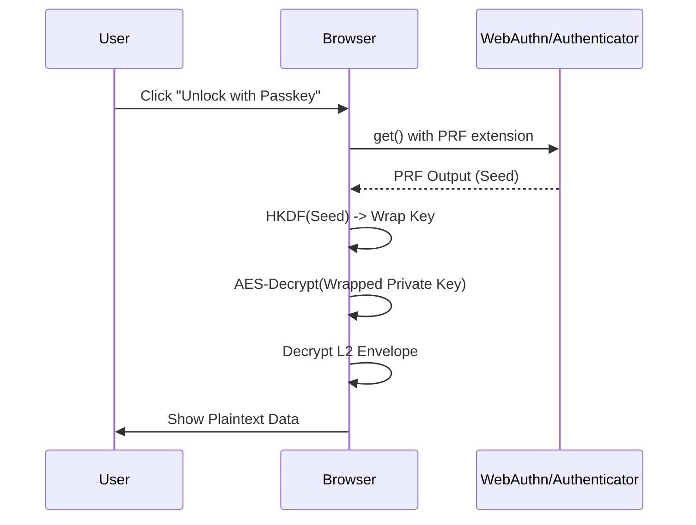

# Web/A Layer 2 Encryption Architecture
**Confidentiality and Privacy for Distributed Form Data**

## 1. Abstract
This report details the architectural design and implementation of **Layer 2 Encryption** for the Web/A protocol. Web/A Layer 2 Encryption provides end-to-end confidentiality for user responses (Layer 2) in a file-centric, serverless environment. By utilizing a Hybrid Public Key Encryption (HPKE)-like construction, it ensures that sensitive data is readable only by the intended recipient (Issuer/Aggregator), protecting it during transit and storage. The system supports a hybrid Post-Quantum Cryptography (PQC) mode and integrates with WebAuthn PRF for browser-native decryption.

## 2. Introduction
In the Web/A model, documents are self-contained artifacts. A "Form" (Layer 1) is a static file that users fill out to generate an "Answer" (Layer 2). Unlike traditional web forms that POST data to a specific server, Web/A answers can be transported via any channel (email, USB, IPFS, etc.).

This decoupled architecture necessitates a robust encryption mechanism that:
1.  **Protects Confidentiality**: Data must remain encrypted at rest and in transit.
2.  **Binds to Context**: Answers must be cryptographically bound to the specific question (Layer 1) to prevent splicing attacks.
3.  **Enables Offline Operations**: Decryption should be possible in offline environments (e.g., local browser, air-gapped aggregators).

## 3. Architecture Overview

Layer 2 Encryption acts as a wrapper around the standard signed Layer 2 payload.

```mermaid
flowchart LR
    User[User Input] --> Plain[L2 Plaintext]
    Plain --> Sign[Signer (Ed25519)]
    Sign --> Signed[L2 Payload\n(Signed)]
    Signed --> Encrypt[Encrypter\n(HPKE/X25519)]
    Encrypt --> Envelope[L2 Encrypted Envelope]
    
    subgraph Browser/Client
    User
    Plain
    Sign
    Signed
    Encrypt
    end
    
    Envelope --> Storage[Storage/Transport]
    Storage --> Decrypt[Decrypter]
    Decrypt --> Verify[Signature Verifier]
    Verify --> Data[Validated Data]

    subgraph Aggregator/Issuer
    Decrypt
    Verify
    Data
    end
```

### 3.1. Design Principles
*   **Identity Separation**: Signing (Authentication) and Encryption (Confidentiality) use different keys. Signing keys are user-controlled (ephemeral or persistent), while encryption keys are issuer-controlled.
*   **Hybrid Encryption**: We use a KEM (Key Encapsulation Mechanism) + DEM (Data Encapsulation Mechanism) approach, allowing efficient encryption of large payloads.
*   **Context Binding**: Using AEAD (Authenticated Encryption with Associated Data), we bind the encryption to the Layer 1 hash (`layer1_ref`), ensuring that an encrypted answer cannot be validly decrypted in the context of a different form.

## 4. Cryptographic Specifications

The protocol uses a suite inspired by **HPKE (RFC 9180)** but optimized for JSON/JavaScript environments.

| Component | Primitive | Notes |
| :--- | :--- | :--- |
| **Signing** | Ed25519 | For user authentication of the plaintext. |
| **KEM** | X25519 | Classical Diffie-Hellman (Curve25519). |
| **KEM (PQC)** | ML-KEM-768 | Optional hybrid extension (Kyber). |
| **KDF** | HKDF-SHA256 | Key Derivation Function. |
| **AEAD** | AES-256-GCM | Authenticated Encryption. |

### 4.1. Encryption Process



1.  **Input**: A signed `Layer2Payload` and a target `layer1_ref`.
2.  **AAD Construction**: A canonical JSON string binding the context:
    ```json
    {"layer1_ref": "...", "recipient": "...", "weba_version": "0.1"}
    ```
3.  **KEM**: Generate an ephemeral X25519 key pair. Compute shared secret with Recipient Public Key.
    *   *Hybrid PQC*: If enabled, also generate PQC encapsulation and concatenate shared secrets.
4.  **KDF**: Derive `key` (32 bytes) and `iv` (12 bytes) using HKDF-SHA256. The AAD is used as the salt.
5.  **AEAD**: Encrypt the payload using AES-256-GCM with the derived key, IV, and AAD.

### 4.2. Data Structures

#### Layer 2 Payload (Inner)
The plaintext data, signed by the user.

```typescript
type Layer2Payload = {
  layer2_plain: any; // The form data
  layer2_sig: {
    alg: "Ed25519";
    kid: string;     // e.g., "user#sig-1"
    sig: string;     // base64url encoded signature
    created_at: string;
  };
};
```

#### Layer 2 Encrypted Envelope (Outer)
The final artifact embedded in the HTML or JSON output.

```typescript
type Layer2Encrypted = {
  weba_version: string;
  layer1_ref: string; // Critical: binds to the form template
  layer2: {
    enc: "HPKE-v1";
    suite: {
      kem: "X25519" | "X25519+ML-KEM-768";
      kdf: "HKDF-SHA256";
      aead: "AES-256-GCM";
    };
    recipient: string; // Key ID of the recipient
    encapsulated: {
      classical: string; // base64url(ephemeral_pk)
      pqc?: string;      // base64url(kem_ct) [Optional]
    };
    ciphertext: string;  // base64url(aes_ct + auth_tag)
    aad: string;         // base64url(aad_json)
  };
  meta: {
    created_at: string;
    nonce: string;
    campaign_id?: string;
  };
};
```

## 5. Key Management & Hierarchy

To manage keys effectively across many campaigns and forms, Web/A employs a hierarchical key derivation scheme for organizations.

### 5.1. Organization Key Derivation
Instead of managing thousands of random key pairs, an organization maintains a single **SRN Instance Key**.

```mermaid
graph TD
    Instance[SRN Instance Key] -->|HKDF "org-root"| Root[Org Root Key]
    Root -->|HKDF "campaign+layer1"| Campaign[Campaign/Form Key]
    
    subgraph Per-Form
    Campaign --> Pub[Public Key (embedded in Form)]
    Campaign --> Priv[Private Key (used by Aggregator)]
    end
```

*   **SRN Instance Key**: The master secret for the server/node.
*   **Org Root Key**: Derived per organization ID. Allows multi-tenant isolation.
*   **Campaign/Form Key**: Derived for a specific campaign or form (`layer1_ref`).

This ensures that compromising a key for one form does not compromise past or future forms.

### 5.2. Aggregator Escrow
In the "Aggregator Escrow" model, the derived private key for a specific form is temporarily provided to the aggregator tool (browser-based or CLI). This allows authorized operators to batch-decrypt responses without needing access to the master root key.

## 6. Browser Integration & WebAuthn PRF

For individual recipients (e.g., a doctor receiving a patient form directly), we support **Browser-Only Decryption** using WebAuthn PRF (Pseudo-Random Function).

### 6.1. Key Wrapping Flow
1.  **Setup**: The recipient generates a persistent L2 encryption key pair.
2.  **Wrapping**: The private key is encrypted (wrapped) using a key derived from their Passkey (WebAuthn PRF).
3.  **Embedding**: The wrapped key is embedded in the Form HTML or the Aggregator HTML.



This enables a "smart document" experience where the file itself verifies the user's identity via biometric/security key before revealing its contents, without contacting any central server.

## 7. Security Considerations

### 7.1. Context Binding (Anti-Splicing)
A critical threat is an attacker taking an encrypted answer from Form A (e.g., "Sign up for Newsletter") and injecting it into Form B (e.g., "Authorize Transfer").
*   **Mitigation**: The `layer1_ref` (hash of the Form) is included in the **AAD**.
*   **Effect**: If the envelope is moved to a form with a different `layer1_ref`, the AEAD decryption will fail (Auth Tag mismatch) because the AAD verification fails.

### 7.2. Forward Secrecy
*   **Current State**: The scheme uses static recipient public keys. If the recipient's private key is compromised, past messages can be decrypted.
*   **Mitigation**: Use distinct keys per campaign (Key Derivation) and rotate keys frequently. The hierarchical derivation makes rotation cheap (no storage cost).

### 7.3. Post-Quantum Readiness
*   The hybrid mode (`X25519 + ML-KEM-768`) ensures that data harvested today cannot be decrypted by future quantum computers, provided the quantum computer cannot break SHA-256 (used in HKDF) or AES-256.

## 8. Current Implementation Status
*   **Core Logic**: Implemented in TypeScript (`src/core/l2crypto.ts`).
*   **Browser Support**: Verified in Chrome/Edge/Safari. PQC support requires a WASM polyfill (e.g., specific libraries).
*   **WebAuthn PRF**: Implemented but requires browser support (Chrome/Edge stable).
*   **CLI Tooling**: `weba-l2-crypto` CLI supports key generation and manual encryption/decryption.

## 9. Conclusion
Web/A Layer 2 Encryption provides a robust, flexible, and future-proof confidentiality layer for serverless forms. By leveraging standard primitives (HPKE, AES-GCM) and modern browser capabilities (WebAuthn PRF), it enables secure workflows ranging from personal medical forms to large-scale organizational surveys without centralized infrastructure dependency.