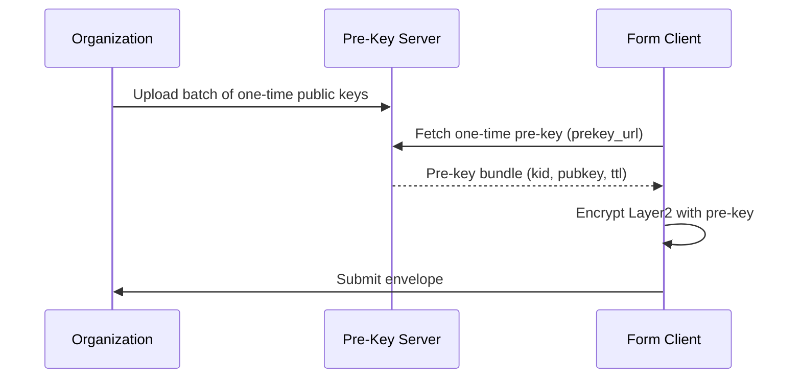

# Offline Pre-Key Server Plan (Draft)

This document describes the minimum viable design for an **Offline Pre-Key Server** that enables forward secrecy for Web/A Layer 2 encryption without requiring interactive sessions.

## 1. Goals
- Provide **one-time recipient public keys** for each encryption request.
- Preserve the **offline submission** experience for end users.
- Maintain **auditable metadata** without exposing plaintext.

## 2. Non-Goals
- Real-time chat style ratchets (Signal/Double Ratchet).
- Full anonymity against traffic analysis (handled separately).
- Client key escrow or centralized decryption services.

## 3. Design Overview



## 4. Key Material & Metadata

**Pre-Key Bundle (Response):**
```json
{
  "kid": "org#prekey-2025-12-29-000123",
  "x25519": "base64url-public-key",
  "pqc": "base64url-pqc-key",
  "expires_at": "2025-12-30T00:00:00Z",
  "issued_at": "2025-12-29T12:00:00Z"
}
```

**Properties**
- `kid`: Unique key identifier, one-time use.
- `x25519`: Classical pre-key.
- `pqc`: Optional ML-KEM public key for hybrid mode.
- `expires_at`: Short TTL to reduce key exposure.

## 5. Server Endpoints (Minimal)

- `POST /v1/prekeys/{org_id}`
  - Upload a batch of pre-keys (authenticated).
- `GET /v1/prekeys/{org_id}?count=1`
  - Fetch one-time pre-keys for encryption.
- `DELETE /v1/prekeys/{org_id}/{kid}`
  - Optional cleanup or revocation.

## 6. Security Requirements
- **One-Time Use**: Keys are invalidated after first delivery.
- **Rate Limiting**: Prevent bulk scraping of pre-keys.
- **Authentication**: Pre-key upload requires org credentials.
- **Audit Log**: Store `kid`, timestamp, org_id, and requester metadata (no payloads).

## 7. Operational Model
- **Key Generation**: Generated offline by the organization and uploaded as a batch.
- **Rotation**: Continuous replenishment (daily or hourly) with limited TTL.
- **Failure Mode**: If no pre-keys remain, client falls back to static recipient keys and logs a warning.

## 8. Client Integration
- The form includes `prekey_url` in its L2 config.
- The client fetches one pre-key at submission time.
- The returned `kid` is embedded in the Layer 2 envelope metadata.

## 9. Roadmap
- Phase 1: Stateless HTTP service + basic auth + JSON store.
- Phase 2: Signed pre-key bundles + replay-safe issuance.
- Phase 3: Privacy-preserving request logs + anomaly detection.

## 10. Related Documents
- [Web/A L2 Encryption](./web-a-l2-encryption.html)
- [Security Audit v2](./web-a-l2-security-audit-v2.html)
- [Remediation Report (Response to v2)](./web-a-l2-security-remediation-report.html)
- [Security Re-Assessment v3](./web-a-l2-security-audit-v3.html)
