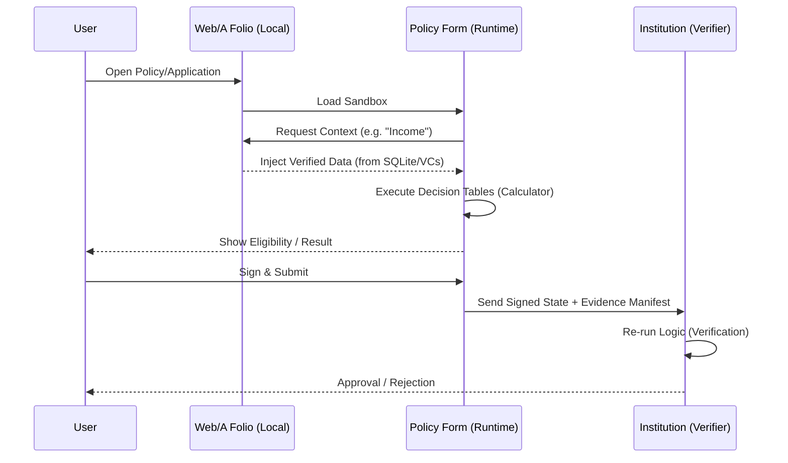

> **The Document IS the Rule.**

In the Web/A ecosystem, a form is not just a passive data collector. It is an active, deterministic agent capable of verifying eligibility, calculating benefits, and binding evidence.

This paper outlines the **"Policy-as-Form"** concept: an architecture where legal or institutional policies are encoded directly into Markdown-based forms, making them executable by the **Web/A Runtime** and interoperable with the **Web/A Folio**.

## 1. The Core Philosophy: Grounded Intelligence

While AI Agents provide the "intelligence" to navigate complex systems, the **final adjudication must be deterministic**. 

1.  **Human-Readable**: Policies are expressed as Markdown tables and prose.
2.  **Machine-Extractable**: Rules are automatically parsed into a JavaScript-based execution tree.
3.  **User-Sovereign**: All matching and calculation happen in the user's local sandbox (Folio/Browser), preventing data leakage to institutional servers during the "discovery" phase.

## 2. Table-Driven Logic (The Adjudicator)

Instead of complex `if-else` blocks, Web/A uses **Decision Tables**. This aligns with how human administrators often read policy handbooks.

### Example: Subsidy Eligibility
```markdown
| Annual Income (Max) | Residents | Subsidy Amount |
| :---                | :---      | :---           |
| 2,000,000           | 1         | 50,000         |
| 4,000,000           | 2+        | 100,000        |
| -                   | -         | 0              |

[number:amount (formula="LOOKUP_TABLE(income, 'Subsidy Eligibility')")]
```

*   **Runtime Action**: The `Calculator` converts this table into a JSON lookup. 
*   **Auditability**: To verify the result, an auditor simply looks at the rendered table in the document.

## 3. Contextual Data Injection (The Bridge)

Web/A Folio acts as the data provider. The form "asks" the Folio for specific evidence through declarative mapping.

### Semantic Mapping
Instead of writing database queries, the document author defines a **Target Schema**.

```markdown
- Major: [text:major (suggest="certificates:DegreeCredential.major")]
```

*   **Folio Action**: The Folio CLI/Web-App sees the `suggest` attribute and retrieves the corresponding value from the user's local SQLite index.
*   **Result**: The field is pre-filled. If the value comes from a signed Verifiable Credential (VC), the field is marked as **Verified**.

## 4. The Validation Sandbox (Zero-Knowledge Discovery)

A "Policy-as-Form" document can be used as a **Simulator**.

1.  A user downloads a "vague" policy form (e.g., "Child Support Eligibility").
2.  The Folio "fills" the form in an ephemeral sandbox.
3.  The Runtime executes all formulas and validations.
4.  The user sees the results (e.g., "You are eligible for $200") **before** any data is sent to the government.

This turns every Web/A form into a private API for policy matching.

## 5. Evidence Chaining & Integrity

When a "Policy-as-Form" is submitted, it includes an **Adjudication Manifest**.

*   **Binding**: The calculated values are bound to the source data (e.g., "Field `income` was derived from hash `0xabc...` of the 2024 Tax Return").
*   **Signatures**: The entire "State" (Inputs + Calculated Results + Manifest) is signed by the user.
*   **Verification**: The receiver (e.g., a government agency) re-runs the same logic on the submitted inputs. If the results match and the evidence hashes are valid, the application is processed automatically.

## 6. The Role of AI: The Synthesizer

In this model, the AI Agent does not "decide" the outcome. Instead, it:
1.  **Discovers**: Finds the most relevant "Policy-as-Form" based on user context.
2.  **Maps**: Suggests which Folio records satisfy the form's requirements.
3.  **Explains**: Translates the deterministic result (e.g., "Rejected") back into natural language for the user, referencing the specific table rows that caused the rejection.

## 7. Architecture Diagram



## 8. Security and Anti-Tampering

A critical challenge is ensuring the embedded logic (Decision Tables and Formulas) is not tampered with by the user to force a "Qualified" result.

1.  **Template Binding**: The form template itself is hashed. The submission must include the hash of the template.
2.  **Server-Side Re-execution**: Because the logic is deterministic and self-contained, the receiving institution **re-runs the logic** using the same Runtime. Any discrepancy between the user's claimed result and the server's calculation is flagged as fraud.
3.  **Audit Trail**: The `Adjudication Manifest` provides a step-by-step trace of how the results were derived, signed by the user's keys.

## 9. Comparison with Traditional Architectures

| Feature | Legacy Rules Engine (e.g., OpenFisca) | Web/A Policy-as-Form |
| :--- | :--- | :--- |
| **Execution** | Server-side / API | Local Browser / Folio |
| **Privacy** | Data sent to server for "checks" | Checks occur offline/privately |
| **Logic** | Proprietary Python/Ruby code | Human-readable Markdown tables |
| **Proof** | Database record | Signed, self-contained document |
| **Scale** | Centralized bottleneck | Infinite edge-side scaling |

## 10. Future Outlook: The "Automated Ombudsman"

As policies become more complex, the combination of **Policy-as-Form** and **AI Agents** creates an "Automated Ombudsman" that helps citizens navigate their rights without disclosing personal data to the state until they are certain of their eligibility.

## 12. Developer Experience & Debugging

As forms become applications, debugging tools are essential to verify "Why did this result occur?".

1.  **Logic Inspector**: An overlay mode in the browser where hovering over a calculated field reveals the formula execution tree (e.g., `LookUp(4500000, 'Tax') -> Result: 20%`).
2.  **Table Tracer**: In debug mode, the specific row of a markdown table that matches the current input is visually highlighted. This allows authors to instantly verify if their decision logic is triggering correctly.
3.  **Context Simulator**: A panel to inject mock Folio data (e.g., "Persona A: Annual Income $30k") to test the form behaves correctly for different user scenarios without needing physical credentials.

## Appendix: Draft Syntax Specification

### A. Decision Table Lookup
```markdown
[number:result (formula="LOOKUP_TABLE(input_var, 'Table Name')")]
```
*   `input_var`: The scalar value to match against the first column.
*   `Table Name`: Exact string match of the Markdown table header (or preceding heading).

### B. Boolean Logic
```markdown
[checkbox:is_eligible (formula="age >= 18 && income < 3000000")]
```
*   Supported operators: `==`, `!=`, `<`, `>`, `<=`, `>=`, `&&`, `||`, `!`.

### C. Folio Suggestion
```markdown
[text:target_field (suggest="context:SchemaType.path")]
```
*   `context`: Namespace (e.g., `certificates`, `history`, `profile`).
*   `SchemaType`: The JSON-LD Type (e.g., `VerifiableCredential`, `Person`).
*   `path`: Dot-notation path to the property (e.g., `credentialSubject.degree.name`).
