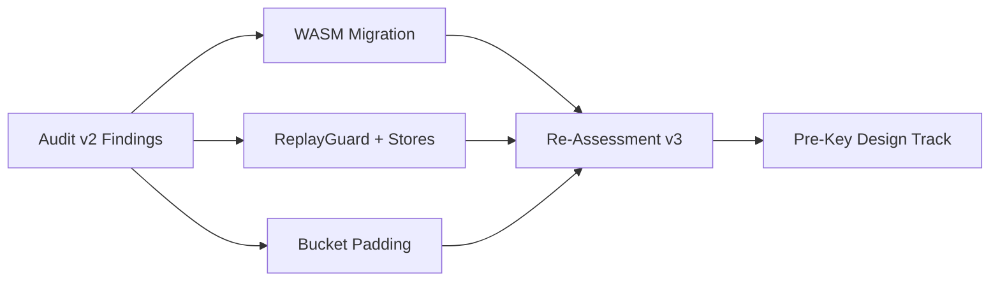
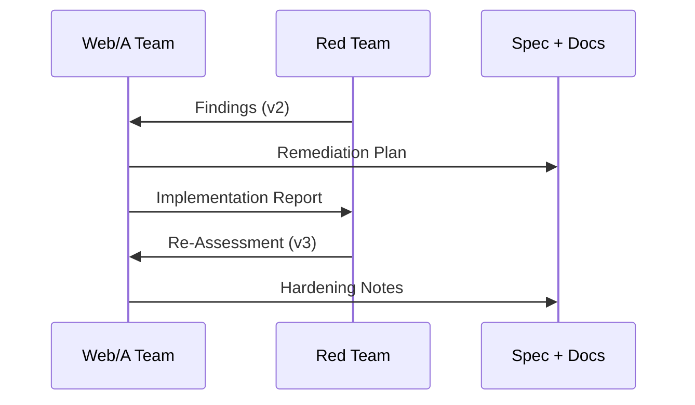
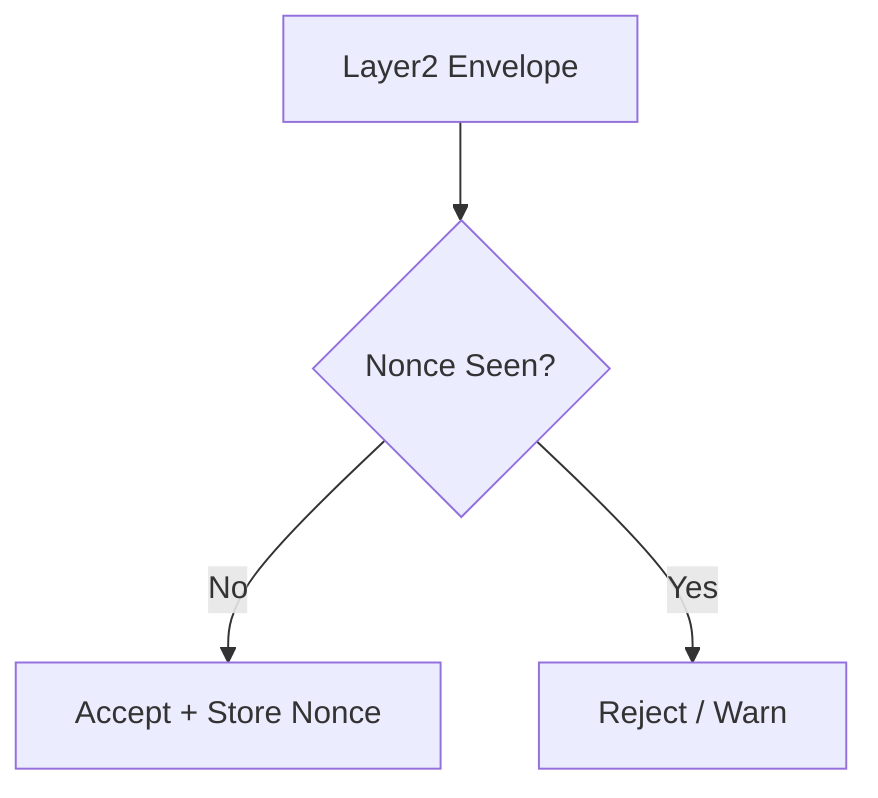

SORANE

<h1>Web/A Security Improvements</h1>

技術者向け: 改善施策とレッドチームによる対話的な強化プロセス

---

Scope

<h2>今日の目的</h2>

<ul>
  <li>セキュリティ改善の<strong>設計判断</strong>と<strong>実装の軌跡</strong>を共有する</li>
  <li>レッドチームとの<strong>往復型のレビュー</strong>を再現可能な形で示す</li>
  <li>関連ホワイトペーパーを<strong>読みたくなる導線</strong>を用意する</li>
</ul>

---

<h2>Security Posture: From High Risk to Medium-High</h2>
<ul>
  <li>WASM移行により<strong>実行環境の揺らぎ</strong>を抑制</li>
  <li>Replay防止は<strong>実装済み</strong>、運用設計で<strong>必須化</strong>を推進</li>
  <li>Forward Secrecyは<strong>課題として明示</strong>し、Pre-Key構想へ</li>
</ul>

---

<h2>Threat Model Summary</h2>
<ul>
  <li>Browser XSS / Extension</li>
  <li>Replay attacks (stateless transport)</li>
  <li>Traffic analysis</li>
  <li>Key compromise (long-term)</li>
</ul>

<svg width="520" height="340" viewBox="0 0 520 340" fill="none" xmlns="http://www.w3.org/2000/svg" role="img" aria-labelledby="threat-title threat-desc" style="max-width: 100%; height: auto; border: 1px solid #e2e8f0; border-radius: 8px; background: #fff;">
  <title id="threat-title">Threat Model Map</title>
  <desc id="threat-desc">A map of threats around Web/A L2 Encryption: browser layer, network layer, storage layer, and key management.</desc>
  <rect x="20" y="20" width="480" height="300" rx="12" fill="#F8FAFC" stroke="#E2E8F0"/>
  <rect x="50" y="60" width="180" height="70" rx="8" fill="#FEF3C7" stroke="#F59E0B"/>
  <text x="70" y="90" font-family="system-ui" font-size="12" font-weight="700" fill="#92400E">Browser / Client</text>
  <text x="70" y="110" font-family="system-ui" font-size="11" fill="#92400E">XSS, Extension, UI Spoofing</text>

  <rect x="290" y="60" width="180" height="70" rx="8" fill="#E0F2FE" stroke="#38BDF8"/>
  <text x="310" y="90" font-family="system-ui" font-size="12" font-weight="700" fill="#0C4A6E">Network</text>
  <text x="310" y="110" font-family="system-ui" font-size="11" fill="#0C4A6E">Traffic Analysis, Replay</text>

  <rect x="50" y="180" width="180" height="70" rx="8" fill="#EDE9FE" stroke="#8B5CF6"/>
  <text x="70" y="210" font-family="system-ui" font-size="12" font-weight="700" fill="#5B21B6">Storage</text>
  <text x="70" y="230" font-family="system-ui" font-size="11" fill="#5B21B6">Nonce reuse, data leakage</text>

  <rect x="290" y="180" width="180" height="70" rx="8" fill="#ECFDF5" stroke="#10B981"/>
  <text x="310" y="210" font-family="system-ui" font-size="12" font-weight="700" fill="#047857">Key Management</text>
  <text x="310" y="230" font-family="system-ui" font-size="11" fill="#047857">Static key compromise</text>

  <path d="M230 95H290" stroke="#94A3B8" stroke-width="2" marker-end="url(#arrow-gray)"/>
  <path d="M230 215H290" stroke="#94A3B8" stroke-width="2" marker-end="url(#arrow-gray)"/>
  <defs>
    <marker id="arrow-gray" markerWidth="10" markerHeight="10" refX="9" refY="3" orient="auto" markerUnits="strokeWidth">
      <path d="M0,0 L0,6 L9,3 z" fill="#94A3B8"/>
    </marker>
  </defs>
</svg>

---

Implementation Track

<h2>Remediation Timeline</h2>

---

Red Teaming

<h2>Dialog-Driven Hardening</h2>

<ul>
  <li>Auditの指摘を<strong>仕様</strong>と<strong>実装</strong>に反映</li>
  <li>改善報告 → 再評価 → 追加要求の<strong>反復</strong></li>
  <li>「安全なデフォルト」を<strong>設計原則</strong>として定着</li>
</ul>

---

<h2>WASM Migration (Core Crypto)</h2>
<ul>
  <li>Ed25519 / X25519 / ML-KEM / AES-GCM をRust/WASMへ</li>
  <li>JS JITのタイミング差異を<strong>低減</strong></li>
  <li>TS側は<strong>バインディング層の安全性</strong>が焦点</li>
</ul>

---

<h2>Replay Protection</h2>
<ul>
  <li>Nonceによる再送検知を<strong>標準機能</strong>に</li>
  <li>CLI: JsonFileReplayStore</li>
  <li>Browser: LocalStorageReplayStore</li>
</ul>

---

<h2>Forward Secrecy: Design Track</h2>
<ul>
  <li>静的公開鍵のみでは<strong>後方秘匿性</strong>が不足</li>
  <li>Pre-Keyサーバーで<strong>一回限りの公開鍵</strong>を配布</li>
  <li>フォーム側は<strong>prekey_url</strong>を指定</li>
</ul>

---

Client Safety

<h2>Draft State Preservation</h2>

<ul>
  <li>ドラフトHTMLに<strong>作業状態</strong>を埋め込み</li>
  <li>ローカルキャッシュ消去後でも復元可能</li>
  <li>ファイルは<strong>機密扱い</strong>として運用</li>
</ul>

---

Evidence

<h2>Linked Whitepapers</h2>

<ul>
  <li><a href="./papers/web-a-l2-encryption.html">Web/A L2 Encryption</a></li>
  <li><a href="./papers/web-a-l2-security-audit-v2.html">Security Audit v2</a></li>
  <li><a href="./papers/web-a-l2-security-remediation-report.html">Remediation Report</a></li>
  <li><a href="./papers/web-a-l2-security-audit-v3.html">Re-Assessment v3</a></li>
  <li><a href="./papers/web-a-l2-market-comparison.html">Market Comparison</a></li>
</ul>

---

<h2>Next Steps</h2>
<ul>
  <li>Pre-Keyインフラの設計と最小PoC</li>
  <li>Replay検証の<strong>必須化</strong>と警告強化</li>
  <li>WASMバインディングの第三者レビュー</li>
</ul>

