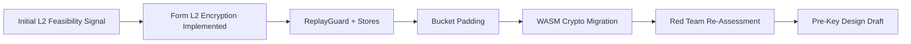
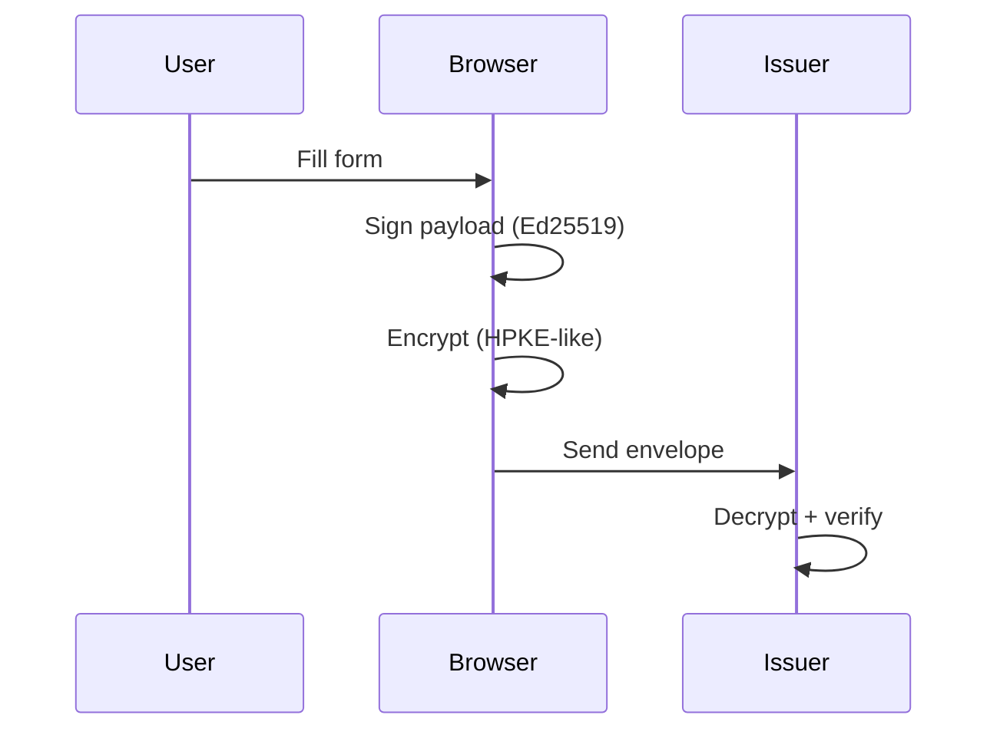
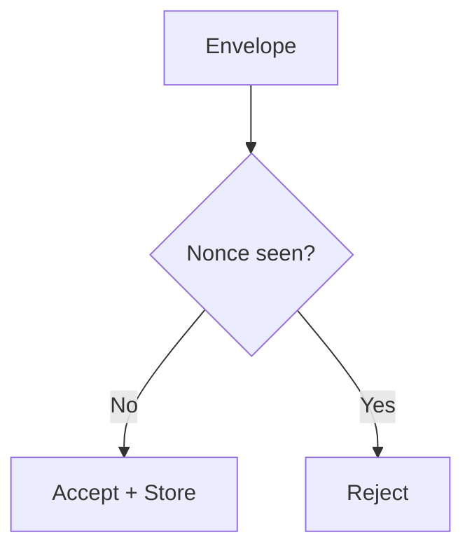
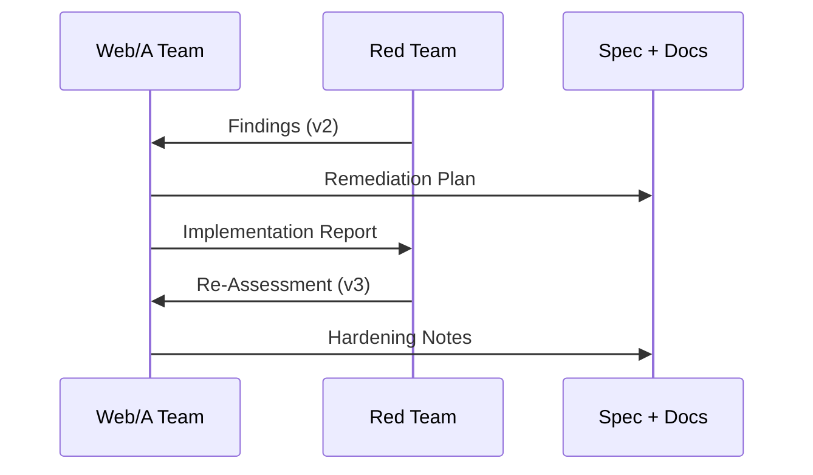

SORANE

<h1>Web/A Security & Verifiability</h1>

Two-week engineering deep dive: verification, security model, and form encryption.

---

Session Map

<h2>What We Cover (60 minutes)</h2>

<ul>
  <li>SRN verifiability model and Human-Machine Parity</li>
  <li>Threat model and security posture evolution</li>
  <li>Web/A Form: Layer 1, Layer 2, Layer 3</li>
  <li>L2 encryption design, padding, replay protection</li>
  <li>Red Team feedback loop and remaining gaps</li>
</ul>

---

<h2>Why We Built SRN</h2>
<ul>
  <li>Precision typography is a security problem: layout must be verifiable</li>
  <li>Documents should be readable <strong>and</strong> provable for decades</li>
  <li>Encryption must work without server lock-in</li>
</ul>

---

Verifiability

<h2>Human-Machine Parity (HMP)</h2>

<ul>
  <li>Human-readable HTML + machine-readable JSON-LD are bound</li>
  <li>Signatures guarantee both views describe the same artifact</li>
  <li>Verification is built into every generated document</li>
</ul>

---

<h2>Three-Layer Model</h2>
<ul>
  <li><strong>Layer 1</strong>: issuer-signed template</li>
  <li><strong>Layer 2</strong>: user answers + encryption</li>
  <li><strong>Layer 3</strong>: presentation and layout</li>
</ul>

<svg width="560" height="380" viewBox="0 0 560 380" fill="none" xmlns="http://www.w3.org/2000/svg" role="img" aria-labelledby="layer-title layer-desc" style="max-width: 100%; height: auto; border: 1px solid #e2e8f0; border-radius: 8px; background: #fff;">
  <title id="layer-title">Web/A Layers</title>
  <desc id="layer-desc">A Web/A document with three layers: presentation, encrypted user payload, and issuer-signed core.</desc>
  <rect x="30" y="30" width="500" height="320" rx="12" fill="#F8FAFC" stroke="#E2E8F0"/>
  <rect x="60" y="60" width="440" height="70" rx="8" fill="#E2E8F0" stroke="#94A3B8"/>
  <text x="80" y="95" font-family="system-ui" font-size="13" font-weight="700" fill="#334155">Layer 3: Presentation</text>
  <rect x="60" y="150" width="440" height="80" rx="8" fill="#ECFDF5" stroke="#10B981"/>
  <text x="80" y="185" font-family="system-ui" font-size="13" font-weight="700" fill="#047857">Layer 2: User Payload (Encrypted)</text>
  <rect x="60" y="250" width="440" height="70" rx="8" fill="#EEF2FF" stroke="#6366F1"/>
  <text x="80" y="285" font-family="system-ui" font-size="13" font-weight="700" fill="#4338CA">Layer 1: Issuer Signed Core</text>
</svg>

---

Threat Model

<h2>Security Assumptions</h2>

<ul>
  <li>Browsers are hostile by default (XSS, extensions)</li>
  <li>Transport is observable (timing + size metadata)</li>
  <li>Recipient key compromise is possible over time</li>
</ul>

---

Two Weeks Timeline

<h2>From Concept to Hardened Pipeline</h2>

---

<h2>Web/A Form Security Highlights</h2>
<ul>
  <li>Layer 1 template is signed and hash-bound</li>
  <li>Layer 2 payload uses Ed25519 signature</li>
  <li>Encryption binds AAD to layer1_ref</li>
</ul>

---

Encryption

<h2>L2 Envelope Lifecycle</h2>

---

<h2>Replay Protection</h2>
<ul>
  <li>Nonce is stored and checked per envelope</li>
  <li>CLI: JsonFileReplayStore</li>
  <li>Browser: LocalStorageReplayStore</li>
</ul>

---

<h2>Traffic Analysis Mitigation</h2>
<ul>
  <li>Bucket padding (1KB / 4KB / 16KB / ...)</li>
  <li>Obscures payload size class</li>
  <li>Decoy traffic planned for high-sensitivity cases</li>
</ul>

---

<h2>WASM Crypto Migration</h2>
<ul>
  <li>Ed25519 / X25519 / ML-KEM / AES-GCM in Rust/WASM</li>
  <li>Reduces timing variance across JS engines</li>
  <li>Binding layer is now the main review focus</li>
</ul>

---

Forward Secrecy

<h2>Pre-Key Infrastructure Draft</h2>

<ul>
  <li>One-time recipient keys via prekey_url</li>
  <li>Offline submission preserved</li>
  <li>Fallback to static keys with warnings</li>
</ul>

---

Client Safety

<h2>Draft State Preservation</h2>

<ul>
  <li>Draft HTML embeds working state</li>
  <li>Restore across devices or after cache clears</li>
  <li>Draft files treated as sensitive artifacts</li>
</ul>

---

Red Teaming

<h2>Iterative Feedback Loop</h2>

<ul>
  <li>Audit v2 findings became a concrete plan</li>
  <li>Remediation report + re-assessment v3</li>
  <li>Unresolved gaps explicitly documented</li>
</ul>

---

Evidence

<h2>Key Papers</h2>

<ul>
  <li><a href="./papers/web-a-l2-encryption.html">Web/A L2 Encryption</a></li>
  <li><a href="./papers/web-a-l2-security-audit-v2.html">Security Audit v2</a></li>
  <li><a href="./papers/web-a-l2-security-remediation-report.html">Remediation Report</a></li>
  <li><a href="./papers/web-a-l2-security-audit-v3.html">Re-Assessment v3</a></li>
  <li><a href="./papers/web-a-l2-prekey-server-plan.html">Pre-Key Server Plan</a></li>
</ul>

---

<h2>Open Gaps (Transparent)</h2>
<ul>
  <li>Mandatory replay checks at API boundary</li>
  <li>Formal review of WASM bindings</li>
  <li>Decoy traffic strategy</li>
</ul>

---

<h2>Next Steps</h2>
<ul>
  <li>Pre-Key server PoC + test harness</li>
  <li>Secure-by-default replay enforcement</li>
  <li>Publish CSP/SRI templates for deployments</li>
</ul>

