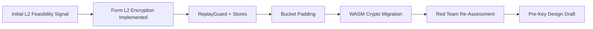
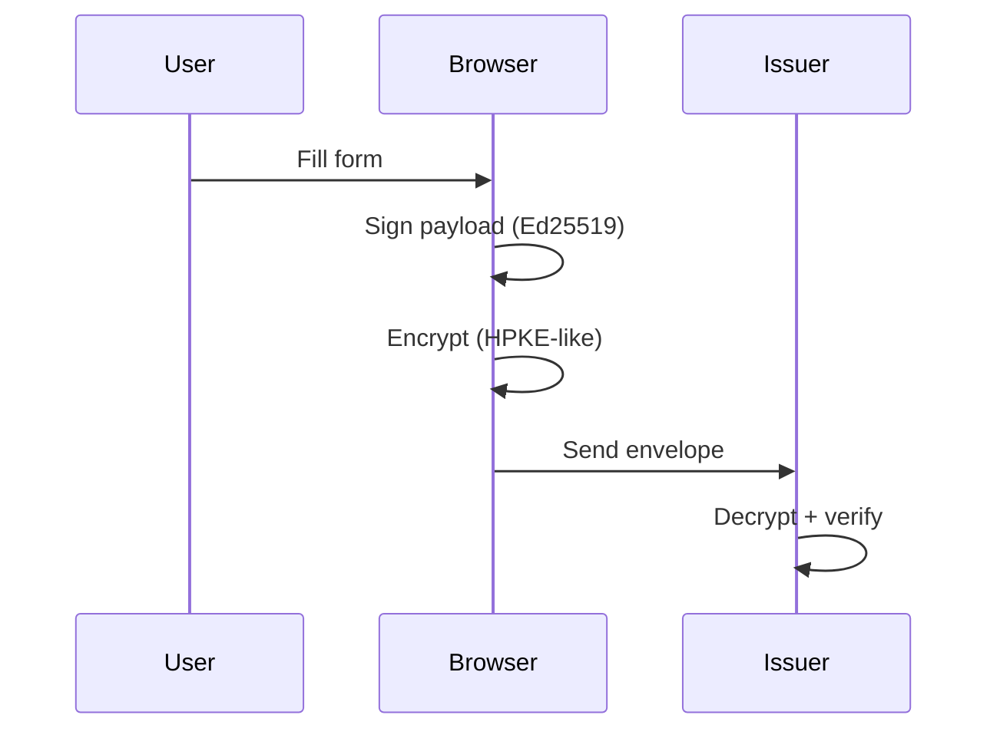
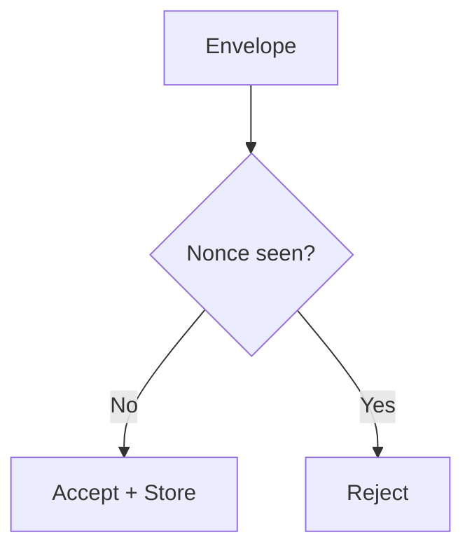
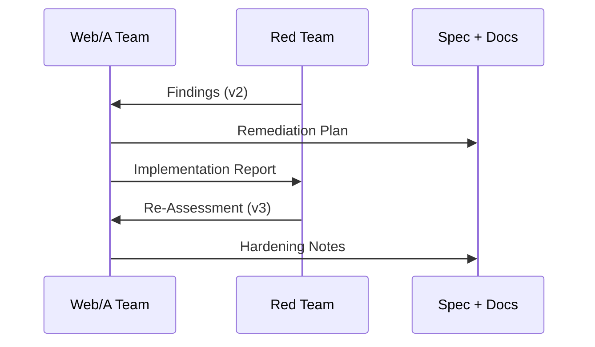

SORANE

<h1>Web/A Security & Verifiability</h1>

Two-week engineering deep dive: verification, security model, and form encryption.

---

Session Map

<h2>What We Cover (60 minutes)</h2>

<ul>
  <li>SRN verifiability model and Human-Machine Parity</li>
  <li>Threat model and security posture evolution</li>
  <li>Web/A Form: Layer 1, Layer 2, Layer 3</li>
  <li>L2 encryption design, padding, replay protection</li>
  <li>Red Team feedback loop and remaining gaps</li>
</ul>

---

Context

<h2>What Is Sorane?</h2>

<ul>
  <li>An open-source reference implementation for <strong>verifiable web documents</strong></li>
  <li>Focused on <strong>long-term readability</strong> and <strong>cryptographic trust</strong></li>
  <li>Designed for public-sector workflows where PDFs fall short</li>
</ul>

---

<h2>Web/A: The Core Concept</h2>
<ul>
  <li>Single-file HTML as the delivery format</li>
  <li>Human + machine views bound by signatures</li>
  <li>Portable, auditable, and future-proof</li>
</ul>

---

Whitepapers

<h2>What the Papers Cover</h2>

<ul>
  <li><strong>Web/A</strong>: archival web documents and HMP model</li>
  <li><strong>Web/A Form</strong>: interactive, verifiable forms</li>
  <li><strong>L2 Encryption</strong>: confidentiality for submitted data</li>
  <li><strong>Security Audits</strong>: red-team findings and remediation</li>
</ul>

---

<h2>Why Web/A Instead of PDF</h2>
<ul>
  <li>PDF is readable but hard to verify at scale</li>
  <li>Web is flexible but lacks built-in authenticity</li>
  <li>Web/A combines both with a signed, portable artifact</li>
</ul>

---

<h2>Why We Built SRN</h2>
<ul>
  <li>Precision typography is a security problem: layout must be verifiable</li>
  <li>Documents should be readable <strong>and</strong> provable for decades</li>
  <li>Encryption must work without server lock-in</li>
</ul>

---

Verifiability

<h2>Human-Machine Parity (HMP)</h2>

<ul>
  <li>Human-readable HTML + machine-readable JSON-LD are bound</li>
  <li>Signatures guarantee both views describe the same artifact</li>
  <li>Verification is built into every generated document</li>
</ul>

---

<h2>Three-Layer Model</h2>
<ul>
  <li><strong>Layer 1</strong>: issuer-signed template</li>
  <li><strong>Layer 2</strong>: user answers + encryption</li>
  <li><strong>Layer 3</strong>: presentation and layout</li>
</ul>

<svg width="600" height="460" viewBox="0 0 600 460" fill="none" xmlns="http://www.w3.org/2000/svg" style="max-width: 100%; height: auto; border: 1px solid #e2e8f0; border-radius: 8px; background: #fff;">
  <defs>
    <marker id="arrow" markerWidth="10" markerHeight="10" refX="9" refY="3" orient="auto" markerUnits="strokeWidth">
      <path d="M0,0 L0,6 L9,3 z" fill="#10B981" />
    </marker>
    <marker id="arrow-blue" markerWidth="10" markerHeight="10" refX="9" refY="3" orient="auto" markerUnits="strokeWidth">
      <path d="M0,0 L0,6 L9,3 z" fill="#6366F1" />
    </marker>
  </defs>
  <rect width="600" height="460" fill="#F8FAFC"/>
  <rect x="40" y="30" width="520" height="400" rx="12" fill="white" stroke="#E2E8F0" stroke-width="2"/>
  <text x="60" y="55" font-family="system-ui" font-size="14" font-weight="700" fill="#64748B">Web/A Document (.html)</text>

  <!-- Layer 3: Presentation -->
  <rect x="60" y="70" width="480" height="50" rx="6" fill="#F1F5F9" stroke="#CBD5E1" stroke-dasharray="4 4"/>
  <text x="75" y="95" font-family="system-ui" font-size="13" font-weight="700" fill="#475569">Layer 3: Portable Presentation (View)</text>
  <text x="75" y="110" font-family="system-ui" font-size="10" fill="#64748B">CSS, Fonts (Replaceable for Future Compatibility)</text>

  <!-- Layer 2: User Signed -->
  <rect x="60" y="130" width="480" height="80" rx="6" fill="#ECFDF5" stroke="#10B981" stroke-width="2"/>
  <text x="75" y="155" font-family="system-ui" font-size="13" font-weight="700" fill="#047857">Layer 2: User-Signed Context (Input/Fact)</text>
  <text x="75" y="175" font-family="system-ui" font-size="11" fill="#065F46">User Answers / Agreement</text>
  <text x="75" y="190" font-family="system-ui" font-size="11" fill="#065F46">Passkey Signature (VP)</text>
  <!-- Link to Layer 1 -->
  <path d="M300 210V220" stroke="#10B981" stroke-width="2" marker-end="url(#arrow)"/>

  <!-- Layer 1: Issuer Signed -->
  <rect x="60" y="220" width="480" height="150" rx="6" fill="#EEF2FF" stroke="#6366F1" stroke-width="2"/>
  <text x="75" y="245" font-family="system-ui" font-size="13" font-weight="700" fill="#4338CA">Layer 1: Issuer-Signed Core (Template/Law)</text>

  <rect x="80" y="260" width="200" height="60" rx="4" fill="white" stroke="#6366F1"/>
  <text x="90" y="280" font-family="system-ui" font-size="12" font-weight="700" fill="#4338CA">Human Readable</text>
  <text x="90" y="300" font-family="system-ui" font-size="11" fill="#64748B">HTML / Questions</text>

  <!-- Semantic Mapping -->
  <path d="M280 290H320" stroke="#6366F1" stroke-width="1.5" stroke-dasharray="3 3" marker-end="url(#arrow-blue)" marker-start="url(#arrow-blue)"/>
  <text x="300" y="285" font-family="system-ui" font-size="9" fill="#6366F1" text-anchor="middle" font-weight="bold">Mapping</text>

  <rect x="320" y="260" width="200" height="60" rx="4" fill="white" stroke="#6366F1"/>
  <text x="330" y="280" font-family="system-ui" font-size="12" font-weight="700" fill="#4338CA">Machine Readable</text>
  <text x="330" y="300" font-family="system-ui" font-size="11" fill="#64748B">JSON-LD / Logic</text>

  <rect x="80" y="330" width="440" height="25" rx="4" fill="#6366F1" fill-opacity="0.1"/>
  <text x="300" y="347" font-family="system-ui" font-size="11" font-weight="700" fill="#4338CA" text-anchor="middle">Issuer Signature: Ed25519 + PQC</text>
</svg>

---

Threat Model

<h2>Security Assumptions</h2>

<ul>
  <li>Browsers are hostile by default (XSS, extensions)</li>
  <li>Transport is observable (timing + size metadata)</li>
  <li>Recipient key compromise is possible over time</li>
</ul>

---

Two Weeks Timeline

<h2>From Concept to Hardened Pipeline</h2>

---

<h2>Web/A Form Security Highlights</h2>
<ul>
  <li>Layer 1 template is signed and hash-bound</li>
  <li>Layer 2 payload uses Ed25519 signature</li>
  <li>Encryption binds AAD to layer1_ref</li>
</ul>

---

Encryption

<h2>L2 Envelope Lifecycle</h2>

---

<h2>Replay Protection</h2>
<ul>
  <li>Nonce is stored and checked per envelope</li>
  <li>CLI: JsonFileReplayStore</li>
  <li>Browser: LocalStorageReplayStore</li>
</ul>

---

<h2>Traffic Analysis Mitigation</h2>
<ul>
  <li>Bucket padding (1KB / 4KB / 16KB / ...)</li>
  <li>Obscures payload size class</li>
  <li>Decoy traffic planned for high-sensitivity cases</li>
</ul>

---

<h2>WASM Crypto Migration</h2>
<ul>
  <li>Ed25519 / X25519 / ML-KEM / AES-GCM in Rust/WASM</li>
  <li>Reduces timing variance across JS engines</li>
  <li>Binding layer is now the main review focus</li>
</ul>

---

Forward Secrecy

<h2>Pre-Key Infrastructure Draft</h2>

<ul>
  <li>One-time recipient keys via prekey_url</li>
  <li>Offline submission preserved</li>
  <li>Fallback to static keys with warnings</li>
</ul>

---

Client Safety

<h2>Draft State Preservation</h2>

<ul>
  <li>Draft HTML embeds working state</li>
  <li>Restore across devices or after cache clears</li>
  <li>Draft files treated as sensitive artifacts</li>
</ul>

---

Red Teaming

<h2>Iterative Feedback Loop</h2>

<ul>
  <li>Audit v2 findings became a concrete plan</li>
  <li>Remediation report + re-assessment v3</li>
  <li>Unresolved gaps explicitly documented</li>
</ul>

---

Evidence

<h2>Key Papers</h2>

<ul>
  <li><a href="./papers/web-a-l2-encryption.html">Web/A L2 Encryption</a></li>
  <li><a href="./papers/web-a-l2-security-audit-v2.html">Security Audit v2</a></li>
  <li><a href="./papers/web-a-l2-security-remediation-report.html">Remediation Report</a></li>
  <li><a href="./papers/web-a-l2-security-audit-v3.html">Re-Assessment v3</a></li>
  <li><a href="./papers/web-a-l2-prekey-server-plan.html">Pre-Key Server Plan</a></li>
</ul>

---

<h2>Open Gaps (Transparent)</h2>
<ul>
  <li>Mandatory replay checks at API boundary</li>
  <li>Formal review of WASM bindings</li>
  <li>Decoy traffic strategy</li>
</ul>

---

<h2>Next Steps</h2>
<ul>
  <li>Pre-Key server PoC + test harness</li>
  <li>Secure-by-default replay enforcement</li>
  <li>Publish CSP/SRI templates for deployments</li>
</ul>

