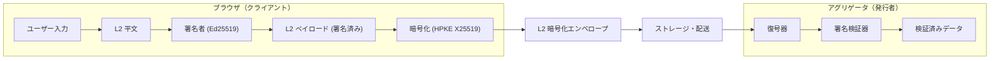
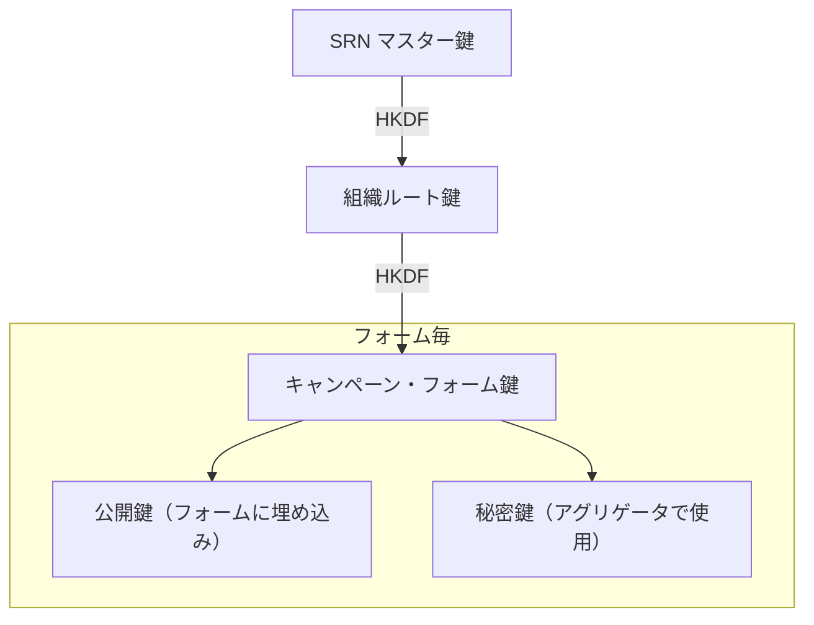
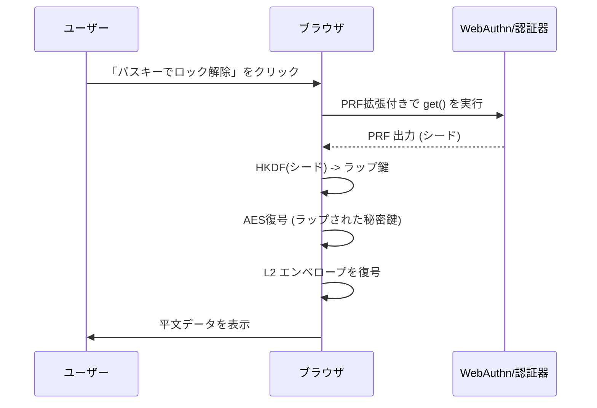
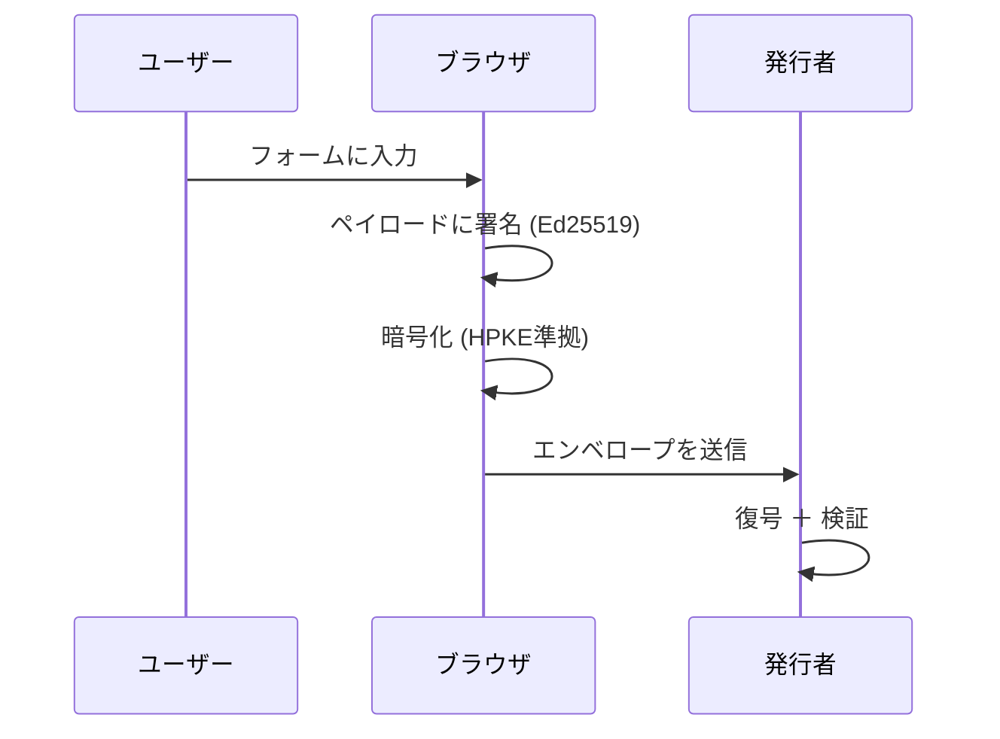
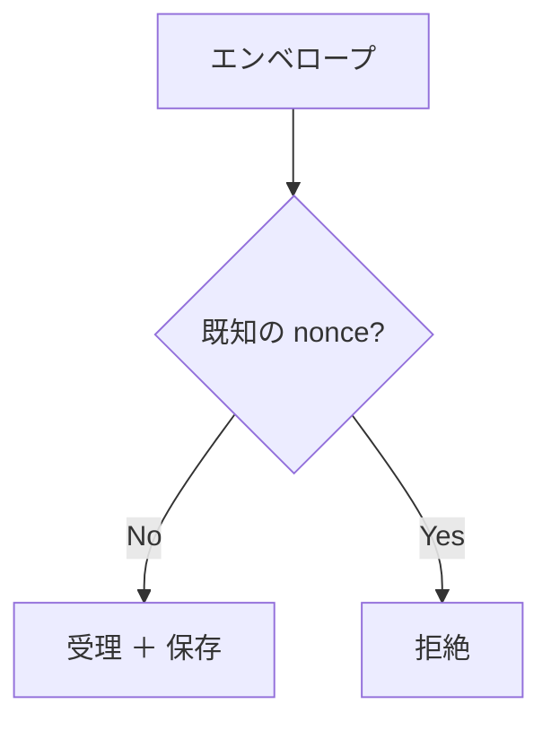
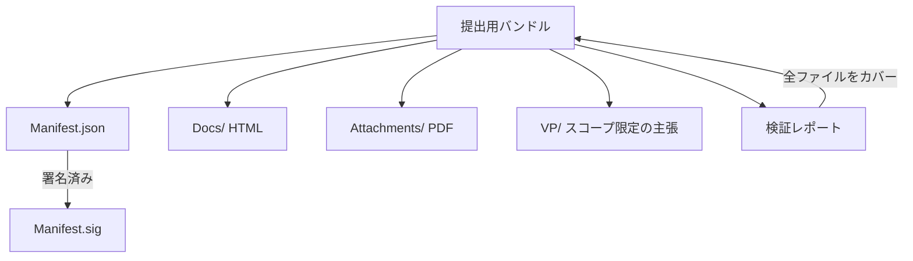
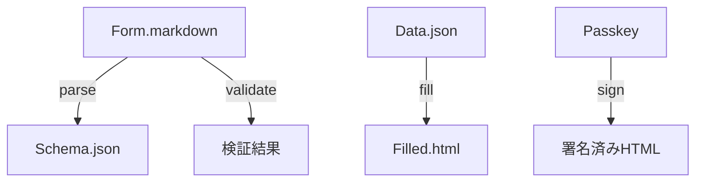
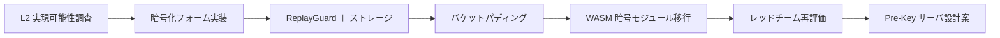
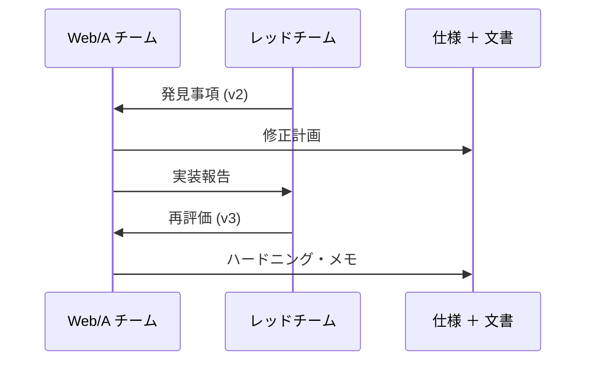

# Web/A Tech & Verifiability: Two-Week Engineering Deep Dive

SORANE

<h1>Web/Aの技術概要と検証可能性</h1>

2週間のエンジニアリング深掘り：検証、セキュリティモデル、およびフォームの暗号化

---

セッションマップ

<h2>アジェンダ (60分)</h2>

<ul>
  <li><strong>Part 1: ビジョン</strong> — PDF/XMLの罠を超えて</li>
  <li><strong>Part 2: コア・アーキテクチャ</strong> — 3レイヤーモデルとHMP</li>
  <li><strong>Part 3: L2 セキュリティ深掘り</strong> — 暗号化、PRF、およびWASM</li>
  <li><strong>Part 4: データ主権</strong> — Web/A Folio と信頼レベル (LoA)</li>
  <li><strong>Part 5: 信頼モデルとガバナンス</strong> — ライトウェイト・トラストとDID-lite</li>
  <li><strong>Part 6: エンジニアリング詳細</strong> — タイポグラフィとバイモーダルUI</li>
  <li><strong>Part 7: 現在の状況とロードマップ</strong> — レッドチーミングと標準化</li>
</ul>

---

ビジョン

<h2>Soraneとは何か？</h2>

<ul>
  <li><strong>検証可能なWebドキュメント</strong>のためのオープンソース参照実装</li>
  <li><strong>長期的な判読性</strong>と<strong>暗号化による信頼</strong>にフォーカス</li>
  <li>PDFでは不十分な公共セクターのワークフロー向けに設計</li>
</ul>

---

<h2>マシン専用の罠 (XTX / カスタムXML)</h2>
<ul>
  <li>構造化データが人間には読めなくなる</li>
  <li>ベンダやスキーマ間でセマンティクスが乖離する</li>
  <li>レイアウトが切り離されることで、人間による信頼が損なわれる</li>
</ul>

---

<h2>XML + XSLT: 外部接続性の罠</h2>
<ul>
  <li>レンダリングが外部のスタイルシートに依存する</li>
  <li>依存関係なしには長期的な存続が危うい</li>
  <li>アーカイブの真正性維持の運用コストが膨大になる</li>
</ul>

---

<h2>署名検証の壁</h2>
<ul>
  <li>AATLとビューアのロックインが隠れた信頼のアンカーを生んでいる</li>
  <li>ライセンスされたツール以外での検証コストが高い</li>
  <li>Web/Aは、ビューアへの依存を排除することを目指している</li>
  <li>PDFは判読可能だが、大規模な検証が困難</li>
</ul>

---

比較

<h2>Web/A vs PDF/A vs XML/XTX</h2>

<svg width="760" height="420" viewBox="0 0 760 420" fill="none" xmlns="http://www.w3.org/2000/svg" role="img" aria-labelledby="compare-title compare-desc" style="max-width: 100%; height: auto; border: 1px solid #e2e8f0; border-radius: 12px; background: #fff;">
  <title id="compare-title">比較表</title>
  <rect x="24" y="24" width="712" height="372" rx="12" fill="#F8FAFC" stroke="#E2E8F0"/>
  <rect x="48" y="56" width="664" height="48" rx="8" fill="#E2E8F0"/>
  <text x="72" y="86" font-family="system-ui" font-size="14" font-weight="700" fill="#334155">項目</text>
  <text x="300" y="86" font-family="system-ui" font-size="14" font-weight="700" fill="#334155">Web/A</text>
  <text x="470" y="86" font-family="system-ui" font-size="14" font-weight="700" fill="#334155">PDF/A</text>
  <text x="620" y="86" font-family="system-ui" font-size="14" font-weight="700" fill="#334155">XML/XTX</text>

  <rect x="48" y="112" width="664" height="64" rx="8" fill="white" stroke="#E2E8F0"/>
  <text x="72" y="144" font-family="system-ui" font-size="13" font-weight="600" fill="#334155">ポータビリティ</text>
  <text x="300" y="144" font-family="system-ui" font-size="12" fill="#0f172a">HTML 1ファイル</text>
  <text x="470" y="144" font-family="system-ui" font-size="12" fill="#0f172a">ファイルベース</text>
  <text x="620" y="144" font-family="system-ui" font-size="12" fill="#0f172a">ツールに依存</text>

  <rect x="48" y="184" width="664" height="64" rx="8" fill="white" stroke="#E2E8F0"/>
  <text x="72" y="216" font-family="system-ui" font-size="13" font-weight="600" fill="#334155">検証可能性</text>
  <text x="300" y="216" font-family="system-ui" font-size="12" fill="#0f172a">署名を内蔵</text>
  <text x="470" y="216" font-family="system-ui" font-size="12" fill="#0f172a">ビューアに依存</text>
  <text x="620" y="216" font-family="system-ui" font-size="12" fill="#0f172a">スキーマに依存</text>

  <rect x="48" y="256" width="664" height="64" rx="8" fill="white" stroke="#E2E8F0"/>
  <text x="72" y="288" font-family="system-ui" font-size="13" font-weight="600" fill="#334155">人間による可読性</text>
  <text x="300" y="288" font-family="system-ui" font-size="12" fill="#0f172a">最高（Web標準）</text>
  <text x="470" y="288" font-family="system-ui" font-size="12" fill="#0f172a">高い</text>
  <text x="620" y="288" font-family="system-ui" font-size="12" fill="#0f172a">低い（専用ツール要）</text>

  <rect x="48" y="328" width="664" height="48" rx="8" fill="#EEF2FF" stroke="#C7D2FE"/>
  <text x="72" y="358" font-family="system-ui" font-size="12" font-weight="700" fill="#4338CA">要約</text>
  <text x="300" y="358" font-family="system-ui" font-size="12" fill="#4338CA">可搬かつ検証可能</text>
  <text x="470" y="358" font-family="system-ui" font-size="12" fill="#4338CA">可搬だが、意味論が脆弱</text>
  <text x="620" y="358" font-family="system-ui" font-size="12" fill="#4338CA">構造化されているが脆い</text>
</svg>

---

<h2>なぜSRNを構築したのか</h2>
<ul>
  <li>精密なタイポグラフィはセキュリティの問題である：レイアウト自体が検証可能でなければならない</li>
  <li>ドキュメントは数十年にわたり読めるだけでなく、証明可能でなければならない</li>
  <li>暗号化は特定のサーバに依存せずに機能しなければならない</li>
</ul>

---

コア・アーキテクチャ

<h2>3レイヤー信頼モデル</h2>

<ul>
  <li><strong>Layer 1</strong>：発行者が署名したテンプレート（法/規約）</li>
  <li><strong>Layer 2</strong>：ユーザーの回答 ＋ 暗号化（事実）</li>
  <li><strong>Layer 3</strong>：プレゼンテーションとレイアウト（ビュー）</li>
</ul>

<svg width="600" height="460" viewBox="0 0 600 460" fill="none" xmlns="http://www.w3.org/2000/svg" style="max-width: 100%; height: auto; border: 1px solid #e2e8f0; border-radius: 8px; background: #fff;">
  <defs>
    <marker id="arrow" markerWidth="10" markerHeight="10" refX="9" refY="3" orient="auto" markerUnits="strokeWidth">
      <path d="M0,0 L0,6 L9,3 z" fill="#10B981" />
    </marker>
    <marker id="arrow-blue" markerWidth="10" markerHeight="10" refX="9" refY="3" orient="auto" markerUnits="strokeWidth">
      <path d="M0,0 L0,6 L9,3 z" fill="#6366F1" />
    </marker>
  </defs>
  <rect width="600" height="460" fill="#F8FAFC"/>
  <rect x="40" y="30" width="520" height="400" rx="12" fill="white" stroke="#E2E8F0" stroke-width="2"/>
  <text x="60" y="55" font-family="system-ui" font-size="14" font-weight="700" fill="#64748B">Web/A ドキュメント (.html)</text>

  <!-- Layer 3: Presentation -->
  <rect x="60" y="70" width="480" height="50" rx="6" fill="#F1F5F9" stroke="#CBD5E1" stroke-dasharray="4 4"/>
  <text x="75" y="95" font-family="system-ui" font-size="13" font-weight="700" fill="#475569">Layer 3: プレゼンテーション（ビュー）</text>
  <text x="75" y="110" font-family="system-ui" font-size="10" fill="#64748B">CSS、フォント（将来の互換性のために差し替え可能）</text>

  <!-- Layer 2: User Signed -->
  <rect x="60" y="130" width="480" height="80" rx="6" fill="#ECFDF5" stroke="#10B981" stroke-width="2"/>
  <text x="75" y="155" font-family="system-ui" font-size="13" font-weight="700" fill="#047857">Layer 2: ユーザー署名済みコンテキスト</text>
  <text x="75" y="175" font-family="system-ui" font-size="11" fill="#065F46">ユーザーの回答 / 合意内容</text>
  <text x="75" y="190" font-family="system-ui" font-size="11" fill="#065F46">Passkey署名 (VP)</text>
  <!-- Link to Layer 1 -->
  <path d="M300 210V220" stroke="#10B981" stroke-width="2" marker-end="url(#arrow)"/>

  <!-- Layer 1: Issuer Signed -->
  <rect x="60" y="220" width="480" height="150" rx="6" fill="#EEF2FF" stroke="#6366F1" stroke-width="2"/>
  <text x="75" y="245" font-family="system-ui" font-size="13" font-weight="700" fill="#4338CA">Layer 1: 発行者署名済みコア（テンプレート）</text>

  <rect x="80" y="260" width="200" height="60" rx="4" fill="white" stroke="#6366F1"/>
  <text x="90" y="280" font-family="system-ui" font-size="12" font-weight="700" fill="#4338CA">人間用（可読）</text>
  <text x="90" y="300" font-family="system-ui" font-size="11" fill="#64748B">HTML / 設問内容</text>

  <!-- Semantic Mapping -->
  <path d="M280 290H320" stroke="#6366F1" stroke-width="1.5" stroke-dasharray="3 3" marker-end="url(#arrow-blue)" marker-start="url(#arrow-blue)"/>
  <text x="300" y="285" font-family="system-ui" font-size="9" fill="#6366F1" text-anchor="middle" font-weight="bold">マッピング</text>

  <rect x="320" y="260" width="200" height="60" rx="4" fill="white" stroke="#6366F1"/>
  <text x="330" y="280" font-family="system-ui" font-size="12" font-weight="700" fill="#4338CA">マシン用（構造データ）</text>
  <text x="330" y="300" font-family="system-ui" font-size="11" fill="#64748B">JSON-LD / ロジック</text>

  <rect x="80" y="330" width="440" height="25" rx="4" fill="#6366F1" fill-opacity="0.1"/>
  <text x="300" y="347" font-family="system-ui" font-size="11" font-weight="700" fill="#4338CA" text-anchor="middle">発行者署名: Ed25519 + PQC</text>
</svg>

---

検証可能性

<h2>人間・マシン等価性 (HMP)</h2>

<ul>
  <li>人間用のHTMLとマシン用のJSON-LDが確実に統合されている</li>
  <li>署名によって、両方のビューが同一の事実を表していることを保証する</li>
  <li>生成された全てのドキュメントに検証UIが組み込まれている</li>
</ul>

---

適合性

<h2>Web/A 適合性レベル</h2>

<svg width="760" height="360" viewBox="0 0 760 360" fill="none" xmlns="http://www.w3.org/2000/svg" role="img" aria-labelledby="conformance-title conformance-desc" style="max-width: 100%; height: auto; border: 1px solid #e2e8f0; border-radius: 12px; background: #fff;">
  <title id="conformance-title">Web/A 適合性レベル</title>
  <rect x="24" y="24" width="712" height="312" rx="12" fill="#F8FAFC" stroke="#E2E8F0"/>

  <rect x="60" y="72" width="200" height="210" rx="12" fill="#EEF2FF" stroke="#6366F1"/>
  <text x="80" y="106" font-family="system-ui" font-size="13" font-weight="700" fill="#4338CA">Web/A-1s</text>
  <text x="80" y="130" font-family="system-ui" font-size="12" fill="#4338CA">Semantic (意味論)</text>
  <text x="80" y="156" font-family="system-ui" font-size="11" fill="#334155">HTML + CSS</text>
  <text x="80" y="176" font-family="system-ui" font-size="11" fill="#334155">JSON-LD 埋め込み</text>
  <text x="80" y="196" font-family="system-ui" font-size="11" fill="#334155">基本的な署名</text>

  <rect x="280" y="72" width="200" height="210" rx="12" fill="#ECFDF5" stroke="#10B981"/>
  <text x="300" y="106" font-family="system-ui" font-size="13" font-weight="700" fill="#047857">Web/A-1u</text>
  <text x="300" y="130" font-family="system-ui" font-size="12" fill="#047857">Universal (汎用)</text>
  <text x="300" y="156" font-family="system-ui" font-size="11" fill="#334155">全アセット埋め込み</text>
  <text x="300" y="176" font-family="system-ui" font-size="11" fill="#334155">サブセット化フォント</text>
  <text x="300" y="196" font-family="system-ui" font-size="11" fill="#334155">CLS 0 (レイアウト崩れなし)</text>

  <rect x="500" y="72" width="200" height="210" rx="12" fill="#FEF3C7" stroke="#F59E0B"/>
  <text x="520" y="106" font-family="system-ui" font-size="13" font-weight="700" fill="#92400E">Web/A-1p</text>
  <text x="520" y="130" font-family="system-ui" font-size="12" fill="#92400E">Provenance (出自)</text>
  <text x="520" y="156" font-family="system-ui" font-size="11" fill="#334155">C2PA マニフェスト</text>
  <text x="520" y="176" font-family="system-ui" font-size="11" fill="#334155">HMP証明</text>
  <text x="520" y="196" font-family="system-ui" font-size="11" fill="#334155">高信頼アーカイブ</text>
</svg>

---

L2 セキュリティ

<h2>Web/A Form セキュリティのハイライト</h2>

<ul>
  <li>Layer 1 テンプレートは署名され、ハッシュで束縛されている</li>
  <li>Layer 2 ペイロードは Ed25519 署名を使用</li>
  <li>暗号化は AAD を用いて layer1_ref に束縛される (切り貼り攻撃防止)</li>
</ul>

---

L2 暗号化

<h2>アーキテクチャ概要</h2>

---

L2 暗号化

<h2>階層的鍵導出</h2>

<ul>
  <li>運用の手間がかからない鍵ローテーション</li>
  <li>キャンペーンおよびフォーム間の隔離</li>
  <li>マスター鍵を露出させない鍵預託</li>
</ul>

---

L2 暗号化

<h2>WebAuthn PRF による復号</h2>

---

暗号化

<h2>L2 エンベロープのライフサイクル</h2>

---

L2 セキュリティ

<h2>リプレイ保護</h2>

<ul>
  <li>エンベロープ毎に nonce を保存・照合</li>
  <li>CLI: JsonFileReplayStore</li>
  <li>ブラウザ: LocalStorageReplayStore</li>
</ul>

---

<h2>トラフィック解析対策</h2>
<ul>
  <li>バケットパディング (1KB / 4KB / 16KB / ...)</li>
  <li>ペイロードのサイズクラスを秘匿</li>
  <li>高機密用途向けにダミートラフィックを計画中</li>
</ul>

---

<h2>WASM 暗号モジュールへの移行</h2>
<ul>
  <li>Ed25519 / X25519 / ML-KEM / AES-GCM を Rust/WASM で実装</li>
  <li>JSエンジンによる実行タイミングの差異を低減</li>
  <li>バインディングレイヤーが現在の主なレビュー対象</li>
</ul>

---

前方秘匿性

<h2>Pre-Key インフラストラクチャ草案</h2>

<ul>
  <li>prekey_url を介した使い捨て受信者鍵</li>
  <li>オフライン提出の利便性を維持</li>
  <li>静的な鍵へのフォールバック時には警告を表示</li>
</ul>

---

L3の展望

<h2>Layer 3：Web/A Folio</h2>

<svg width="760" height="360" viewBox="0 0 760 360" fill="none" xmlns="http://www.w3.org/2000/svg" role="img" aria-labelledby="folio-title folio-desc" style="max-width: 100%; height: auto; border: 1px solid #e2e8f0; border-radius: 12px; background: #fff;">
  <title id="folio-title">Web/A Folioの展望</title>
  <rect x="24" y="24" width="712" height="312" rx="12" fill="#F8FAFC" stroke="#E2E8F0"/>

  <rect x="60" y="80" width="220" height="200" rx="14" fill="#EEF2FF" stroke="#6366F1"/>
  <text x="80" y="116" font-family="system-ui" font-size="13" font-weight="700" fill="#4338CA">Web/A Folio</text>
  <text x="80" y="142" font-family="system-ui" font-size="11" fill="#334155">アイデンティティ紐付け型コンテナ</text>
  <text x="80" y="162" font-family="system-ui" font-size="11" fill="#334155">履歴 ＋ 証明 ＋ 主張</text>
  <text x="80" y="182" font-family="system-ui" font-size="11" fill="#334155">ポータブルでオフライン対応</text>

  <rect x="320" y="80" width="200" height="90" rx="12" fill="#ECFDF5" stroke="#10B981"/>
  <text x="340" y="115" font-family="system-ui" font-size="12" font-weight="700" fill="#047857">検証可能な提示 (VP)</text>
  <text x="340" y="140" font-family="system-ui" font-size="11" fill="#334155">選択的開示</text>

  <rect x="320" y="190" width="200" height="90" rx="12" fill="#FEF3C7" stroke="#F59E0B"/>
  <text x="340" y="225" font-family="system-ui" font-size="12" font-weight="700" fill="#92400E">認可フロー</text>
  <text x="340" y="250" font-family="system-ui" font-size="11" fill="#334155">同意 ＋ 権限の委譲</text>

  <rect x="560" y="130" width="160" height="120" rx="12" fill="#E0F2FE" stroke="#38BDF8"/>
  <text x="580" y="165" font-family="system-ui" font-size="12" font-weight="700" fill="#0C4A6E">依存当事者 (RP)</text>
  <text x="580" y="190" font-family="system-ui" font-size="11" fill="#334155">サービスの検証者</text>

  <path d="M280 150H320" stroke="#94A3B8" stroke-width="2" marker-end="url(#arrow-gray)"/>
  <path d="M280 210H320" stroke="#94A3B8" stroke-width="2" marker-end="url(#arrow-gray)"/>
  <path d="M520 150H560" stroke="#94A3B8" stroke-width="2" marker-end="url(#arrow-gray)"/>
  <path d="M520 230H560" stroke="#94A3B8" stroke-width="2" marker-end="url(#arrow-gray)"/>
  <defs>
    <marker id="arrow-gray" markerWidth="10" markerHeight="10" refX="9" refY="3" orient="auto" markerUnits="strokeWidth">
      <path d="M0,0 L0,6 L9,3 z" fill="#94A3B8"/>
    </marker>
  </defs>
</svg>

---

Folio設計

<h2>信頼レベルとLoA</h2>

<ul>
  <li><strong>LoA 1 (本人申告)</strong>：正本 ＝ 人間可読テキスト。JSONは派生。</li>
  <li><strong>LoA 2+ (検証済み)</strong>：正本 ＝ マシン可読。人間用は派生。</li>
  <li><strong>バリデーション</strong>：LoA 2+データを編集すると「検証済み」が無効化される。</li>
</ul>

---

Folio内部構造

<h2>提出用バンドル</h2>

---

Folio CLI

<h2>ツールキット・アーキテクチャ</h2>

---

Folio適合性

<h2>ポリシー用DSL（草案）</h2>

<pre><code>profile: onboarding
requires:
  - manifest.bundle_id
  - subject.id
rules:
  - id: vp_required_for_l3
    when: claims.level == 3
    assert: vp.exists == true</code></pre>

---

<h2>エコシステム戦略：AIエージェント・ファースト</h2>
<ul>
  <li>エージェントがWeb/Aを読み取り、検証し、要約できる</li>
  <li>構造化データが安全な自動化を可能にする</li>
  <li>人間が最終的な信頼のアンカーとして残り続ける</li>
</ul>

---

信頼とガバナンス

<h2>「ライトウェイト・トラスト」モデル</h2>

<ul>
  <li>強力な検証機能を維持しつつ、導入コストを低減</li>
  <li>レガシーPKIからの段階的な移行を想定した設計</li>
  <li>インフラ刷新なしに耐量子暗号 (PQC) への移行をサポート</li>
</ul>

---

<h2>権限の階層化：PasskeyからBuildへの委譲</h2>
<ul>
  <li>ルート権限がビルド時の署名権限を委譲する</li>
  <li>Passkeyによるハードウェアベースの信頼</li>
  <li>ルート鍵を露出させることなく、自動化を可能にする</li>
</ul>

---

<h2>エフェメラル（一時的）な発行</h2>
<ul>
  <li>ビルド毎に署名鍵をリフレッシュし、漏洩時の影響範囲を最小化</li>
  <li>頻繁な鍵更新を容易にする</li>
  <li>オフライン、ファイル中心のワークフローに適合する</li>
</ul>

---

<h2>透明性によるアイデンティティ (DID-lite)</h2>
<ul>
  <li>Web上での公開と透明性から信頼を導き出す</li>
  <li>重厚な証明書階層よりも摩擦が少ない</li>
  <li>フィンガープリントの公開により「既知の良い発行者」リストを提供</li>
</ul>

---

<h2>暗号の俊敏性 (Cryptographic Agility)</h2>
<ul>
  <li>動的な信頼のルートと継続性</li>
  <li>ハイブリッド署名（従来型 Ed25519 ＋ PQC ML-DSA-44）</li>
  <li>量子時代の安全な移行を最優先要件としている</li>
</ul>

---

<h2>法的ポジショニング</h2>
<ul>
  <li>「意思」から「証拠」へ</li>
  <li>証明可能な意図と監査可能性にフォーカス</li>
  <li>署名法に基づく厳格なPKIとは実用的な距離を置く</li>
</ul>

---

展開の安全性

<h2>クライアントの安全性：下書き状態の保存</h2>

<ul>
  <li>下書きHTML内に作業状態を埋め込み</li>
  <li>デバイス間移動やキャッシュクリア後の復元を可能に</li>
  <li>下書きファイル自体を機密性の高い成果物として扱う</li>
</ul>

---

エンジニアリング

<h2>高度なタイポグラフィ要件</h2>

<ul>
  <li>行政標準文字のカバー (IVS/SVS)</li>
  <li>公的なレイアウトの忠実な再現（グリッド再現）</li>
  <li>セキュリティ制約としての「レイアウト崩れゼロ」</li>
</ul>

---

<h2>フォーム再現における課題</h2>
<ul>
  <li>レンダリングエンジンの差異 vs ミリメートル単位の精度</li>
  <li>レイアウトに依存するセマンティクス（意味論）</li>
  <li>署名されたビューが長期間安定していなければならない</li>
</ul>

---

<h2>バイモーダル・プレゼンテーション</h2>
<ul>
  <li><strong>アーカイブ・ビュー</strong>：公式検証用の固定レイアウト</li>
  <li><strong>ウォレット・ビュー</strong>：スマートフォン向けのレスポンシブなカード表示</li>
  <li>単一の署名済みペイロードからCSSで動的に切り替え可能</li>
</ul>

---

<h2>保存プロファイル</h2>
<ul>
  <li>Web技術の安全なサブセットを定義する (Evergreen)</li>
  <li>ブラウザの仕様変更によるアーカイブの破損を防ぐ</li>
  <li>プロファイル検証により、長期的な可読性を保証する</li>
</ul>

---

現在の状況

<h2>Web/Aの進化（サマリー）</h2>

<svg width="760" height="320" viewBox="0 0 760 320" fill="none" xmlns="http://www.w3.org/2000/svg" role="img" aria-labelledby="history-title history-desc" style="max-width: 100%; height: auto; border: 1px solid #e2e8f0; border-radius: 12px; background: #fff;">
  <title id="history-title">Web/Aの進化タイムライン</title>
  <rect x="24" y="24" width="712" height="272" rx="12" fill="#F8FAFC" stroke="#E2E8F0"/>
  <line x1="80" y1="170" x2="680" y2="170" stroke="#94A3B8" stroke-width="3" stroke-linecap="round"/>

  <circle cx="150" cy="170" r="8" fill="#6366F1"/>
  <text x="120" y="130" font-family="system-ui" font-size="11" fill="#334155">3レイヤー信頼モデル</text>
  <text x="120" y="146" font-family="system-ui" font-size="10" fill="#64748B">フォーム対応</text>

  <circle cx="360" cy="170" r="8" fill="#10B981"/>
  <text x="320" y="130" font-family="system-ui" font-size="11" fill="#334155">Layer 2 暗号化</text>
  <text x="320" y="146" font-family="system-ui" font-size="10" fill="#64748B">機密ペイロードの保護</text>

  <circle cx="570" cy="170" r="8" fill="#F59E0B"/>
  <text x="520" y="130" font-family="system-ui" font-size="11" fill="#334155">監査ループ</text>
  <text x="520" y="146" font-family="system-ui" font-size="10" fill="#64748B">問題修正のトラッキング</text>
</svg>

---

タイムライン

<h2>エンジニアリングの進捗</h2>

---

レッドチーミング

<h2>反復的なフィードバックループ</h2>

---

導入戦略

<h2>段階的な導入アプローチ</h2>

<svg width="760" height="360" viewBox="0 0 760 360" fill="none" xmlns="http://www.w3.org/2000/svg" role="img" aria-labelledby="adoption-title adoption-desc" style="max-width: 100%; height: auto; border: 1px solid #e2e8f0; border-radius: 12px; background: #fff;">
  <title id="adoption-title">段階的導入戦略</title>
  <rect x="24" y="24" width="712" height="312" rx="12" fill="#F8FAFC" stroke="#E2E8F0"/>

  <rect x="60" y="72" width="200" height="210" rx="12" fill="#EEF2FF" stroke="#6366F1"/>
  <text x="80" y="106" font-family="system-ui" font-size="13" font-weight="700" fill="#4338CA">Layer 1</text>
  <text x="80" y="130" font-family="system-ui" font-size="12" fill="#4338CA">公的ドキュメント</text>
  <text x="80" y="158" font-family="system-ui" font-size="11" fill="#334155">証明書、通知</text>
  <text x="80" y="178" font-family="system-ui" font-size="11" fill="#334155">まず監査可能性を確保</text>
  <text x="80" y="198" font-family="system-ui" font-size="11" fill="#334155">現在のSRNスコープ</text>

  <rect x="280" y="72" width="200" height="210" rx="12" fill="#ECFDF5" stroke="#10B981"/>
  <text x="300" y="106" font-family="system-ui" font-size="13" font-weight="700" fill="#047857">Layer 2</text>
  <text x="300" y="130" font-family="system-ui" font-size="12" fill="#047857">機密データ</text>
  <text x="300" y="158" font-family="system-ui" font-size="11" fill="#334155">L2 暗号化</text>
  <text x="300" y="178" font-family="system-ui" font-size="11" fill="#334155">リプレイ保護</text>
  <text x="300" y="198" font-family="system-ui" font-size="11" fill="#334155">選択的アクセス</text>

  <rect x="500" y="72" width="200" height="210" rx="12" fill="#FEF3C7" stroke="#F59E0B"/>
  <text x="520" y="106" font-family="system-ui" font-size="13" font-weight="700" fill="#92400E">Layer 3</text>
  <text x="520" y="130" font-family="system-ui" font-size="12" fill="#92400E">本人確認・認可</text>
  <text x="520" y="158" font-family="system-ui" font-size="11" fill="#334155">検証可能な提示 (VP)</text>
  <text x="520" y="178" font-family="system-ui" font-size="11" fill="#334155">ホルダー・バインディング</text>
  <text x="520" y="198" font-family="system-ui" font-size="11" fill="#334155">将来の拡張スコープ</text>
</svg>

---

ロードマップ

<h2>文書の類型化</h2>

<svg width="760" height="360" viewBox="0 0 760 360" fill="none" xmlns="http://www.w3.org/2000/svg" role="img" aria-labelledby="typology-title typology-desc" style="max-width: 100%; height: auto; border: 1px solid #e2e8f0; border-radius: 12px; background: #fff;">
  <title id="typology-title">文書の類型化</title>
  <rect x="24" y="24" width="712" height="312" rx="12" fill="#F8FAFC" stroke="#E2E8F0"/>

  <rect x="60" y="72" width="200" height="210" rx="12" fill="#EEF2FF" stroke="#6366F1"/>
  <text x="80" y="106" font-family="system-ui" font-size="13" font-weight="700" fill="#4338CA">Tier 1</text>
  <text x="80" y="130" font-family="system-ui" font-size="12" fill="#4338CA">公共アセット</text>
  <text x="80" y="158" font-family="system-ui" font-size="11" fill="#334155">官報、統計レポート</text>
  <text x="80" y="178" font-family="system-ui" font-size="11" fill="#334155">誰でも閲覧可能</text>
  <text x="80" y="198" font-family="system-ui" font-size="11" fill="#334155">公共の信頼</text>

  <rect x="280" y="72" width="200" height="210" rx="12" fill="#ECFDF5" stroke="#10B981"/>
  <text x="300" y="106" font-family="system-ui" font-size="13" font-weight="700" fill="#047857">Tier 2</text>
  <text x="300" y="130" font-family="system-ui" font-size="12" fill="#047857">個人記録</text>
  <text x="300" y="158" font-family="system-ui" font-size="11" fill="#334155">領収書、個別通知</text>
  <text x="300" y="178" font-family="system-ui" font-size="11" fill="#334155">機密性が最優先</text>
  <text x="300" y="198" font-family="system-ui" font-size="11" fill="#334155">直接配送</text>

  <rect x="500" y="72" width="200" height="210" rx="12" fill="#FEF3C7" stroke="#F59E0B"/>
  <text x="520" y="106" font-family="system-ui" font-size="13" font-weight="700" fill="#92400E">Tier 3</text>
  <text x="520" y="130" font-family="system-ui" font-size="12" fill="#92400E">本人確認資格</text>
  <text x="520" y="158" font-family="system-ui" font-size="11" fill="#334155">住民票、身分証</text>
  <text x="520" y="178" font-family="system-ui" font-size="11" fill="#334155">なりすまし防止が必須</text>
  <text x="520" y="198" font-family="system-ui" font-size="11" fill="#334155">ホルダーとの紐付け</text>
</svg>

---

課題

<h2>標準化に向けた課題</h2>

<ul>
  <li>デバイス間、および対面での転送プロトコル</li>
  <li>ブラウザサンドボックス内での実用的なホルダーバインディング</li>
  <li>ブラウザによるネイティブな検証サポート</li>
  <li>長期検証 (LTV) の確立</li>
</ul>

---

関連資料

<h2>主要なホワイトペーパー</h2>

<ul>
  <li><a href="./papers/web-a.html">Web/A 解説書</a></li>
  <li><a href="./papers/web-a-l2-encryption.html">Web/A L2 暗号化仕様</a></li>
  <li><a href="./papers/web-a-folio.html">Web/A Folio コンセプト</a></li>
  <li><a href="./papers/web-a-l2-security-audit-v3.html">再評価報告書 v3</a></li>
</ul>

---

<h2>次のステップ</h2>
<ul>
  <li>Pre-Key サーバの PoC ＋ テストハーネス</li>
  <li>WASM バインディングの形式的な外部レビュー</li>
  <li>ダミートラフィック生成戦略の策定</li>
  <li>デプロイ用の CSP/SRI テンプレートの公開</li>
</ul>

---

最後に

<h2>なぜこれが重要なのか</h2>

<ul>
  <li>Web/Aは文書を、単なるファイルではなく検証可能な「成果物」に変える</li>
  <li>信頼は時間、デバイス、機関を超えてポータブルになる</li>
  <li>目標は、ロックインではなく、透明なセキュリティによる相互運用性である</li>
</ul>

