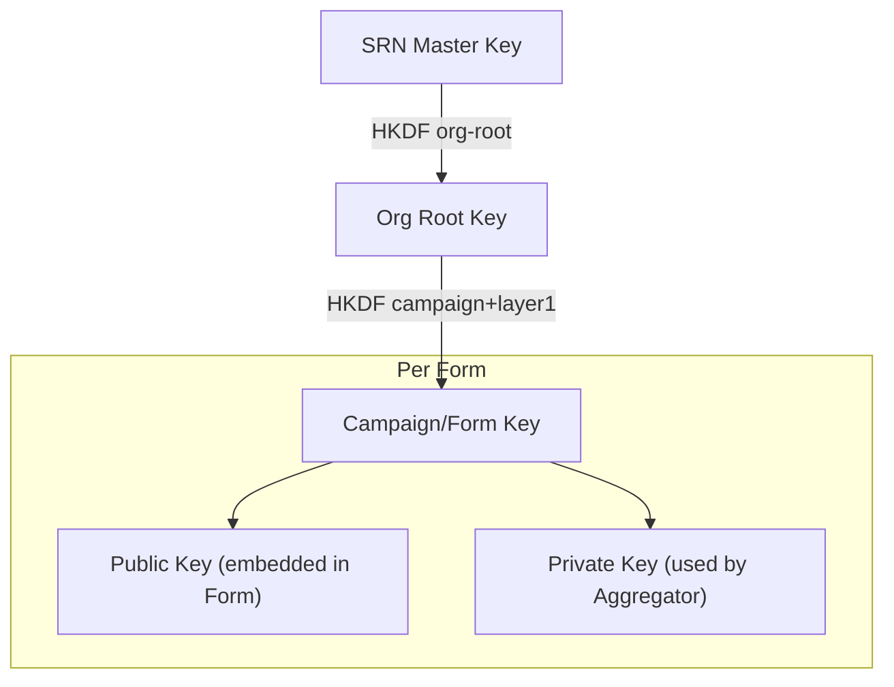
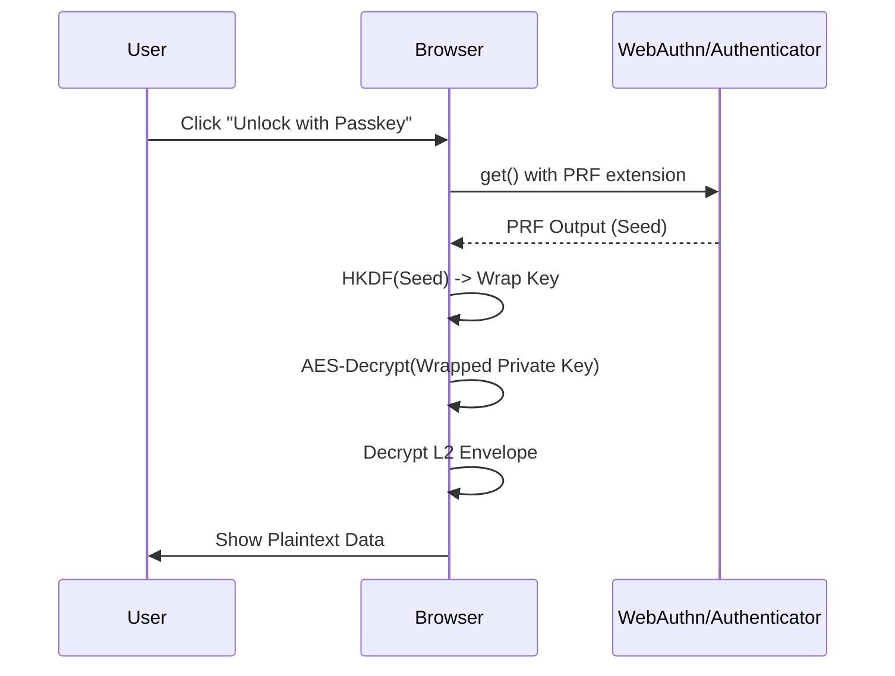
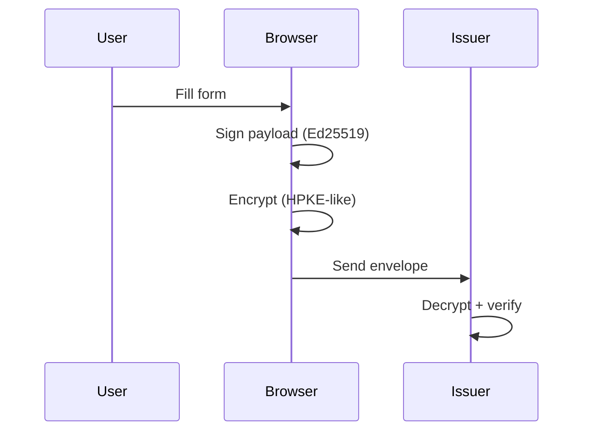
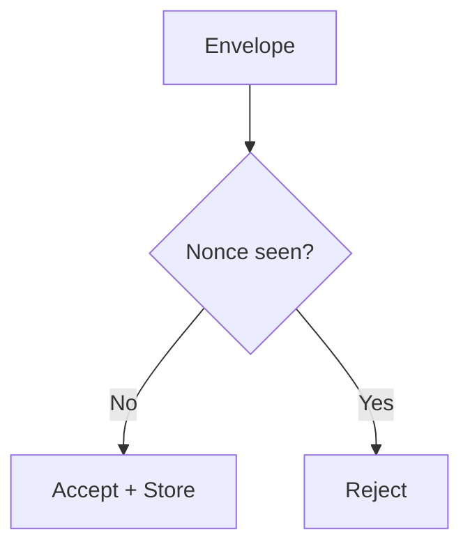
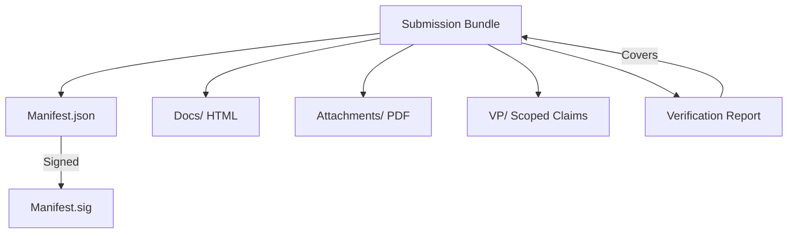
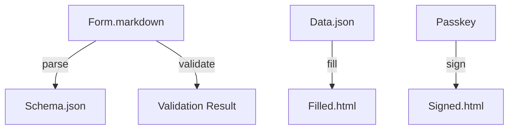
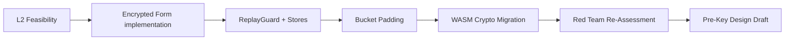
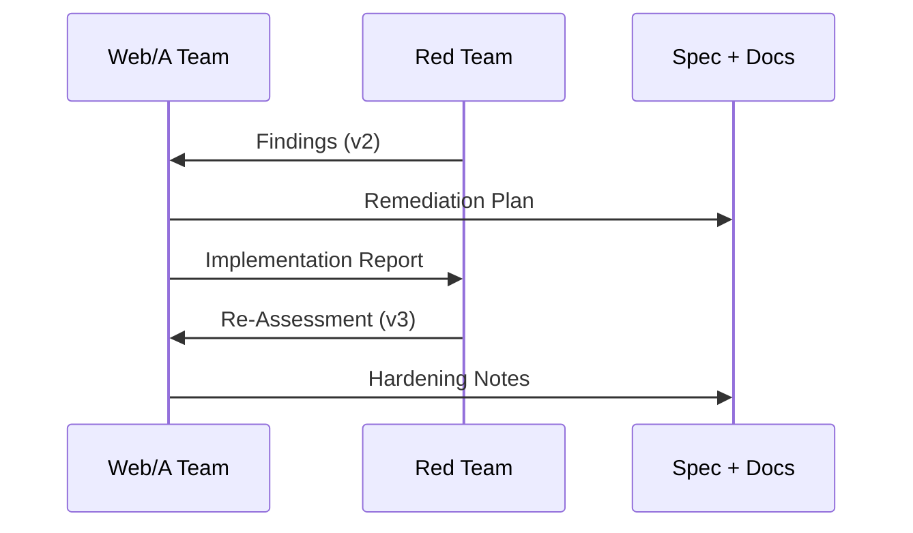

```mermaid
flowchart LR
    User["User Input"] --> Plain["L2 Plaintext"]
    Plain --> Sign["Signer (Ed25519)"]
    Sign --> Signed["L2 Payload (Signed)"]
    Signed --> Encrypt["Encrypter (HPKE X25519)"]
    Encrypt --> Envelope["L2 Encrypted Envelope"]
    
    subgraph browser ["Browser Client"]
        User
        Plain
        Sign
        Signed
        Encrypt
    end
    
    Envelope --> Storage["Storage Transport"]
    Storage --> Decrypt["Decrypter"]
    Decrypt --> Verify["Signature Verifier"]
    Verify --> Data["Validated Data"]

    subgraph aggregator ["Aggregator Issuer"]
        Decrypt
        Verify
        Data
    end
```

# Web/A Tech & Verifiability: Two-Week Engineering Deep Dive

SORANE

<h1>Web/A Tech & Verifiability</h1>

Two-week engineering deep dive: verification, security model, and form encryption.

---

Session Map

<h2>The Journey (60 minutes)</h2>

<ul>
  <li><strong>Part 1: Vision</strong> — Beyond the PDF/XML traps</li>
  <li><strong>Part 2: Core Architecture</strong> — 3-Layer Model & HMP</li>
  <li><strong>Part 3: L2 Security Deep Dive</strong> — Encryption, PRF, and WASM</li>
  <li><strong>Part 4: Data Sovereignty</strong> — Web/A Folio & LoA</li>
  <li><strong>Part 5: Trust & Governance</strong> — Lightweight Trust & DID-lite</li>
  <li><strong>Part 6: Engineering Details</strong> — Typography & Bimodal UX</li>
  <li><strong>Part 7: Status & Roadmap</strong> — Red Teaming & Standardization</li>
</ul>

---

Vision

<h2>What Is Sorane?</h2>

<ul>
  <li>An open-source reference implementation for <strong>verifiable web documents</strong></li>
  <li>Focused on <strong>long-term readability</strong> and <strong>cryptographic trust</strong></li>
  <li>Designed for public-sector workflows where PDFs fall short</li>
</ul>

---

<h2>The Machine-Only Trap (XTX / Custom XML)</h2>
<ul>
  <li>Structured data becomes unreadable to humans</li>
  <li>Semantics drift across vendors and schemas</li>
  <li>Human trust is weakened when layout is detached</li>
</ul>

---

<h2>XML + XSLT: The Connectivity Trap</h2>
<ul>
  <li>Rendering depends on external stylesheets</li>
  <li>Long-term survival is fragile without dependencies</li>
  <li>Archival integrity becomes operationally expensive</li>
</ul>

---

<h2>Signature Verification Barrier</h2>
<ul>
  <li>AATL and viewer lock-in create hidden trust anchors</li>
  <li>Verification is expensive outside licensed tools</li>
  <li>Web/A aims to remove viewer dependence</li>
  <li>PDF is readable but hard to verify at scale</li>
</ul>

---

Comparison

<h2>Web/A vs PDF/A vs XML/XTX</h2>

<svg width="760" height="420" viewBox="0 0 760 420" fill="none" xmlns="http://www.w3.org/2000/svg" role="img" aria-labelledby="compare-title compare-desc" style="max-width: 100%; height: auto; border: 1px solid #e2e8f0; border-radius: 12px; background: #fff;">
  <title id="compare-title">Comparison Table</title>
  <desc id="compare-desc">A comparison of Web/A, PDF/A, and XML/XTX across portability, verifiability, and human readability.</desc>
  <rect x="24" y="24" width="712" height="372" rx="12" fill="#F8FAFC" stroke="#E2E8F0"/>
  <rect x="48" y="56" width="664" height="48" rx="8" fill="#E2E8F0"/>
  <text x="72" y="86" font-family="system-ui" font-size="14" font-weight="700" fill="#334155">Dimension</text>
  <text x="300" y="86" font-family="system-ui" font-size="14" font-weight="700" fill="#334155">Web/A</text>
  <text x="470" y="86" font-family="system-ui" font-size="14" font-weight="700" fill="#334155">PDF/A</text>
  <text x="620" y="86" font-family="system-ui" font-size="14" font-weight="700" fill="#334155">XML/XTX</text>

  <rect x="48" y="112" width="664" height="64" rx="8" fill="white" stroke="#E2E8F0"/>
  <text x="72" y="144" font-family="system-ui" font-size="13" font-weight="600" fill="#334155">Portability</text>
  <text x="300" y="144" font-family="system-ui" font-size="12" fill="#0f172a">Single-file HTML</text>
  <text x="470" y="144" font-family="system-ui" font-size="12" fill="#0f172a">File-based</text>
  <text x="620" y="144" font-family="system-ui" font-size="12" fill="#0f172a">Depends on tooling</text>

  <rect x="48" y="184" width="664" height="64" rx="8" fill="white" stroke="#E2E8F0"/>
  <text x="72" y="216" font-family="system-ui" font-size="13" font-weight="600" fill="#334155">Verifiability</text>
  <text x="300" y="216" font-family="system-ui" font-size="12" fill="#0f172a">Built-in signatures</text>
  <text x="470" y="216" font-family="system-ui" font-size="12" fill="#0f172a">Viewer-dependent</text>
  <text x="620" y="216" font-family="system-ui" font-size="12" fill="#0f172a">Schema-dependent</text>

  <rect x="48" y="256" width="664" height="64" rx="8" fill="white" stroke="#E2E8F0"/>
  <text x="72" y="288" font-family="system-ui" font-size="13" font-weight="600" fill="#334155">Human Readability</text>
  <text x="300" y="288" font-family="system-ui" font-size="12" fill="#0f172a">First-class</text>
  <text x="470" y="288" font-family="system-ui" font-size="12" fill="#0f172a">Strong</text>
  <text x="620" y="288" font-family="system-ui" font-size="12" fill="#0f172a">Weak</text>

  <rect x="48" y="328" width="664" height="48" rx="8" fill="#EEF2FF" stroke="#C7D2FE"/>
  <text x="72" y="358" font-family="system-ui" font-size="12" font-weight="700" fill="#4338CA">Summary</text>
  <text x="300" y="358" font-family="system-ui" font-size="12" fill="#4338CA">Portable + Verifiable</text>
  <text x="470" y="358" font-family="system-ui" font-size="12" fill="#4338CA">Portable, low semantics</text>
  <text x="620" y="358" font-family="system-ui" font-size="12" fill="#4338CA">Structured, fragile</text>
</svg>

---

<h2>Why We Built SRN</h2>
<ul>
  <li>Precision typography is a security problem: layout must be verifiable</li>
  <li>Documents should be readable <strong>and</strong> provable for decades</li>
  <li>Encryption must work without server lock-in</li>
</ul>

---

Core Architecture

<h2>Three-Layer Trust Model</h2>

<ul>
  <li><strong>Layer 1</strong>: issuer-signed template (The Law)</li>
  <li><strong>Layer 2</strong>: user answers + encryption (The Fact)</li>
  <li><strong>Layer 3</strong>: presentation and layout (The View)</li>
</ul>

<svg width="600" height="460" viewBox="0 0 600 460" fill="none" xmlns="http://www.w3.org/2000/svg" style="max-width: 100%; height: auto; border: 1px solid #e2e8f0; border-radius: 8px; background: #fff;">
  <defs>
    <marker id="arrow" markerWidth="10" markerHeight="10" refX="9" refY="3" orient="auto" markerUnits="strokeWidth">
      <path d="M0,0 L0,6 L9,3 z" fill="#10B981" />
    </marker>
    <marker id="arrow-blue" markerWidth="10" markerHeight="10" refX="9" refY="3" orient="auto" markerUnits="strokeWidth">
      <path d="M0,0 L0,6 L9,3 z" fill="#6366F1" />
    </marker>
  </defs>
  <rect width="600" height="460" fill="#F8FAFC"/>
  <rect x="40" y="30" width="520" height="400" rx="12" fill="white" stroke="#E2E8F0" stroke-width="2"/>
  <text x="60" y="55" font-family="system-ui" font-size="14" font-weight="700" fill="#64748B">Web/A Document (.html)</text>

  <!-- Layer 3: Presentation -->
  <rect x="60" y="70" width="480" height="50" rx="6" fill="#F1F5F9" stroke="#CBD5E1" stroke-dasharray="4 4"/>
  <text x="75" y="95" font-family="system-ui" font-size="13" font-weight="700" fill="#475569">Layer 3: Portable Presentation (View)</text>
  <text x="75" y="110" font-family="system-ui" font-size="10" fill="#64748B">CSS, Fonts (Replaceable for Future Compatibility)</text>

  <!-- Layer 2: User Signed -->
  <rect x="60" y="130" width="480" height="80" rx="6" fill="#ECFDF5" stroke="#10B981" stroke-width="2"/>
  <text x="75" y="155" font-family="system-ui" font-size="13" font-weight="700" fill="#047857">Layer 2: User-Signed Context (Input/Fact)</text>
  <text x="75" y="175" font-family="system-ui" font-size="11" fill="#065F46">User Answers / Agreement</text>
  <text x="75" y="190" font-family="system-ui" font-size="11" fill="#065F46">Passkey Signature (VP)</text>
  <!-- Link to Layer 1 -->
  <path d="M300 210V220" stroke="#10B981" stroke-width="2" marker-end="url(#arrow)"/>

  <!-- Layer 1: Issuer Signed -->
  <rect x="60" y="220" width="480" height="150" rx="6" fill="#EEF2FF" stroke="#6366F1" stroke-width="2"/>
  <text x="75" y="245" font-family="system-ui" font-size="13" font-weight="700" fill="#4338CA">Layer 1: Issuer-Signed Core (Template/Law)</text>

  <rect x="80" y="260" width="200" height="60" rx="4" fill="white" stroke="#6366F1"/>
  <text x="90" y="280" font-family="system-ui" font-size="12" font-weight="700" fill="#4338CA">Human Readable</text>
  <text x="90" y="300" font-family="system-ui" font-size="11" fill="#64748B">HTML / Questions</text>

  <!-- Semantic Mapping -->
  <path d="M280 290H320" stroke="#6366F1" stroke-width="1.5" stroke-dasharray="3 3" marker-end="url(#arrow-blue)" marker-start="url(#arrow-blue)"/>
  <text x="300" y="285" font-family="system-ui" font-size="9" fill="#6366F1" text-anchor="middle" font-weight="bold">Mapping</text>

  <rect x="320" y="260" width="200" height="60" rx="4" fill="white" stroke="#6366F1"/>
  <text x="330" y="280" font-family="system-ui" font-size="12" font-weight="700" fill="#4338CA">Machine Readable</text>
  <text x="330" y="300" font-family="system-ui" font-size="11" fill="#64748B">JSON-LD / Logic</text>

  <rect x="80" y="330" width="440" height="25" rx="4" fill="#6366F1" fill-opacity="0.1"/>
  <text x="300" y="347" font-family="system-ui" font-size="11" font-weight="700" fill="#4338CA" text-anchor="middle">Issuer Signature: Ed25519 + PQC</text>
</svg>

---

Verifiability

<h2>Human-Machine Parity (HMP)</h2>

<ul>
  <li>Human-readable HTML + machine-readable JSON-LD are bound</li>
  <li>Signatures guarantee both views describe the same artifact</li>
  <li>Verification is built into every generated document</li>
</ul>

---

Conformance

<h2>Web/A Conformance Levels</h2>

<svg width="760" height="360" viewBox="0 0 760 360" fill="none" xmlns="http://www.w3.org/2000/svg" role="img" aria-labelledby="conformance-title conformance-desc" style="max-width: 100%; height: auto; border: 1px solid #e2e8f0; border-radius: 12px; background: #fff;">
  <title id="conformance-title">Web/A Conformance Levels</title>
  <desc id="conformance-desc">Three conformance tiers: 1s semantic, 1u universal, 1p provenance.</desc>
  <rect x="24" y="24" width="712" height="312" rx="12" fill="#F8FAFC" stroke="#E2E8F0"/>

  <rect x="60" y="72" width="200" height="210" rx="12" fill="#EEF2FF" stroke="#6366F1"/>
  <text x="80" y="106" font-family="system-ui" font-size="13" font-weight="700" fill="#4338CA">Web/A-1s</text>
  <text x="80" y="130" font-family="system-ui" font-size="12" fill="#4338CA">Semantic</text>
  <text x="80" y="156" font-family="system-ui" font-size="11" fill="#334155">HTML + CSS</text>
  <text x="80" y="176" font-family="system-ui" font-size="11" fill="#334155">JSON-LD embedded</text>
  <text x="80" y="196" font-family="system-ui" font-size="11" fill="#334155">Basic signature</text>

  <rect x="280" y="72" width="200" height="210" rx="12" fill="#ECFDF5" stroke="#10B981"/>
  <text x="300" y="106" font-family="system-ui" font-size="13" font-weight="700" fill="#047857">Web/A-1u</text>
  <text x="300" y="130" font-family="system-ui" font-size="12" fill="#047857">Universal</text>
  <text x="300" y="156" font-family="system-ui" font-size="11" fill="#334155">All assets embedded</text>
  <text x="300" y="176" font-family="system-ui" font-size="11" fill="#334155">Subsetted fonts</text>
  <text x="300" y="196" font-family="system-ui" font-size="11" fill="#334155">CLS 0 target</text>

  <rect x="500" y="72" width="200" height="210" rx="12" fill="#FEF3C7" stroke="#F59E0B"/>
  <text x="520" y="106" font-family="system-ui" font-size="13" font-weight="700" fill="#92400E">Web/A-1p</text>
  <text x="520" y="130" font-family="system-ui" font-size="12" fill="#92400E">Provenance</text>
  <text x="520" y="156" font-family="system-ui" font-size="11" fill="#334155">C2PA manifest</text>
  <text x="520" y="176" font-family="system-ui" font-size="11" fill="#334155">HMP claim</text>
  <text x="520" y="196" font-family="system-ui" font-size="11" fill="#334155">High-trust archive</text>
</svg>

---

L2 Security

<h2>Web/A Form Security Highlights</h2>

<ul>
  <li>Layer 1 template is signed and hash-bound</li>
  <li>Layer 2 payload uses Ed25519 signature</li>
  <li>Encryption binds AAD to layer1_ref (Anti-splicing)</li>
</ul>

---

L2 Encryption

<h2>Architecture Overview</h2>

---

L2 Encryption

<h2>Hierarchical Key Derivation</h2>

<ul>
  <li>Zero-touch key rotation</li>
  <li>Isolation between campaigns and forms</li>
  <li>Aggregator escrow without master key exposure</li>
</ul>

---

L2 Encryption

<h2>WebAuthn PRF Unlock</h2>

---

Encryption

<h2>L2 Envelope Lifecycle</h2>

---

L2 Security

<h2>Replay Protection</h2>

<ul>
  <li>Nonce is stored and checked per envelope</li>
  <li>CLI: JsonFileReplayStore</li>
  <li>Browser: LocalStorageReplayStore</li>
</ul>

---

<h2>Traffic Analysis Mitigation</h2>
<ul>
  <li>Bucket padding (1KB / 4KB / 16KB / ...)</li>
  <li>Obscures payload size class</li>
  <li>Decoy traffic planned for high-sensitivity cases</li>
</ul>

---

<h2>WASM Crypto Migration</h2>
<ul>
  <li>Ed25519 / X25519 / ML-KEM / AES-GCM in Rust/WASM</li>
  <li>Reduces timing variance across JS engines</li>
  <li>Binding layer is now the main review focus</li>
</ul>

---

Forward Secrecy

<h2>Pre-Key Infrastructure Draft</h2>

<ul>
  <li>One-time recipient keys via prekey_url</li>
  <li>Offline submission preserved</li>
  <li>Fallback to static keys with warnings</li>
</ul>

---

L3 Outlook

<h2>Layer 3: Web/A Folio</h2>

<svg width="760" height="360" viewBox="0 0 760 360" fill="none" xmlns="http://www.w3.org/2000/svg" role="img" aria-labelledby="folio-title folio-desc" style="max-width: 100%; height: auto; border: 1px solid #e2e8f0; border-radius: 12px; background: #fff;">
  <title id="folio-title">Web/A Folio Outlook</title>
  <desc id="folio-desc">A conceptual view of Web/A Folio enabling verifiable presentations and identity-bound proofs.</desc>
  <rect x="24" y="24" width="712" height="312" rx="12" fill="#F8FAFC" stroke="#E2E8F0"/>

  <rect x="60" y="80" width="220" height="200" rx="14" fill="#EEF2FF" stroke="#6366F1"/>
  <text x="80" y="116" font-family="system-ui" font-size="13" font-weight="700" fill="#4338CA">Web/A Folio</text>
  <text x="80" y="142" font-family="system-ui" font-size="11" fill="#334155">Identity-bound container</text>
  <text x="80" y="162" font-family="system-ui" font-size="11" fill="#334155">History + proofs + claims</text>
  <text x="80" y="182" font-family="system-ui" font-size="11" fill="#334155">Portable, offline-capable</text>

  <rect x="320" y="80" width="200" height="90" rx="12" fill="#ECFDF5" stroke="#10B981"/>
  <text x="340" y="115" font-family="system-ui" font-size="12" font-weight="700" fill="#047857">Verifiable Presentation</text>
  <text x="340" y="140" font-family="system-ui" font-size="11" fill="#334155">Selective disclosure</text>

  <rect x="320" y="190" width="200" height="90" rx="12" fill="#FEF3C7" stroke="#F59E0B"/>
  <text x="340" y="225" font-family="system-ui" font-size="12" font-weight="700" fill="#92400E">Authorization Flow</text>
  <text x="340" y="250" font-family="system-ui" font-size="11" fill="#334155">Consent + delegation</text>

  <rect x="560" y="130" width="160" height="120" rx="12" fill="#E0F2FE" stroke="#38BDF8"/>
  <text x="580" y="165" font-family="system-ui" font-size="12" font-weight="700" fill="#0C4A6E">Relying Party</text>
  <text x="580" y="190" font-family="system-ui" font-size="11" fill="#334155">Service verifier</text>

  <path d="M280 150H320" stroke="#94A3B8" stroke-width="2" marker-end="url(#arrow-gray)"/>
  <path d="M280 210H320" stroke="#94A3B8" stroke-width="2" marker-end="url(#arrow-gray)"/>
  <path d="M520 150H560" stroke="#94A3B8" stroke-width="2" marker-end="url(#arrow-gray)"/>
  <path d="M520 230H560" stroke="#94A3B8" stroke-width="2" marker-end="url(#arrow-gray)"/>
  <defs>
    <marker id="arrow-gray" markerWidth="10" markerHeight="10" refX="9" refY="3" orient="auto" markerUnits="strokeWidth">
      <path d="M0,0 L0,6 L9,3 z" fill="#94A3B8"/>
    </marker>
  </defs>
</svg>

---

Folio Design

<h2>Trust Levels & LoA</h2>

<ul>
  <li><strong>LoA 1 (Self-Asserted)</strong>: Canonical = Human-Readable. JSON is derived.</li>
  <li><strong>LoA 2+ (Verified)</strong>: Canonical = Machine-Readable. Human view is derived.</li>
  <li><strong>Validation</strong>: Editing LoA 2+ data invalidates verified status.</li>
</ul>

---

Folio Internals

<h2>The Submission Bundle</h2>

---

Folio CLI

<h2>Toolkit Architecture</h2>

---

Folio Conformance

<h2>Policy DSL (Draft)</h2>

<pre><code>profile: onboarding
requires:
  - manifest.bundle_id
  - subject.id
rules:
  - id: vp_required_for_l3
    when: claims.level == 3
    assert: vp.exists == true</code></pre>

---

<h2>Ecosystem Strategy: AI Agent-First</h2>
<ul>
  <li>Agents can read, verify, and summarize Web/A</li>
  <li>Structured data enables safe automation</li>
  <li>Humans remain the final trust anchor</li>
</ul>

---

Trust & Governance

<h2>The "Lightweight Trust" Model</h2>

<ul>
  <li>Lower entry cost with strong verification</li>
  <li>Designed for gradual migration from legacy PKI</li>
  <li>Supports PQC transition without new infrastructure</li>
</ul>

---

<h2>Tiered Authority: Passkey-to-Build Delegation</h2>
<ul>
  <li>Root authority delegates build-time signing</li>
  <li>Passkeys provide hardware-backed trust</li>
  <li>Enables automation without exposing root keys</li>
</ul>

---

<h2>Ephemeral Issuance</h2>
<ul>
  <li>Fresh signing keys per build reduce blast radius</li>
  <li>Encourages frequent rotation</li>
  <li>Fits offline, file-first workflows</li>
</ul>

---

<h2>Identity via Transparency (DID-lite)</h2>
<ul>
  <li>Trust derived from web publication and transparency</li>
  <li>Lower friction than heavy certificate hierarchies</li>
  <li>Fingerprint publication provides a "Known Good" list</li>
</ul>

---

<h2>Cryptographic Agility</h2>
<ul>
  <li>Dynamic Root of Trust and continuity</li>
  <li>Hybrid signatures (classical Ed25519 + PQC ML-DSA-44)</li>
  <li>Safety-first migration for the quantum era</li>
</ul>

---

<h2>Legal Positioning</h2>
<ul>
  <li>From "will" to "evidence"</li>
  <li>Focus on provable intent and auditability</li>
  <li>Pragmatic distance from rigid national act PKI</li>
</ul>

---

Deployment Safety

<h2>Client Safety: Draft State</h2>

<ul>
  <li>Draft HTML embeds recovery state</li>
  <li>Restore across devices without data loss</li>
  <li>Draft files treated as sensitive artifacts</li>
</ul>

---

Engineering

<h2>Advanced Typography Requirements</h2>

<ul>
  <li>Administrative glyph coverage (IVS/SVS)</li>
  <li>Faithful reproduction of official layouts (Grid fidelity)</li>
  <li>Zero layout shift as a security constraint</li>
</ul>

---

<h2>Challenges in Form Reproduction</h2>
<ul>
  <li>Rendering engine variance vs millimeter precision</li>
  <li>Layout-dependent semantics</li>
  <li>Signed views must remain stable over time</li>
</ul>

---

<h2>Bimodal Presentation (Mobile + Desktop)</h2>
<ul>
  <li><strong>Archive View</strong>: Fixed layout for official verification</li>
  <li><strong>Wallet View</strong>: Responsive card view for quick reference</li>
  <li>Switchable from single signed payload via CSS</li>
</ul>

---

<h2>Conservation Profiles</h2>
<ul>
  <li>Define a safe subset of web tech (Evergreen)</li>
  <li>Prevent browser drift from breaking archives</li>
  <li>Long-term readability guaranteed by profile validation</li>
</ul>

---

Status

<h2>Web/A Evolution (Summary)</h2>

<svg width="760" height="320" viewBox="0 0 760 320" fill="none" xmlns="http://www.w3.org/2000/svg" role="img" aria-labelledby="history-title history-desc" style="max-width: 100%; height: auto; border: 1px solid #e2e8f0; border-radius: 12px; background: #fff;">
  <title id="history-title">Web/A Evolution Timeline</title>
  <desc id="history-desc">A concise timeline showing key milestones in Web/A development.</desc>
  <rect x="24" y="24" width="712" height="272" rx="12" fill="#F8FAFC" stroke="#E2E8F0"/>
  <line x1="80" y1="170" x2="680" y2="170" stroke="#94A3B8" stroke-width="3" stroke-linecap="round"/>

  <circle cx="150" cy="170" r="8" fill="#6366F1"/>
  <text x="120" y="130" font-family="system-ui" font-size="11" fill="#334155">3-Layer Trust</text>
  <text x="120" y="146" font-family="system-ui" font-size="10" fill="#64748B">Forms supported</text>

  <circle cx="360" cy="170" r="8" fill="#10B981"/>
  <text x="320" y="130" font-family="system-ui" font-size="11" fill="#334155">Layer 2 Encryption</text>
  <text x="320" y="146" font-family="system-ui" font-size="10" fill="#64748B">Confidential payloads</text>

  <circle cx="570" cy="170" r="8" fill="#F59E0B"/>
  <text x="520" y="130" font-family="system-ui" font-size="11" fill="#334155">Audit Loop</text>
  <text x="520" y="146" font-family="system-ui" font-size="10" fill="#64748B">Remediation tracking</text>
</svg>

---

Timeline

<h2>Engineering Progress</h2>

---

Red Teaming

<h2>Iterative Feedback Loop</h2>

---

Adoption

<h2>Phased Adoption Strategy</h2>

<svg width="760" height="360" viewBox="0 0 760 360" fill="none" xmlns="http://www.w3.org/2000/svg" role="img" aria-labelledby="adoption-title adoption-desc" style="max-width: 100%; height: auto; border: 1px solid #e2e8f0; border-radius: 12px; background: #fff;">
  <title id="adoption-title">Phased Adoption Strategy</title>
  <desc id="adoption-desc">Three-stage adoption plan across Layer 1, Layer 2, and Layer 3.</desc>
  <rect x="24" y="24" width="712" height="312" rx="12" fill="#F8FAFC" stroke="#E2E8F0"/>

  <rect x="60" y="72" width="200" height="210" rx="12" fill="#EEF2FF" stroke="#6366F1"/>
  <text x="80" y="106" font-family="system-ui" font-size="13" font-weight="700" fill="#4338CA">Layer 1</text>
  <text x="80" y="130" font-family="system-ui" font-size="12" fill="#4338CA">Public Documents</text>
  <text x="80" y="158" font-family="system-ui" font-size="11" fill="#334155">Certificates, notices</text>
  <text x="80" y="178" font-family="system-ui" font-size="11" fill="#334155">Auditability first</text>
  <text x="80" y="198" font-family="system-ui" font-size="11" fill="#334155">Current SRN scope</text>

  <rect x="280" y="72" width="200" height="210" rx="12" fill="#ECFDF5" stroke="#10B981"/>
  <text x="300" y="106" font-family="system-ui" font-size="13" font-weight="700" fill="#047857">Layer 2</text>
  <text x="300" y="130" font-family="system-ui" font-size="12" fill="#047857">Confidential Data</text>
  <text x="300" y="158" font-family="system-ui" font-size="11" fill="#334155">L2 encryption</text>
  <text x="300" y="178" font-family="system-ui" font-size="11" fill="#334155">Replay protection</text>
  <text x="300" y="198" font-family="system-ui" font-size="11" fill="#334155">Selective access</text>

  <rect x="500" y="72" width="200" height="210" rx="12" fill="#FEF3C7" stroke="#F59E0B"/>
  <text x="520" y="106" font-family="system-ui" font-size="13" font-weight="700" fill="#92400E">Layer 3</text>
  <text x="520" y="130" font-family="system-ui" font-size="12" fill="#92400E">Identity & Authorization</text>
  <text x="520" y="158" font-family="system-ui" font-size="11" fill="#334155">Verifiable presentation</text>
  <text x="520" y="178" font-family="system-ui" font-size="11" fill="#334155">Holder binding</text>
  <text x="520" y="198" font-family="system-ui" font-size="11" fill="#334155">Future scope</text>
</svg>

---

Roadmap

<h2>Document Typology</h2>

<svg width="760" height="360" viewBox="0 0 760 360" fill="none" xmlns="http://www.w3.org/2000/svg" role="img" aria-labelledby="typology-title typology-desc" style="max-width: 100%; height: auto; border: 1px solid #e2e8f0; border-radius: 12px; background: #fff;">
  <title id="typology-title">Document Typology</title>
  <desc id="typology-desc">Three document tiers mapped to Web/A layers and preservation requirements.</desc>
  <rect x="24" y="24" width="712" height="312" rx="12" fill="#F8FAFC" stroke="#E2E8F0"/>

  <rect x="60" y="72" width="200" height="210" rx="12" fill="#EEF2FF" stroke="#6366F1"/>
  <text x="80" y="106" font-family="system-ui" font-size="13" font-weight="700" fill="#4338CA">Tier 1</text>
  <text x="80" y="130" font-family="system-ui" font-size="12" fill="#4338CA">Public Assets</text>
  <text x="80" y="158" font-family="system-ui" font-size="11" fill="#334155">Gazettes, reports</text>
  <text x="80" y="178" font-family="system-ui" font-size="11" fill="#334155">Universal access</text>
  <text x="80" y="198" font-family="system-ui" font-size="11" fill="#334155">Public trust</text>

  <rect x="280" y="72" width="200" height="210" rx="12" fill="#ECFDF5" stroke="#10B981"/>
  <text x="300" y="106" font-family="system-ui" font-size="13" font-weight="700" fill="#047857">Tier 2</text>
  <text x="300" y="130" font-family="system-ui" font-size="12" fill="#047857">Individual Records</text>
  <text x="300" y="158" font-family="system-ui" font-size="11" fill="#334155">Receipts, notices</text>
  <text x="300" y="178" font-family="system-ui" font-size="11" fill="#334155">Confidentiality primary</text>
  <text x="300" y="198" font-family="system-ui" font-size="11" fill="#334155">Direct delivery</text>

  <rect x="500" y="72" width="200" height="210" rx="12" fill="#FEF3C7" stroke="#F59E0B"/>
  <text x="520" y="106" font-family="system-ui" font-size="13" font-weight="700" fill="#92400E">Tier 3</text>
  <text x="520" y="130" font-family="system-ui" font-size="12" fill="#92400E">Identity Credentials</text>
  <text x="520" y="158" font-family="system-ui" font-size="11" fill="#334155">Resident records, IDs</text>
  <text x="520" y="178" font-family="system-ui" font-size="11" fill="#334155">Anti-personation required</text>
  <text x="520" y="198" font-family="system-ui" font-size="11" fill="#334155">Holder binding</text>
</svg>

---

Challenges

<h2>Standardization Challenges</h2>

<ul>
  <li>Cross-device and in-person transfer protocols</li>
  <li>Practical holder binding in browser sandboxes</li>
  <li>Native browser verification support</li>
  <li>Long-term validation (LTV)</li>
</ul>

---

Resource

<h2>Key Papers</h2>

<ul>
  <li><a href="./papers/web-a.html">Web/A Whitepaper</a></li>
  <li><a href="./papers/web-a-l2-encryption.html">Web/A L2 Encryption</a></li>
  <li><a href="./papers/web-a-folio.html">Web/A Folio Concept</a></li>
  <li><a href="./papers/web-a-l2-security-audit-v3.html">Re-Assessment v3</a></li>
</ul>

---

<h2>Next Steps</h2>
<ul>
  <li>Pre-Key server PoC + test harness</li>
  <li>Formal review of WASM bindings</li>
  <li>Decoy traffic strategy</li>
  <li>Publish CSP/SRI templates for deployments</li>
</ul>

---

Final Thoughts

<h2>Why This Matters</h2>

<ul>
  <li>Web/A turns documents into verifiable artifacts, not just files</li>
  <li>Trust is portable across time, devices, and institutions</li>
  <li>The goal is interoperability with transparent security, not lock-in</li>
</ul>

