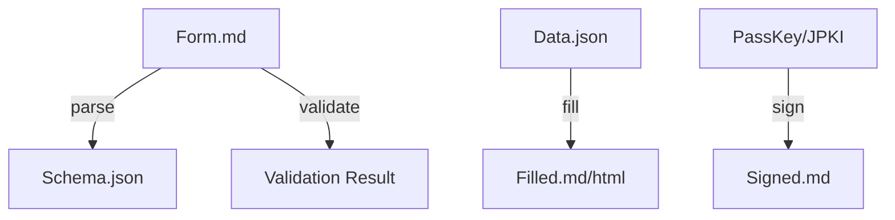

# Folio CLI Design Doc

Web/A Folio の参照実装であり、AIエージェントや自動化システムが Web/A Form エコシステムを操作するための「手足」となるヘッドレスツールキット。

## 概要

*   **Name**: `folio`
*   **Runtime**: Bun (TypeScript)
*   **Distribution**: Single Binary (via `bun build --compile`)
*   **Philosophy**: "Web/A Engine". ブラウザ（GUI）を必要とせず、テキスト処理のみで Web/A 文書のパース・編集・検証を行う。

## アーキテクチャ

Web/A Form (Markdown) を構造化データとして扱い、JSONデータとの相互変換やマージを行う。

## コマンド体系

### 1. フォーム操作 (Form Operations)

AIエージェントが最も頻繁に利用する機能群。

*   `folio parse <file>`
    *   Markdownファイルを解析し、入力フィールドの定義、型、制約を JSON Schema として出力する。
    *   AIはこのスキーマを見て、入力すべきデータの構造を理解する。
*   `folio fill <file> --data <data.json>`
    *   Markdownファイルと入力データをマージし、値が埋め込まれた新しい Markdown (またはHTML) を出力する。
    *   入力値のバリデーションも同時に行う。
*   `folio validate <file>`
    *   既に入力されたファイルが、定義された制約（必須、型、Regexなど）を満たしているか検証する。

### 2. Folio 管理 (Folio Management)

ユーザー（人間）またはセットアップ時のエージェントが利用。

*   `folio init`
    *   カレントディレクトリに Web/A Folio のディレクトリ構造 (`.index/`, `keys/`, `history/` 等) を初期化する。
*   `folio index`
    *   Folio 内の全ての Web/A ファイルをスキャンし、AI用のインデックス (`.index/vectors.db` 等) を更新する。

### 3. 本人確認・署名 (Identity & Signing)

*   `folio sign <file> --key <key_alias>`
    *   指定された鍵で文書に署名を行う（PassKey連携は要検討）。
*   `folio verify <file>`
    *   文書の署名を検証する。

### 4. MCP Server 機能 (Agent Integration)

AIエージェント (Claude, Gemini, etc.) との標準的な接続プロトコルとして、**Model Context Protocol (MCP)** をネイティブサポートする。CLI自体がMCPサーバーとして振る舞う。

*   `folio serve`
    *   Stdio または SSE モードで MCP サーバーを起動する。

#### Exposed Resources
*   `folio://profile`
    *   `profile.html` の内容を、AIが理解しやすいテキストまたはJSON形式で提供。
*   `folio://history/latest`
    *   直近の活動履歴や作成したフォームのサマリー。

#### Exposed Tools
*   `weba_parse_form`
    *   `folio parse` のラッパー。指定されたフォームの構造を返す。
*   `weba_draft_form`
    *   `folio fill` のラッパー。AIが推論した値を入力し、ドラフトファイルを作成する（上書きは許可しない）。
*   `weba_search`
    *   `folio index` で作成されたベクターDBやインデックスを用いて、過去の書類を意味検索する。

## 実装ロードマップ

### Phase 1: Core Parser (v0.1)
*   Markdown AST の解析機能 (Web/A記法 `[text:...]` の抽出)
*   `parse` コマンドの実装
*   `fill` コマンドの基本的な実装（バリデーションなし）

### Phase 2: Validation & Indexing (v0.2)
*   バリデーションロジックの実装
*   `folio index` コマンド（簡易的な全文検索インデックス作成）

### Phase 3: Identity (v0.3)
*   署名・検証ロジックの実装
*   JPKI/PassKey 連携のプロトタイピング
